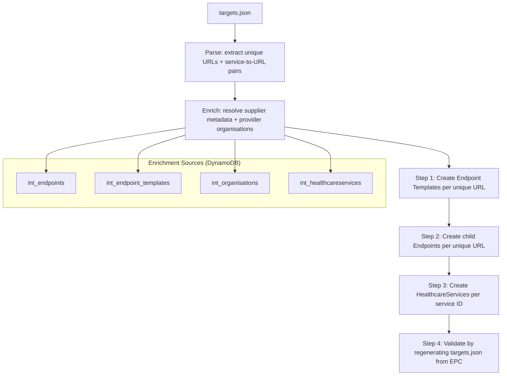
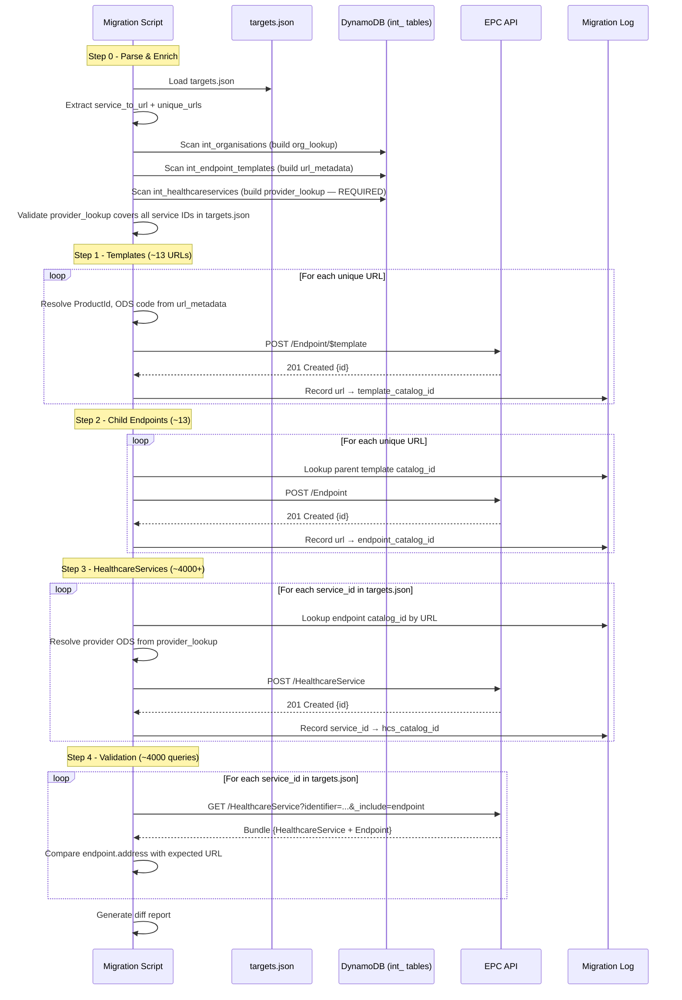

# Migration Process Design: targets.json → EPC

## Objective

Populate the new Endpoint Catalogue (EPC) using `targets.json` as the principal data source, enriched with supplier metadata from the `int_` DynamoDB tables. This approach treats the flat file as the source of truth for service-to-endpoint routing and builds the minimum viable EPC state to reproduce that routing.

---

## Why targets.json as primary source?

The `targets.json` file is the live routing configuration — it defines which DoS service IDs resolve to which supplier URLs. Starting from this file ensures:

1. Only services that are actively routed get migrated (no stale/orphaned data)
2. The validation step is a direct comparison against the same source
3. Simpler process — fewer records, no filtering of inactive/placeholder data
4. Guarantees the EPC can reproduce current production routing on day one

---

## Source Data Structure

`targets.json` structure:

```json
{
  "NHSD-Target-Identifier": {
    "tests": { ... },
    "https://fhir.nhs.uk/Id/dos-service-id": {
      "<service_id>": "<endpoint_url>",
      "<service_id>": "<endpoint_url>",
      ...
    }
  }
}
```

We only process the `https://fhir.nhs.uk/Id/dos-service-id` section. The `tests` section is ignored.

Each key-value pair represents:
- **Key:** DoS service ID (numeric string, e.g., `"2000017562"`)
- **Value:** The supplier's FHIR receiver URL (e.g., `"https://bars-prod-ygm04.cegedim.thirdparty.nhs.uk/FHIR/R4/"`)

---

## Overview



---

## Pre-requisites

| Item | Description | Status |
|------|-------------|--------|
| `targets.json` | Current production routing file | Required |
| EPC API available | Target environment (INT or DEV) accessible | Required |
| API credentials | Bearer token or OAuth2 client credentials for EPC API | Required |
| AWS access | IAM role/credentials with read access to `int_` DynamoDB tables (for enrichment and provider resolution) | Required |
| Product ID mapping | Short codes (ygm04, AC0, etc.) → agreed EPC Product IDs | Required |
| Provider organisation resolution | `int_healthcareservices` + `int_organisations` scanned to build service_id → provider ODS lookup | Required (built in Step 0) |
| Migration log store | Persistent map of `source_id → catalog_id` for cross-referencing between steps | Required |

---

## Step 0: Parse targets.json and Derive Unique URLs

**Input:** `targets.json`

**Action:** Extract the `https://fhir.nhs.uk/Id/dos-service-id` section, build two data structures:

1. **service_to_url** — the full mapping (used in Steps 2-3)
2. **unique_urls** — deduplicated list of endpoint URLs (used in Step 1)

```python
import json

with open('targets.json') as f:
    data = json.load(f)

service_section = data["NHSD-Target-Identifier"]["https://fhir.nhs.uk/Id/dos-service-id"]

# Full mapping: service_id → url
service_to_url = service_section  # ~4000+ entries

# Unique URLs (case-insensitive dedup)
seen = {}
unique_urls = []
for url in service_to_url.values():
    normalised = url.lower().rstrip('/')
    if normalised not in seen:
        seen[normalised] = url  # keep original casing
        unique_urls.append(url)

print(f"Total service mappings: {len(service_to_url)}")
print(f"Unique endpoint URLs: {len(unique_urls)}")
```

**Output:**
- `service_to_url`: dict of ~4,000+ entries
- `unique_urls`: list of ~13 unique URLs

---

## Step 0a: Build Provider Organisation Lookup (Required)

targets.json does not contain the provider organisation (the pharmacy, hospital, or service that delivers care). This must be resolved before Step 3, so it is built as part of Step 0.

**Source:** `int_healthcareservices` DynamoDB table + `int_organisations` (for ODS code resolution)

**Action:** Scan `int_healthcareservices` and build a dictionary keyed by `ServiceId` that maps each service to its provider organisation ODS code and service name.

```python
hcs_table = dynamodb.Table('int_healthcareservices')

# Build service_id → provider organisation + service name lookup
provider_lookup = {}
response = hcs_table.scan(
    FilterExpression=Attr('DataStatus').eq(0)
)
for item in response['Items']:
    service_id = item.get('ServiceId', '')
    provider_org_id = item.get('ProviderOrganisationId', '')
    org = org_lookup.get(provider_org_id, {})
    provider_lookup[service_id] = {
        "provider_ods": org.get('ods_code', ''),
        "provider_name": org.get('name', ''),
        "name": item.get('Name', '').strip('"'),
    }

# Handle pagination
while 'LastEvaluatedKey' in response:
    response = hcs_table.scan(
        FilterExpression=Attr('DataStatus').eq(0),
        ExclusiveStartKey=response['LastEvaluatedKey']
    )
    for item in response['Items']:
        service_id = item.get('ServiceId', '')
        provider_org_id = item.get('ProviderOrganisationId', '')
        org = org_lookup.get(provider_org_id, {})
        provider_lookup[service_id] = {
            "provider_ods": org.get('ods_code', ''),
            "provider_name": org.get('name', ''),
            "name": item.get('Name', '').strip('"'),
        }

print(f"Provider lookup entries: {len(provider_lookup)}")
```

**Validation:** After building, check coverage against targets.json:

```python
missing_providers = []
for service_id in service_to_url.keys():
    if service_id not in provider_lookup:
        missing_providers.append(service_id)

if missing_providers:
    print(f"WARNING: {len(missing_providers)} services in targets.json have no provider in int_healthcareservices")
    print(f"These will be created without providedBy — must be resolved before go-live")
else:
    print("All services have provider organisation resolved")
```

**Output:** `provider_lookup` — dict of `service_id → { provider_ods, provider_name, name }`

This is a **required** pre-requisite for Step 3. Any services missing from this lookup must be flagged for manual resolution before migration is considered complete.

---

## Step 0b: Enrich — Resolve Supplier Metadata for Each Unique URL

For each unique URL, we need to know: which supplier owns it, their ODS code, and the product ID. This comes from the `int_` DynamoDB tables.

**Process:** For each URL in `unique_urls`, query `int_endpoint_templates` or `int_endpoints` to find a matching `Address` and extract the supplier metadata.

```python
import boto3
from boto3.dynamodb.conditions import Attr

dynamodb = boto3.resource('dynamodb')
templates_table = dynamodb.Table('int_endpoint_templates')
orgs_table = dynamodb.Table('int_organisations')

# Build org lookup (same as main migration doc Step 1)
org_lookup = {}
response = orgs_table.scan()
for item in response['Items']:
    org_lookup[item['OrganisationId']] = {
        "ods_code": item.get('ODSCode', ''),
        "name": item.get('Name', ''),
    }
while 'LastEvaluatedKey' in response:
    response = orgs_table.scan(ExclusiveStartKey=response['LastEvaluatedKey'])
    for item in response['Items']:
        org_lookup[item['OrganisationId']] = {
            "ods_code": item.get('ODSCode', ''),
            "name": item.get('Name', ''),
        }

# Scan templates to build URL → supplier metadata map
templates_response = templates_table.scan(
    FilterExpression=Attr('DataStatus').eq(0) & Attr('Address').ne('addressHere')
)

url_metadata = {}
for item in templates_response['Items']:
    address = item.get('Address', '')
    managing_org_id = item.get('ManagingOrganisationId', '')
    org = org_lookup.get(managing_org_id, {})
    
    url_metadata[address.lower().rstrip('/')] = {
        "address": address,
        "product_id": item.get('ProductId', ''),
        "supplier_name": item.get('Name', ''),
        "managing_org_id": managing_org_id,
        "managing_org_ods": org.get('ods_code', ''),
        "template_id": item.get('TemplateId', ''),
        "is_private": item.get('IsPrivate', False),
    }
```

### URL to Supplier Metadata (Expected Output)

| URL (normalised) | ProductId | Supplier Name | Managing Org ODS | Template Source |
|------------------|-----------|---------------|------------------|----------------|
| `bars-prod-ygm06-pharmoutcomes.emis.thirdparty.nhs.uk` | ygm06 | Pharmoutcomes | (from org_lookup) | int_endpoint_templates |
| `bars-prod-ygm04.cegedim.thirdparty.nhs.uk/fhir/r4/` | ygm04 | Cegedim | (from org_lookup) | int_endpoint_templates |
| `bars-prod-8hk48.sonar.thirdparty.nhs.uk` | 8hk48 | Sonar | (from org_lookup) | int_endpoint_templates |
| `bars-prod-ygm17.positivesolutions.thirdparty.nhs.uk` | ygm17 | Positive Solutions | (from org_lookup) | int_endpoint_templates |
| `bars-prod-8jy34.waspsoftware.thirdparty.nhs.uk/api/r4` | 8JY34 | WASP | (from org_lookup) | int_endpoint_templates |
| `bars-prod-ac0.advanced.thirdparty.nhs.uk/fhirr4/api/bars` | AC0 | Advanced | (from org_lookup) | int_endpoint_templates |
| `bars-prod-8hq44.stratahealth.thirdparty.nhs.uk:3120/bars/` | 8hq44 | Strata Health | (from org_lookup) | int_endpoint_templates |
| `bars-prod-y01061.advanced.thirdparty.nhs.uk/fhirr4/api/bars` | Y01061 | Advanced | (from org_lookup) | int_endpoint_templates |
| `bars-prod-8ht86.fortrus.thirdparty.nhs.uk/` | 8ht86 | Fortrus | (from org_lookup) | int_endpoint_templates |
| `bars-prod-rk5.nervecentre.thirdparty.nhs.uk` | RK5 | Nervecentre | (from org_lookup) | int_endpoint_templates |
| `bars-prod-rx7.nwas.nhs.uk` | RX7 | NWAS | (from org_lookup) | int_endpoint_templates |
| `bars-prod-ga9.gmupca.nhs.uk/fhirr4/api/bars` | GA9 | GMUPCA | (from org_lookup) | int_endpoint_templates |
| `bars-prod-rk5.nervecentre.thirdparty.nhs.uk:9999/...` | RK5 | Nervecentre | (from org_lookup) | int_endpoint_templates |

### Product ID Resolution

Same as the main migration document — map short codes to agreed EPC Product Identifiers:

```python
PRODUCT_ID_MAP = {
    "ygm04": "CegedimPharmacyServices-v6.0",
    "ygm06": "PinnaclePharmOutcomes-v2024.12.12",
    "ygm17": "HXConsultBaRS-v2.0",
    "8hk48": "SonarHealthBaRS-v4.0",
    "8JY34": "WASPBaRSProvider-v1.0.1",
    "AC0":   "Adastra-v3.46.00",
    "Y01061": "Adastra-v3.46.00",
    "8hq44": "StrataPathways-v12",
    "8ht86": "AgyleBaRS-v2.6.5",
    "RK5":   "NervecentreBaRS-v9.2",
    "RX7":   "TBD-NWAS",
    "GA9":   "TBD-GMUPCA",
}
```

---

## Step 1: Create Endpoint Templates (one per unique URL)

For each unique URL in `unique_urls`, create an Endpoint Template in the EPC. This represents the supplier's receiver system at that address.

**For each unique URL:**

1. Look up the URL in `url_metadata` (case-insensitive, trailing-slash-tolerant)
2. Resolve `ProductId` → EPC Product Identifier via `PRODUCT_ID_MAP`
3. Build the FHIR Endpoint Template payload
4. Call: `POST /Endpoint/$template`
5. Record: `{ url: catalog_id }` in `template_log`

### Payload Parameter Table

| FHIR Field | Example Value | Source | How to derive |
|------------|--------------|--------|---------------|
| `resourceType` | `"Endpoint"` | Static | Always `"Endpoint"` |
| `identifier[0].system` | `"https://fhir.nhs.uk/id/product-id"` | Static | Always this system URI |
| `identifier[0].value` | `"CegedimPharmacyServices-v6.0"` | `url_metadata.product_id` → `PRODUCT_ID_MAP` | Look up the `product_id` for this URL from the enrichment step. Then resolve via `PRODUCT_ID_MAP` to the agreed EPC Product Identifier. |
| `status` | `"active"` | Static | Always `"active"` — these URLs are in the live routing file. |
| `connectionType.coding[0].system` | `"http://terminology.hl7.org/CodeSystem/endpoint-connection-type"` | Static | Always this system URI |
| `connectionType.coding[0].code` | `"hl7-fhir-rest"` | Static | Always `"hl7-fhir-rest"` — all BaRS endpoints are FHIR REST. |
| `connectionType.coding[0].display` | `"HL7 FHIR"` | Static | Always `"HL7 FHIR"` |
| `payloadType[0].coding[0].system` | `"http://terminology.hl7.org/CodeSystem/endpoint-payload-type-epc"` | Static | Always this system URI |
| `payloadType[0].coding[0].code` | `"bars"` | Static | Always `"bars"` — all entries in targets.json are BaRS routing. |
| `payloadType[0].coding[0].display` | `"BaRS"` | Static | Always `"BaRS"` |
| `managingOrganization[0].identifier.system` | `"https://fhir.nhs.uk/Id/ods-organization-code"` | Static | Always this system URI |
| `managingOrganization[0].identifier.value` | `"RK5"` | `url_metadata.managing_org_ods` | The ODS code of the supplier organisation that manages this endpoint. Resolved during enrichment via `int_organisations`. |
| `address` | `"https://bars-prod-ygm04.cegedim.thirdparty.nhs.uk/FHIR/R4/"` | `targets.json` URL value | Direct copy of the URL from targets.json. Preserve original casing. Ensure `https://` scheme is present. |
| `header` | `"public"` | `url_metadata.is_private` | Map: `false` → `"public"`, `true` → `"private"`. Default to `"public"` if enrichment data is unavailable. |

### Example payload

URL: `https://bars-prod-ygm04.cegedim.thirdparty.nhs.uk/FHIR/R4/`

Enrichment resolved:
- ProductId: `ygm04` → `"CegedimPharmacyServices-v6.0"`
- ManagingOrg ODS: `"(resolved from org_lookup)"`  — e.g., supplier ODS for Cegedim
- IsPrivate: `false` → `"public"`

```json
{
  "resourceType": "Endpoint",
  "identifier": [{
    "system": "https://fhir.nhs.uk/id/product-id",
    "value": "CegedimPharmacyServices-v6.0"
  }],
  "status": "active",
  "connectionType": {
    "coding": [{
      "system": "http://terminology.hl7.org/CodeSystem/endpoint-connection-type",
      "code": "hl7-fhir-rest",
      "display": "HL7 FHIR"
    }]
  },
  "payloadType": [{
    "coding": [{
      "system": "http://terminology.hl7.org/CodeSystem/endpoint-payload-type-epc",
      "code": "bars",
      "display": "BaRS"
    }]
  }],
  "managingOrganization": [{
    "identifier": {
      "system": "https://fhir.nhs.uk/Id/ods-organization-code",
      "value": "YGM04"
    }
  }],
  "address": "https://bars-prod-ygm04.cegedim.thirdparty.nhs.uk/FHIR/R4/",
  "header": "public"
}
```

**Output:** `template_log` — map of `normalised_url → EPC catalog_id`

---

## Step 2: Create Child Endpoints (one per unique URL)

In the EPC model, each Template needs at least one child Endpoint to be routable. Since targets.json doesn't carry per-service endpoint identity (just URL), we create **one child Endpoint per Template** — all services sharing that URL will reference the same child Endpoint.

**For each unique URL:**

1. Look up the URL in `template_log` to get the parent Template's `catalog_id`
2. Build the FHIR child Endpoint payload
3. Call: `POST /Endpoint`
4. Record: `{ url: endpoint_catalog_id }` in `endpoint_log`

### Payload Parameter Table

| FHIR Field | Example Value | Source | How to derive |
|------------|--------------|--------|---------------|
| `resourceType` | `"Endpoint"` | Static | Always `"Endpoint"` |
| `extension[0].url` | `"http://hl7.org"` | Static | Always this URL — identifies the "basedOn" extension. |
| `extension[0].valueReference.reference` | `"Endpoint/5fce3e6a-..."` | `template_log` | Look up the normalised URL in `template_log` to get the parent Template's catalog_id. Format as `"Endpoint/{catalog_id}"`. |
| `extension[0].valueReference.display` | `"Parent Template Endpoint"` | Static | Always `"Parent Template Endpoint"` |
| `status` | `"active"` | Static | Always `"active"` — the URL is in the live routing file, so the endpoint is active. |
| `period.start` | `"2026-07-20T00:00:00Z"` | Static (migration date) | Use the migration execution date. targets.json doesn't carry start dates. |

### Fields NOT included (inherited from Template)

| Field | Reason |
|-------|--------|
| `identifier` | Inherited from parent Template (Product ID lives on the Template) |
| `address` | Inherited from parent Template |
| `connectionType` | Inherited from parent Template |
| `payloadType` | Inherited from parent Template |
| `managingOrganization` | Inherited from parent Template |
| `name` | Inherited from parent Template |
| `header` | Inherited from parent Template |

### Example payload

For URL `https://bars-prod-ygm04.cegedim.thirdparty.nhs.uk/FHIR/R4/` where `template_log` gives catalog_id `"5fce3e6a-ba37-4289-84d1-cc3ebdb992f5"`:

```json
{
  "resourceType": "Endpoint",
  "extension": [{
    "url": "http://hl7.org",
    "valueReference": {
      "reference": "Endpoint/5fce3e6a-ba37-4289-84d1-cc3ebdb992f5",
      "display": "Parent Template Endpoint"
    }
  }],
  "status": "active",
  "period": {
    "start": "2026-07-20T00:00:00Z"
  }
}
```

**Output:** `endpoint_log` — map of `normalised_url → endpoint_catalog_id`

---

## Step 3: Create HealthcareServices (one per service ID in targets.json)

For each key-value pair in `service_to_url`, create a HealthcareService that references the child Endpoint for its URL.

**For each service_id, url pair in `service_to_url`:**

1. Normalise the URL and look up in `endpoint_log` to get the child Endpoint's `catalog_id`
2. Resolve provider organisation ODS code from `provider_lookup` (built in Step 0b)
3. Resolve service name from `provider_lookup` (built in Step 0b)
4. Build the FHIR HealthcareService payload
5. Call: `POST /HealthcareService`
6. Record: `{ service_id: hcs_catalog_id }` in `hcs_log`

### Provider Organisation (from Step 0b)

The `provider_lookup` dictionary built in Step 0b provides:
- `provider_ods` — the ODS code of the provider organisation (pharmacy/hospital)
- `provider_name` — the organisation name
- `name` — the human-readable service name

These are required fields. If a service_id is not found in `provider_lookup`, log it as a migration gap that must be resolved.

### Payload Parameter Table

| FHIR Field | Example Value | Source | How to derive |
|------------|--------------|--------|---------------|
| `resourceType` | `"HealthcareService"` | Static | Always `"HealthcareService"` |
| `meta.profile[0]` | `"https://fhir.hl7.org.uk/StructureDefinition/UKCore-HealthcareService"` | Static | Always this profile URI |
| `identifier[0].system` | `"https://fhir.nhs.uk/Id/dos-service-id"` | Static | Always `"https://fhir.nhs.uk/Id/dos-service-id"` — this is the identifier system used by the BaRS proxy to query the EPC. |
| `identifier[0].value` | `"2000017562"` | `targets.json` key | Direct copy of the service ID key from the JSON. |
| `active` | `true` | Static | Always `true` — the service is in the live routing file, so it's active. |
| `name` | `"Pharm+: Victoria Pharmacy Golders Green"` | `provider_lookup` (from Step 0b) | Look up `service_id` in `provider_lookup`. Use the `name` field. If not found, log as a migration gap — this must be resolved. Strip surrounding quotes. |
| `providedBy.identifier.system` | `"https://fhir.nhs.uk/Id/ods-organization-code"` | Static | Always this system URI. |
| `providedBy.identifier.value` | `"FLG23"` | `provider_lookup` (from Step 0b) | Look up `service_id` in `provider_lookup`. Use the `provider_ods` field. If not found, log as a migration gap — must be resolved before go-live. |
| `endpoint[0].reference` | `"Endpoint/abc123-..."` | `endpoint_log` | Normalise the URL from targets.json (lowercase, strip trailing slash). Look up in `endpoint_log` to get the child Endpoint's catalog_id. Format as `"Endpoint/{catalog_id}"`. |

### Example payload

For targets.json entry: `"2000017562": "https://bars-prod-ygm04.cegedim.thirdparty.nhs.uk/FHIR/R4/"`

Enrichment resolved:
- `provider_lookup["2000017562"]` → `{ provider_ods: "FE284", name: "Pharm+: Boots Pharmacy Bromley" }`
- `endpoint_log["bars-prod-ygm04.cegedim.thirdparty.nhs.uk/fhir/r4"]` → catalog_id `"0cb21027-a246-43e6-9c7a-35b17163eab1"`

```json
{
  "resourceType": "HealthcareService",
  "meta": {
    "profile": ["https://fhir.hl7.org.uk/StructureDefinition/UKCore-HealthcareService"]
  },
  "identifier": [{
    "system": "https://fhir.nhs.uk/Id/dos-service-id",
    "value": "2000017562"
  }],
  "active": true,
  "name": "Pharm+: Boots Pharmacy Bromley",
  "providedBy": {
    "identifier": {
      "system": "https://fhir.nhs.uk/Id/ods-organization-code",
      "value": "FE284"
    }
  },
  "endpoint": [
    {"reference": "Endpoint/0cb21027-a246-43e6-9c7a-35b17163eab1"}
  ]
}
```

**Output:** `hcs_log` — map of `service_id → hcs_catalog_id`

---

## Step 4: Validate — Rebuild targets.json from EPC

Query the EPC for every service ID from the original targets.json and verify the resolved Endpoint address matches.

### 4a. Query the EPC

```python
import requests

EPC_BASE = "https://int.api.service.nhs.uk/endpoint-catalogue"
reconstructed = {}
errors = []

for service_id, expected_url in service_to_url.items():
    response = requests.get(
        f"{EPC_BASE}/HealthcareService",
        params={
            "identifier": f"https://fhir.nhs.uk/Id/dos-service-id|{service_id}",
            "_include": "HealthcareService:endpoint"
        },
        headers={"Authorization": f"Bearer {token}"}
    )
    
    bundle = response.json()
    
    # Find the Endpoint in the included resources
    endpoint_address = None
    for entry in bundle.get("entry", []):
        resource = entry.get("resource", {})
        if resource.get("resourceType") == "Endpoint" and resource.get("status") == "active":
            endpoint_address = resource.get("address")
            break
    
    if endpoint_address:
        reconstructed[service_id] = endpoint_address
    else:
        reconstructed[service_id] = "NOT_FOUND"
        errors.append(service_id)
```

### 4b. Compare

```python
def urls_match(url1, url2):
    """Case-insensitive, trailing-slash-tolerant URL comparison."""
    if not url1 or not url2:
        return False
    return url1.lower().rstrip('/') == url2.lower().rstrip('/')

differences = []
for service_id, expected_url in service_to_url.items():
    actual_url = reconstructed.get(service_id)
    if not urls_match(expected_url, actual_url):
        differences.append({
            "service_id": service_id,
            "expected": expected_url,
            "actual": actual_url
        })

print(f"Total services: {len(service_to_url)}")
print(f"Matched: {len(service_to_url) - len(differences)}")
print(f"Mismatched: {len(differences)}")
print(f"Not found: {len(errors)}")
```

### 4c. Generate reconstructed targets.json

```python
output = {
    "NHSD-Target-Identifier": {
        "https://fhir.nhs.uk/Id/dos-service-id": reconstructed
    }
}
with open('targets-reconstructed.json', 'w') as f:
    json.dump(output, f, indent=2)
```

### 4d. Success Criteria

| Metric | Target |
|--------|--------|
| Services with correct URL match (case-insensitive) | 100% |
| Services returning NOT_FOUND | 0 |
| Total differences | 0 |

---

## Execution Sequence Diagram



---

## Data Volumes & Estimates

| Step | Records | EPC API Calls | Notes |
|------|---------|---------------|-------|
| Step 0 (parse + enrich) | 4,000+ services, ~13 URLs | 0 (DynamoDB only) | 4 table scans (orgs, templates, endpoints, healthcareservices) |
| Step 1 (templates) | ~13 unique URLs | ~13 POSTs | One template per unique supplier URL |
| Step 2 (child endpoints) | ~13 | ~13 POSTs | One child per template |
| Step 3 (HealthcareServices) | ~4,000+ | ~4,000+ POSTs | One per service ID |
| Step 4 (validation) | ~4,000+ | ~4,000+ GETs | One query per service ID |
| **Total** | | **~8,000+ API calls** | |

At ~10 requests/second, estimated runtime: ~13 minutes.

This is significantly fewer API calls than the full int_ table migration because:
- Only ~13 Templates/Endpoints (not thousands — one per URL, not one per service)
- No inactive/placeholder data to process

---

## Error Handling

| Error                                                            | Action                                                                                                                                                                                        |
| ------------------------------------------------------------------| -----------------------------------------------------------------------------------------------------------------------------------------------------------------------------------------------|
| **URL not found in url_metadata** (enrichment miss)              | Log warning. If ProductId/ODS can be inferred from URL pattern (e.g., `ygm04` in hostname), use that. Otherwise skip and flag for manual resolution.                                          |
| **ProductId not in PRODUCT_ID_MAP**                              | Log as unmapped, skip the template creation, and all services using that URL will fail in Step 3. Add to "needs mapping" report.                                                              |
| **provider_lookup miss** (service not in int_healthcareservices) | Log as migration gap. Create HealthcareService without `providedBy` temporarily but flag as **must-resolve** before go-live. These gaps must be zero for migration to be considered complete. |
| Template POST fails (409 conflict / already exists)              | Query by ProductId to get existing catalog_id. Use that in template_log. Continue.                                                                                                            |
| Endpoint POST fails                                              | Log and skip. Services referencing this URL will have no endpoint reference.                                                                                                                  |
| HealthcareService POST fails                                     | Log service_id and error. Continue with next.                                                                                                                                                 |
| API rate limit (429)                                             | Exponential backoff with jitter. Retry up to 3 times.                                                                                                                                         |
| Validation: URL mismatch                                         | Log full detail (expected vs actual). Common causes: case difference, trailing slash, scheme mismatch.                                                                                        |

---

## Key Differences from Full int_ Table Migration

| Aspect | Full Migration (int_ tables) | targets.json Migration |
|--------|------------------------------|------------------------|
| Source of truth | DynamoDB tables | targets.json flat file |
| Templates created | One per template row (~50-100) | One per unique URL (~13) |
| Child Endpoints created | One per endpoint row (~5,000) | One per unique URL (~13) |
| HealthcareServices created | One per HCS row (~5,000, includes inactive) | One per targets.json entry (~4,000, all active) |
| Inactive services included | Yes | No — only actively routed services |
| Provider organisation | From int_healthcareservices.ProviderOrganisationId | Required — resolved from int_healthcareservices in Step 0b |
| Service name | From int_healthcareservices.Name | Required — resolved from int_healthcareservices in Step 0b |
| Endpoint per service | Dedicated endpoint per service | Shared endpoint per URL (all services on same URL share one endpoint) |
| Total API calls | ~14,000 | ~8,000 |
| Complexity | Higher (more data, more lookups) | Lower (flat file drives everything) |

---

## Key Decisions

| Decision | Choice | Rationale |
|----------|--------|-----------|
| One child Endpoint per URL (shared) vs one per service | One per URL (shared) | targets.json shows many services using the same URL. Creating thousands of identical endpoints is wasteful. |
| All services set to `active: true` | Yes | They're in the live routing file — by definition, they're active. |
| `providedBy` optional | No — required | Provider resolution is built in Step 0b from int_healthcareservices. Any gaps must be resolved before go-live. |
| `name` optional | No — required (with fallback for gaps) | Resolved from int_healthcareservices in Step 0b. Missing names are logged as gaps. |
| URL matching strategy | Case-insensitive, strip trailing slash, strip scheme for comparison | Source data has inconsistent casing |
| Period.start for child endpoints | Migration date | No historical start date available from targets.json |

---

## Comparison: Which Approach to Use?

| Use Case | Recommended Approach |
|----------|---------------------|
| Need to reproduce live routing ASAP with minimal risk | **targets.json approach** (this document) |
| Need full historical data including inactive services | Full int_ table migration |
| Need dedicated endpoint per service (for future per-service config) | Full int_ table migration |
| Need provider organisation and service names | Either (with enrichment), or full migration |
| Proof-of-concept / demo | **targets.json approach** (faster, simpler) |
| Production migration (final) | Full int_ table migration (more complete data) |

---

## Files & Outputs

| Artifact | Location | Purpose |
|----------|----------|---------|
| Migration script | TBD | Executes Steps 0-3 |
| Validation script | TBD | Executes Step 4 |
| Migration log | `migration-log-targets.json` | Source → catalog_id mappings |
| Validation report | `validation-report-targets.json` | Diff between expected and actual |
| Reconstructed targets | `targets-reconstructed.json` | Rebuilt from EPC queries |
