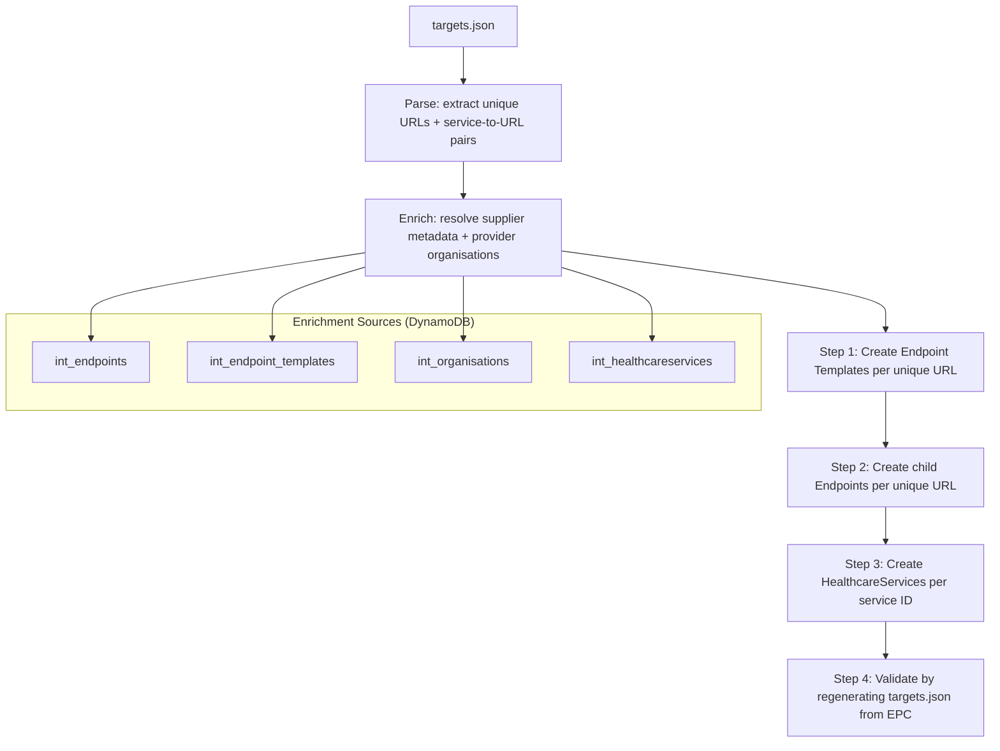
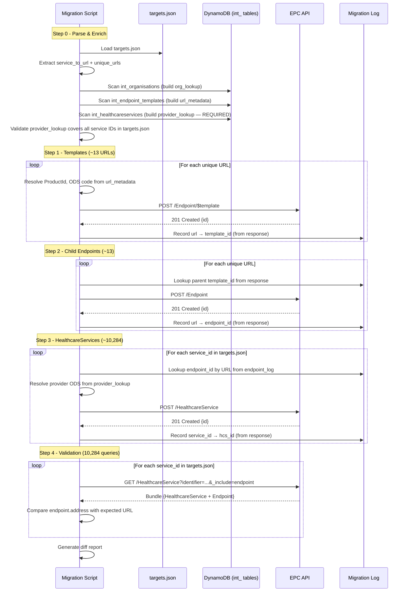
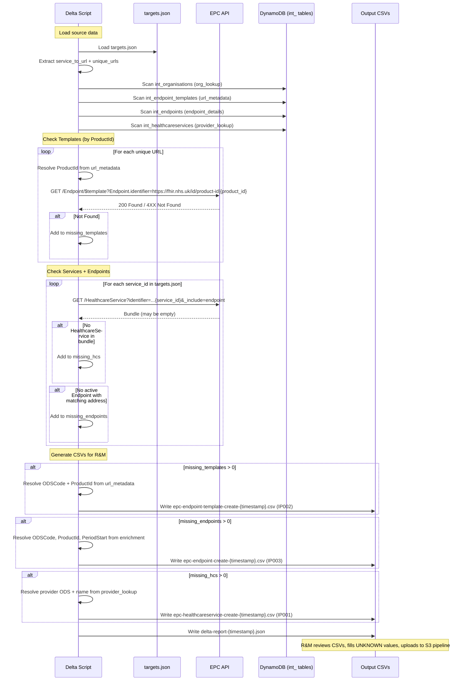
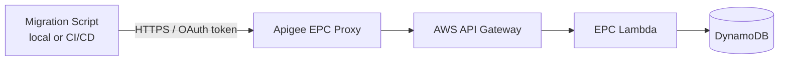
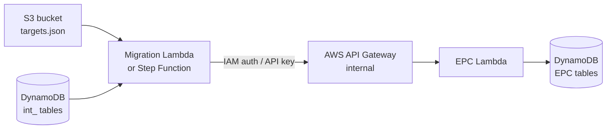
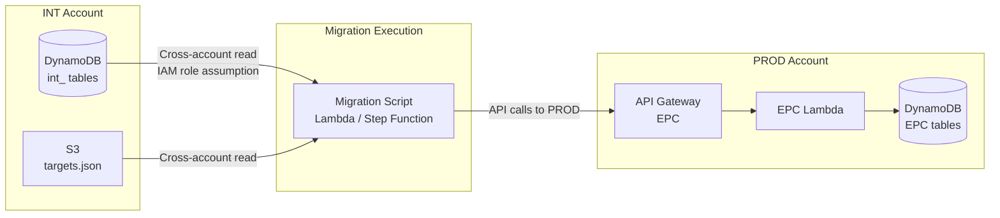

# Migration Process Design: targets.json → EPC

## Executive Summary


| Step  | What                                                                     | Input                      | Output                                                                                 |
| ------- | -------------------------------------------------------------------------- | ---------------------------- | ---------------------------------------------------------------------------------------- |
| **0** | Parse targets.json & enrich from DynamoDB                                | targets.json + int_ tables | `service_to_url`, `unique_urls`, `url_metadata`, `provider_lookup`, `endpoint_details` |
| **1** | Create Endpoint Template + child Endpoint for each unique URL            | ~13 unique URLs            | Template ID + Endpoint ID per URL (from API responses)                                 |
| **2** | Create HealthcareService for each service ID                             | ~10,284 service IDs        | HealthcareService linked to its Endpoint                                               |
| **3** | Validate by querying the EPC and comparing against original targets.json | EPC API queries            | Pass/fail report                                                                       |
| **4** | Delta detection — generate IP001/IP002/IP003 CSVs for anything missing  | EPC API queries            | CSVs for R&M team to action                                                            |

---

## Objective

Populate the new Endpoint Catalogue (EPC) using `targets.json` as the principal data source, enriched with supplier metadata from the `int_` DynamoDB tables. This approach treats the flat file as the source of truth for service-to-endpoint routing and builds the minimum viable EPC state to reproduce that routing.

---

## Why targets.json as primary source?

The `targets.json` file is the live routing configuration — it defines which DoS service IDs resolve to which supplier URLs. Starting from this file ensures:

1. Only services that are actively routed get migrated (no stale/orphaned data)
2. The validation step is a direct comparison against the same source
3. Simpler process — fewer records, no filtering of inactive/placeholder data
4. Guarantees the EPC can reproduce current production routing on day one

---

## Source Data Structure

`targets.json` structure:

```json
{
  "NHSD-Target-Identifier": {
    "tests": { ... },
    "https://fhir.nhs.uk/Id/dos-service-id": {
      "<service_id>": "<endpoint_url>",
      "<service_id>": "<endpoint_url>",
      ...
    }
  }
}
```

We only process the `https://fhir.nhs.uk/Id/dos-service-id` section. The `tests` section is ignored.

Each key-value pair represents:

- **Key:** DoS service ID (numeric string, e.g., `"2000017562"`)
- **Value:** The supplier's FHIR receiver URL (e.g., `"https://bars-prod-ygm04.cegedim.thirdparty.nhs.uk/FHIR/R4/"`)

---

## Overview


```mermaid
flowchart TD
    TJ[targets.json] --> PARSE[Parse: extract unique URLs + service-to-URL pairs]
    PARSE --> ENRICH[Enrich: resolve supplier metadata + provider organisations]
    ENRICH --> S1[Step 1: Create Endpoint Templates per unique URL]
    S1 --> S2[Step 2: Create child Endpoints per unique URL]
    S2 --> S3[Step 3: Create HealthcareServices per service ID]
    S3 --> VALIDATE[Step 4: Validate by regenerating targets.json from EPC]

    subgraph Enrichment["Enrichment Sources (DynamoDB)"]
        INT_EP[int_endpoints]
        INT_TPL[int_endpoint_templates]
        INT_ORG[int_organisations]
        INT_HCS[int_healthcareservices]
    end

    ENRICH --> INT_EP
    ENRICH --> INT_TPL
    ENRICH --> INT_ORG
    ENRICH --> INT_HCS
```

---

## Pre-requisites


| Item                               | Description                                                                                                                                           | Option A (External)        | Option B (Internal)            |
| ------------------------------------ | ------------------------------------------------------------------------------------------------------------------------------------------------------- | ---------------------------- | -------------------------------- |
| `targets.json`                     | Current production routing file. For Option B, copy to S3 in the PROD account or read cross-account from INT.                                         | Required                   | Required                       |
| EPC API (Apigee) available         | Internet-facing Apigee EPC Proxy deployed and routing to the EPC backend.                                                                             | Required                   | Not required                   |
| EPC API (AWS Gateway) available    | AWS API Gateway in PROD account deployed and accessible internally.                                                                                   | Required                   | Required                       |
| API credentials (Apigee)           | Bearer token via OAuth2 (signed JWT → app-restricted token).                                                                                         | Required                   | Not required                   |
| API credentials (AWS)              | IAM auth (SigV4) — the migration executor role has`execute-api:Invoke` permissions on the PROD API Gateway.                                          | Not required               | Required                       |
| IAM cross-account role (INT→PROD) | `epc-migration-source-read` role in INT account, assumable by PROD migration executor. Grants read access to int_ DynamoDB tables.                    | Not required               | Required                       |
| IAM migration executor role        | `epc-migration-executor` role in PROD account with `sts:AssumeRole` (for INT reads) and `execute-api:Invoke` (for PROD API Gateway).                  | Not required               | Required                       |
| AWS access to INT tables           | Read access to`int_organisations`, `int_endpoint_templates`, `int_endpoints`, `int_healthcareservices` in the INT account.                            | Required (direct)          | Required (via role assumption) |
| Product ID mapping                 | Persistent`product-id-lookup.json` file mapping short codes (ygm04, AC0, etc.) → agreed EPC Product IDs. Must be accessible to the migration script. | Required                   | Required                       |
| Provider organisation resolution   | `int_healthcareservices` + `int_organisations` scanned to build service_id → provider ODS lookup.                                                    | Required (built in Step 0) | Required (built in Step 0)     |
| Migration log store                | Persistent map of`source_id → EPC resource id` for cross-referencing between steps. For Option B, an S3 bucket or DynamoDB table in PROD.            | Required                   | Required                       |

---

## Step 0: Parse targets.json and Derive Unique URLs

**Input:** `targets.json`

**Action:** Extract the `https://fhir.nhs.uk/Id/dos-service-id` section, build two data structures:

1. **service_to_url** — the full mapping (used in Steps 2-3)
2. **unique_urls** — deduplicated list of endpoint URLs (used in Step 1)

```python
import json

with open('targets.json') as f:
    data = json.load(f)

service_section = data["NHSD-Target-Identifier"]["https://fhir.nhs.uk/Id/dos-service-id"]

# Full mapping: service_id → url
service_to_url = service_section  # ~10,284 entries

# Unique URLs (case-insensitive dedup)
seen = {}
unique_urls = []
for url in service_to_url.values():
    normalised = url.lower().rstrip('/')
    if normalised not in seen:
        seen[normalised] = url  # keep original casing
        unique_urls.append(url)

print(f"Total service mappings: {len(service_to_url)}")
print(f"Unique endpoint URLs: {len(unique_urls)}")
```

**Output:**

- `service_to_url`: dict of 10,284 entries
- `unique_urls`: list of 13 unique URLs

**Example `service_to_url`:**

```json
{
  "2000017562": "https://bars-prod-ygm04.cegedim.thirdparty.nhs.uk/FHIR/R4/",
  "2000017594": "https://bars-prod-ygm04.cegedim.thirdparty.nhs.uk/FHIR/R4/",
  "110549": "https://bars-prod-ygm06-pharmoutcomes.emis.thirdparty.nhs.uk",
  "2000020742": "https://bars-prod-8hk48.sonar.thirdparty.nhs.uk",
  "55": "https://BaRS-PROD-8JY34.WASPSoftware.thirdparty.nhs.uk/api/r4",
  "104570": "https://bars-prod-8hq44.stratahealth.thirdparty.nhs.uk:3120/bars/",
  "2000017778": "https://bars-prod-ygm17.positivesolutions.thirdparty.nhs.uk"
}
```

**Example `unique_urls`:**

```python
[
  "https://bars-prod-ygm04.cegedim.thirdparty.nhs.uk/FHIR/R4/",
  "https://bars-prod-ygm06-pharmoutcomes.emis.thirdparty.nhs.uk",
  "https://bars-prod-8hk48.sonar.thirdparty.nhs.uk",
  "https://BaRS-PROD-8JY34.WASPSoftware.thirdparty.nhs.uk/api/r4",
  "https://bars-prod-ygm17.positivesolutions.thirdparty.nhs.uk",
  "https://BARS-PROD-AC0.advanced.thirdparty.nhs.uk/fhirR4/api/bars",
  "https://bars-prod-8hq44.stratahealth.thirdparty.nhs.uk:3120/bars/",
  "https://bars-prod-8ht86.fortrus.thirdparty.nhs.uk/",
  "https://bars-prod-rk5.nervecentre.thirdparty.nhs.uk",
  "https://BaRS-PROD-RX7.NWAS.nhs.uk",
  "https://BARS-PROD-GA9.gmupca.nhs.uk/fhirr4/api/bars",
  "https://BARS-PROD-Y01061.advanced.thirdparty.nhs.uk/fhirr4/api/bars",
  "https://bars-prod-rk5.nervecentre.thirdparty.nhs.uk:9999/booking-and-referral/FHIR/R4/"
]
```

---

## Step 0a: Build Provider Organisation Lookup (Required)

targets.json does not contain the provider organisation (the pharmacy, hospital, or service that delivers care). This must be resolved before Step 3, so it is built as part of Step 0.

**Source:** `int_healthcareservices` DynamoDB table + `int_organisations` (for ODS code resolution)

**Action:** Scan `int_healthcareservices` and build a dictionary keyed by `ServiceId` that maps each service to its provider organisation ODS code and service name.

```python
hcs_table = dynamodb.Table('int_healthcareservices')

# Build service_id → provider organisation + service name lookup
provider_lookup = {}
response = hcs_table.scan(
    FilterExpression=Attr('DataStatus').eq(0)
)
for item in response['Items']:
    service_id = item.get('ServiceId', '')
    provider_org_id = item.get('ProviderOrganisationId', '')
    org = org_lookup.get(provider_org_id, {})
    provider_lookup[service_id] = {
        "provider_ods": org.get('ods_code', ''),
        "provider_name": org.get('name', ''),
        "name": item.get('Name', '').strip('"'),
    }

# Handle pagination
while 'LastEvaluatedKey' in response:
    response = hcs_table.scan(
        FilterExpression=Attr('DataStatus').eq(0),
        ExclusiveStartKey=response['LastEvaluatedKey']
    )
    for item in response['Items']:
        service_id = item.get('ServiceId', '')
        provider_org_id = item.get('ProviderOrganisationId', '')
        org = org_lookup.get(provider_org_id, {})
        provider_lookup[service_id] = {
            "provider_ods": org.get('ods_code', ''),
            "provider_name": org.get('name', ''),
            "name": item.get('Name', '').strip('"'),
        }

print(f"Provider lookup entries: {len(provider_lookup)}")
```

**Validation:** After building, check coverage against targets.json:

```python
missing_providers = []
for service_id in service_to_url.keys():
    if service_id not in provider_lookup:
        missing_providers.append(service_id)

if missing_providers:
    print(f"WARNING: {len(missing_providers)} services in targets.json have no provider in int_healthcareservices")
    print(f"These will be created without providedBy — must be resolved before go-live")
else:
    print("All services have provider organisation resolved")
```

**Output:** `provider_lookup` — dict of `service_id → { provider_ods, provider_name, name }`

**Example `provider_lookup`:**

```json
{
  "2000017562": {
    "provider_ods": "FE284",
    "provider_name": "BOOTS UK LIMITED",
    "name": "Pharm+: Boots Pharmacy Bromley"
  },
  "110549": {
    "provider_ods": "FLJ73",
    "provider_name": "WELL PHARMACY",
    "name": "Pharm+: Well Pharmacy Andover"
  },
  "2000020742": {
    "provider_ods": "FX465",
    "provider_name": "COHENS CHEMIST",
    "name": "Pharm+: Cohens Chemist Middlesbrough"
  },
  "55": {
    "provider_ods": "RX898",
    "provider_name": "ANYTOWN UTC",
    "name": "Anytown Urgent Treatment Centre"
  }
}
```

This is a **required** pre-requisite for Step 2. Any services missing from this lookup must be flagged for manual resolution before migration is considered complete.

---

## Step 0b: Enrich — Resolve Supplier Metadata for Each Unique URL

For each unique URL, we need to know: which supplier owns it, their ODS code, and the product ID. This comes from the `int_` DynamoDB tables.

**Process:** For each URL in `unique_urls`, query `int_endpoint_templates` or `int_endpoints` to find a matching `Address` and extract the supplier metadata.

```python
import boto3
from boto3.dynamodb.conditions import Attr

dynamodb = boto3.resource('dynamodb')
templates_table = dynamodb.Table('int_endpoint_templates')
orgs_table = dynamodb.Table('int_organisations')

# Build org lookup (same as main migration doc Step 1)
org_lookup = {}
response = orgs_table.scan()
for item in response['Items']:
    org_lookup[item['OrganisationId']] = {
        "ods_code": item.get('ODSCode', ''),
        "name": item.get('Name', ''),
    }
while 'LastEvaluatedKey' in response:
    response = orgs_table.scan(ExclusiveStartKey=response['LastEvaluatedKey'])
    for item in response['Items']:
        org_lookup[item['OrganisationId']] = {
            "ods_code": item.get('ODSCode', ''),
            "name": item.get('Name', ''),
        }

# Scan templates to build URL → supplier metadata map
templates_response = templates_table.scan(
    FilterExpression=Attr('DataStatus').eq(0) & Attr('Address').ne('addressHere')
)

url_metadata = {}
for item in templates_response['Items']:
    address = item.get('Address', '')
    managing_org_id = item.get('ManagingOrganisationId', '')
    org = org_lookup.get(managing_org_id, {})
  
    url_metadata[address.lower().rstrip('/')] = {
        "address": address,
        "product_id": item.get('ProductId', ''),
        "supplier_name": item.get('Name', ''),
        "managing_org_id": managing_org_id,
        "managing_org_ods": org.get('ods_code', ''),
        "template_id": item.get('TemplateId', ''),
        "is_private": item.get('IsPrivate', False),
    }
```

### URL to Supplier Metadata (Expected Output)


| URL (normalised)                                              | ProductId | Supplier Name      | Managing Org ODS  | Template Source        |
| --------------------------------------------------------------- | ----------- | -------------------- | ------------------- | ------------------------ |
| `bars-prod-ygm06-pharmoutcomes.emis.thirdparty.nhs.uk`        | ygm06     | Pharmoutcomes      | (from org_lookup) | int_endpoint_templates |
| `bars-prod-ygm04.cegedim.thirdparty.nhs.uk/fhir/r4/`          | ygm04     | Cegedim            | (from org_lookup) | int_endpoint_templates |
| `bars-prod-8hk48.sonar.thirdparty.nhs.uk`                     | 8hk48     | Sonar              | (from org_lookup) | int_endpoint_templates |
| `bars-prod-ygm17.positivesolutions.thirdparty.nhs.uk`         | ygm17     | Positive Solutions | (from org_lookup) | int_endpoint_templates |
| `bars-prod-8jy34.waspsoftware.thirdparty.nhs.uk/api/r4`       | 8JY34     | WASP               | (from org_lookup) | int_endpoint_templates |
| `bars-prod-ac0.advanced.thirdparty.nhs.uk/fhirr4/api/bars`    | AC0       | Advanced           | (from org_lookup) | int_endpoint_templates |
| `bars-prod-8hq44.stratahealth.thirdparty.nhs.uk:3120/bars/`   | 8hq44     | Strata Health      | (from org_lookup) | int_endpoint_templates |
| `bars-prod-y01061.advanced.thirdparty.nhs.uk/fhirr4/api/bars` | Y01061    | Advanced           | (from org_lookup) | int_endpoint_templates |
| `bars-prod-8ht86.fortrus.thirdparty.nhs.uk/`                  | 8ht86     | Fortrus            | (from org_lookup) | int_endpoint_templates |
| `bars-prod-rk5.nervecentre.thirdparty.nhs.uk`                 | RK5       | Nervecentre        | (from org_lookup) | int_endpoint_templates |
| `bars-prod-rx7.nwas.nhs.uk`                                   | RX7       | NWAS               | (from org_lookup) | int_endpoint_templates |
| `bars-prod-ga9.gmupca.nhs.uk/fhirr4/api/bars`                 | GA9       | GMUPCA             | (from org_lookup) | int_endpoint_templates |
| `bars-prod-rk5.nervecentre.thirdparty.nhs.uk:9999/...`        | RK5       | Nervecentre        | (from org_lookup) | int_endpoint_templates |

### Product ID Resolution

See the dedicated document: **[Resolving ProductId](./resolving-product-id.md)**

The source data (int_ tables and targets.json) uses internal short codes to identify supplier products — e.g., `ygm04` for Cegedim, `8hk48` for Sonar, `AC0` for Advanced. These short codes are not meaningful outside the existing system and are not used in the EPC.

The EPC uses a formal Product Identifier (e.g., `CegedimPharmacyServices-v6.0`) that uniquely identifies the supplier's product and version. This is what gets stored in the `identifier` field on Endpoint Templates and child Endpoints.

The resolution process:

1. Take the `ProductId` short code from the source data (e.g., from `url_metadata` enrichment)
2. Look it up in the persistent `product-id-lookup.json` file (case-insensitive)
3. Return the agreed EPC Product Identifier

If the short code is not found in the lookup, the record cannot be migrated — it's logged as a gap for the R&M team to resolve by adding the mapping.

```python
from resolving_product_id import load_product_id_map
PRODUCT_ID_MAP = load_product_id_map()
```

---

## Step 1: Create Endpoint Templates and Child Endpoints (one pair per unique URL)

For each unique URL in `unique_urls`, create an Endpoint Template and then immediately create its child Endpoint. Since Template and Endpoint are 1:1 in this migration, we create them together — the child Endpoint uses the `id` returned from the Template creation response (not a value from the int_ tables).

**For each unique URL:**

1. Look up the URL in `url_metadata` (case-insensitive, trailing-slash-tolerant)
2. Resolve `ProductId` → EPC Product Identifier via `PRODUCT_ID_MAP`
3. Build the FHIR Endpoint Template payload
4. Call: `POST /Endpoint/$template`
5. On success: extract the `id` from the response — this is the Template's EPC resource ID
6. Immediately build the child Endpoint payload, setting `extension[0].valueReference.reference` to `"Endpoint/{response_id}"`
7. Call: `POST /Endpoint`
8. Record: `{ url: { template_id, endpoint_id, product_id } }` in `endpoint_log`

### Worked Example: Full Step 1 Flow

**Input:** URL `https://bars-prod-ygm04.cegedim.thirdparty.nhs.uk/FHIR/R4/` from `unique_urls`

---

**Step 1.1 — Look up URL in `url_metadata`:**

```python
normalised = "bars-prod-ygm04.cegedim.thirdparty.nhs.uk/fhir/r4"
metadata = url_metadata[normalised]
# Returns:
# {
#   "address": "https://bars-prod-ygm04.cegedim.thirdparty.nhs.uk/FHIR/R4/",
#   "product_id": "ygm04",
#   "supplier_name": "Cegedim",
#   "managing_org_id": "2f594ac5-6bc8-4241-af41-ae0f92b88949",
#   "managing_org_ods": "YGM04",
#   "is_private": False
# }
```

---

**Step 1.2 — Resolve ProductId:**

```python
product_id = PRODUCT_ID_MAP["YGM04"]
# Returns: "CegedimPharmacyServices-v6.0"
```

---

**Step 1.3 — Build Template payload:**

#### Template Payload Parameter Table


| FHIR Field                                  | Example Value                                                       | Source                                        | How to derive                                                                                                                          |
| --------------------------------------------- | --------------------------------------------------------------------- | ----------------------------------------------- | ---------------------------------------------------------------------------------------------------------------------------------------- |
| `resourceType`                              | `"Endpoint"`                                                        | Static                                        | Always`"Endpoint"`                                                                                                                     |
| `identifier[0].system`                      | `"https://fhir.nhs.uk/id/product-id"`                               | Static                                        | Always this system URI                                                                                                                 |
| `identifier[0].value`                       | `"CegedimPharmacyServices-v6.0"`                                    | `url_metadata.product_id` → `PRODUCT_ID_MAP` | Look up the`product_id` for this URL from the enrichment step. Then resolve via `PRODUCT_ID_MAP` to the agreed EPC Product Identifier. |
| `status`                                    | `"active"`                                                          | Static                                        | Always`"active"` — these URLs are in the live routing file.                                                                           |
| `connectionType.coding[0].system`           | `"http://terminology.hl7.org/CodeSystem/endpoint-connection-type"`  | Static                                        | Always this system URI                                                                                                                 |
| `connectionType.coding[0].code`             | `"hl7-fhir-rest"`                                                   | Static                                        | Always`"hl7-fhir-rest"` — all BaRS endpoints are FHIR REST.                                                                           |
| `connectionType.coding[0].display`          | `"HL7 FHIR"`                                                        | Static                                        | Always`"HL7 FHIR"`                                                                                                                     |
| `payloadType[0].coding[0].system`           | `"http://terminology.hl7.org/CodeSystem/endpoint-payload-type-epc"` | Static                                        | Always this system URI                                                                                                                 |
| `payloadType[0].coding[0].code`             | `"bars"`                                                            | Static                                        | Always`"bars"` — all entries in targets.json are BaRS routing.                                                                        |
| `payloadType[0].coding[0].display`          | `"BaRS"`                                                            | Static                                        | Always`"BaRS"`                                                                                                                         |
| `managingOrganization[0].identifier.system` | `"https://fhir.nhs.uk/Id/ods-organization-code"`                    | Static                                        | Always this system URI                                                                                                                 |
| `managingOrganization[0].identifier.value`  | `"YGM04"`                                                           | `url_metadata.managing_org_ods`               | The ODS code of the supplier organisation. Resolved during enrichment via`int_organisations`.                                          |
| `address`                                   | `"https://bars-prod-ygm04.cegedim.thirdparty.nhs.uk/FHIR/R4/"`      | `targets.json` URL value                      | Direct copy of the URL from targets.json. Preserve original casing. Ensure`https://` scheme is present.                                |
| `header`                                    | `"public"`                                                          | `url_metadata.is_private`                     | Map:`false` → `"public"`, `true` → `"private"`. Default to `"public"` if enrichment data is unavailable.                             |

```json
{
  "resourceType": "Endpoint",
  "identifier": [{
    "system": "https://fhir.nhs.uk/id/product-id",
    "value": "CegedimPharmacyServices-v6.0"
  }],
  "status": "active",
  "connectionType": {
    "coding": [{
      "system": "http://terminology.hl7.org/CodeSystem/endpoint-connection-type",
      "code": "hl7-fhir-rest",
      "display": "HL7 FHIR"
    }]
  },
  "payloadType": [{
    "coding": [{
      "system": "http://terminology.hl7.org/CodeSystem/endpoint-payload-type-epc",
      "code": "bars",
      "display": "BaRS"
    }]
  }],
  "managingOrganization": [{
    "identifier": {
      "system": "https://fhir.nhs.uk/Id/ods-organization-code",
      "value": "YGM04"
    }
  }],
  "address": "https://bars-prod-ygm04.cegedim.thirdparty.nhs.uk/FHIR/R4/",
  "header": "public"
}
```

---

**Step 1.4 — POST Template to EPC:**

```
POST /Endpoint/$template
```

**Response:** `201 Created`

```json
{
  "resourceType": "Endpoint",
  "id": "5fce3e6a-ba37-4289-84d1-cc3ebdb992f5",
  ...
}
```

---

**Step 1.5 — Extract Template ID from response:**

```python
template_id = response.json()["id"]
# "5fce3e6a-ba37-4289-84d1-cc3ebdb992f5"
```

---

**Step 1.6 — Build child Endpoint payload using returned Template ID:**

#### Child Endpoint Payload Parameter Table


| FHIR Field                              | Example Value                                     | Source                                  | How to derive                                                                                                                          |
| ----------------------------------------- | --------------------------------------------------- | ----------------------------------------- | ---------------------------------------------------------------------------------------------------------------------------------------- |
| `resourceType`                          | `"Endpoint"`                                      | Static                                  | Always`"Endpoint"`                                                                                                                     |
| `identifier[0].system`                  | `"https://fhir.nhs.uk/id/product-id"`             | Static                                  | Always this system URI                                                                                                                 |
| `identifier[0].value`                   | `"CegedimPharmacyServices-v6.0"`                  | Copied from Template payload (Step 1.3) | Same Product ID used on the parent Template. No separate lookup.                                                                       |
| `extension[0].url`                      | `"http://hl7.org"`                                | Static                                  | Always this URL — identifies the "basedOn" extension.                                                                                 |
| `extension[0].valueReference.reference` | `"Endpoint/5fce3e6a-ba37-4289-84d1-cc3ebdb992f5"` | **Response from Step 1.4**              | The`id` returned from `POST /Endpoint/$template`. Format as `"Endpoint/{id}"`.                                                         |
| `extension[0].valueReference.display`   | `"Parent Template Endpoint"`                      | Static                                  | Always`"Parent Template Endpoint"`                                                                                                     |
| `status`                                | `"active"`                                        | `endpoint_details` or Static            | Look up service_id in`endpoint_details`. Map `Active`: `"true"` → `"active"`, `"false"` → `"off"`. If not found, default `"active"`. |
| `period.start`                          | `"2026-06-01T16:04:05.168Z"`                      | `endpoint_details` or migration date    | From`int_endpoints.StartDate`. If empty, use migration date as fallback. See period decision note.                                     |
| `period.end`                            | _(omitted if empty)_                              | `endpoint_details` (if populated)       | From`int_endpoints.EndDate`. Only include if populated.                                                                                |

Fields **not** included (inherited from Template at read time): `address`, `connectionType`, `payloadType`, `managingOrganization`, `name`, `header`.

```json
{
  "resourceType": "Endpoint",
  "identifier": [{
    "system": "https://fhir.nhs.uk/id/product-id",
    "value": "CegedimPharmacyServices-v6.0"
  }],
  "extension": [{
    "url": "http://hl7.org",
    "valueReference": {
      "reference": "Endpoint/5fce3e6a-ba37-4289-84d1-cc3ebdb992f5",
      "display": "Parent Template Endpoint"
    }
  }],
  "status": "active",
  "period": {
    "start": "2026-06-01T16:04:05.168Z"
  }
}
```

Note: `period.start` resolved from `endpoint_details` (see period decision note below). `extension[0].valueReference.reference` uses the `id` returned from step 1.4.

---

**Step 1.7 — POST child Endpoint to EPC:**

```
POST /Endpoint
```

**Response:** `201 Created`

```json
{
  "resourceType": "Endpoint",
  "id": "0cb21027-a246-43e6-9c7a-35b17163eab1",
  ...
}
```

---

**Step 1.8 — Record in endpoint_log:**

```python
endpoint_log["bars-prod-ygm04.cegedim.thirdparty.nhs.uk/fhir/r4"] = {
    "template_id": "5fce3e6a-ba37-4289-84d1-cc3ebdb992f5",   # from step 1.4 response
    "endpoint_id": "0cb21027-a246-43e6-9c7a-35b17163eab1",   # from step 1.7 response
    "product_id": "CegedimPharmacyServices-v6.0"
}
```

---

**Output:** `endpoint_log` — map of `normalised_url → { template_id (from response), endpoint_id (from response), product_id }`

---

## Step 2: Create HealthcareServices (one per service ID in targets.json)

For each key-value pair in `service_to_url`, create a HealthcareService that references the child Endpoint for its URL.

**For each service_id, url pair in `service_to_url`:**

1. Look up `service_id`'s URL in `endpoint_log` to get the child Endpoint's `endpoint_id` (returned from `POST /Endpoint`)
2. Resolve provider organisation ODS code from `provider_lookup` (built in Step 0b)
3. Resolve service name from `provider_lookup` (built in Step 0b)
4. Build the FHIR HealthcareService payload
5. Call: `POST /HealthcareService`
6. Record: `{ service_id: hcs_id }` in `hcs_log` (ID returned from `POST /HealthcareService`)

### Provider Organisation (from Step 0b)

The `provider_lookup` dictionary built in Step 0b provides:

- `provider_ods` — the ODS code of the provider organisation (pharmacy/hospital)
- `provider_name` — the organisation name
- `name` — the human-readable service name

These are required fields. If a service_id is not found in `provider_lookup`, log it as a migration gap that must be resolved.

### Worked Example: Full Step 2 Flow

**Input:** targets.json entry `"2000017562": "https://bars-prod-ygm04.cegedim.thirdparty.nhs.uk/FHIR/R4/"`

---

**Step 2.1 — Look up Endpoint ID from `endpoint_log`:**

```python
normalised_url = "bars-prod-ygm04.cegedim.thirdparty.nhs.uk/fhir/r4"
endpoint_entry = endpoint_log[normalised_url]
# Returns:
# {
#   "template_id": "5fce3e6a-ba37-4289-84d1-cc3ebdb992f5",
#   "endpoint_id": "0cb21027-a246-43e6-9c7a-35b17163eab1",
#   "product_id": "CegedimPharmacyServices-v6.0"
# }

endpoint_reference = f"Endpoint/{endpoint_entry['endpoint_id']}"
# "Endpoint/0cb21027-a246-43e6-9c7a-35b17163eab1"
```

---

**Step 2.2 — Resolve provider organisation from `provider_lookup`:**

```python
provider = provider_lookup["2000017562"]
# Returns:
# {
#   "provider_ods": "FE284",
#   "provider_name": "BOOTS UK LIMITED",
#   "name": "Pharm+: Boots Pharmacy Bromley"
# }
```

---

**Step 2.3 — Resolve service name from `provider_lookup`:**

```python
service_name = provider["name"]
# "Pharm+: Boots Pharmacy Bromley"
```

---

**Step 2.4 — Build HealthcareService payload:**

#### HealthcareService Payload Parameter Table


| FHIR Field                     | Example Value                                                            | Source                           | How to derive                                                                                                                                       |
| -------------------------------- | -------------------------------------------------------------------------- | ---------------------------------- | ----------------------------------------------------------------------------------------------------------------------------------------------------- |
| `resourceType`                 | `"HealthcareService"`                                                    | Static                           | Always`"HealthcareService"`                                                                                                                         |
| `meta.profile[0]`              | `"https://fhir.hl7.org.uk/StructureDefinition/UKCore-HealthcareService"` | Static                           | Always this profile URI                                                                                                                             |
| `identifier[0].system`         | `"https://fhir.nhs.uk/Id/dos-service-id"`                                | Static                           | Always`"https://fhir.nhs.uk/Id/dos-service-id"` — the identifier system the BaRS proxy uses to query the EPC.                                      |
| `identifier[0].value`          | `"2000017562"`                                                           | `targets.json` key               | Direct copy of the service ID key from the JSON.                                                                                                    |
| `active`                       | `true`                                                                   | Static                           | Always`true` — the service is in the live routing file, so it's active.                                                                            |
| `name`                         | `"Pharm+: Boots Pharmacy Bromley"`                                       | `provider_lookup` (from Step 0b) | Look up`service_id` in `provider_lookup`. Use the `name` field. Strip surrounding quotes. If not found, log as migration gap.                       |
| `providedBy.identifier.system` | `"https://fhir.nhs.uk/Id/ods-organization-code"`                         | Static                           | Always this system URI.                                                                                                                             |
| `providedBy.identifier.value`  | `"FE284"`                                                                | `provider_lookup` (from Step 0b) | Look up`service_id` in `provider_lookup`. Use the `provider_ods` field. If not found, log as migration gap.                                         |
| `endpoint[0].reference`        | `"Endpoint/0cb21027-a246-43e6-9c7a-35b17163eab1"`                        | `endpoint_log` (from Step 1)     | Look up the service's URL in`endpoint_log` to get `endpoint_id` (returned from `POST /Endpoint` in Step 1.7). Format as `"Endpoint/{endpoint_id}"`. |

```json
{
  "resourceType": "HealthcareService",
  "meta": {
    "profile": ["https://fhir.hl7.org.uk/StructureDefinition/UKCore-HealthcareService"]
  },
  "identifier": [{
    "system": "https://fhir.nhs.uk/Id/dos-service-id",
    "value": "2000017562"
  }],
  "active": true,
  "name": "Pharm+: Boots Pharmacy Bromley",
  "providedBy": {
    "identifier": {
      "system": "https://fhir.nhs.uk/Id/ods-organization-code",
      "value": "FE284"
    }
  },
  "endpoint": [
    {"reference": "Endpoint/0cb21027-a246-43e6-9c7a-35b17163eab1"}
  ]
}
```

---

**Step 2.5 — POST HealthcareService to EPC:**

```
POST /HealthcareService
```

**Response:** `201 Created`

```json
{
  "resourceType": "HealthcareService",
  "id": "a7d3f1b2-9e45-4c8a-b6d1-1234567890ab",
  ...
}
```

---

**Step 2.6 — Record in `hcs_log`:**

```python
hcs_log["2000017562"] = "a7d3f1b2-9e45-4c8a-b6d1-1234567890ab"  # from POST response
```

---

**Output:** `hcs_log` — map of `service_id → hcs_id (from POST /HealthcareService response)`

---

## Step 3: Validate — Rebuild targets.json from EPC

Query the EPC for every service ID from the original targets.json and verify the resolved Endpoint address matches.

### 3a. Query the EPC

```python
import requests

EPC_BASE = "https://int.api.service.nhs.uk/endpoint-catalogue"
reconstructed = {}
errors = []

for service_id, expected_url in service_to_url.items():
    response = requests.get(
        f"{EPC_BASE}/HealthcareService",
        params={
            "identifier": f"https://fhir.nhs.uk/Id/dos-service-id|{service_id}",
            "_include": "HealthcareService:endpoint"
        },
        headers={"Authorization": f"Bearer {token}"}
    )
  
    bundle = response.json()
  
    # Find the Endpoint in the included resources
    endpoint_address = None
    for entry in bundle.get("entry", []):
        resource = entry.get("resource", {})
        if resource.get("resourceType") == "Endpoint" and resource.get("status") == "active":
            endpoint_address = resource.get("address")
            break
  
    if endpoint_address:
        reconstructed[service_id] = endpoint_address
    else:
        reconstructed[service_id] = "NOT_FOUND"
        errors.append(service_id)
```

### 3b. Compare

```python
def urls_match(url1, url2):
    """Case-insensitive, trailing-slash-tolerant URL comparison."""
    if not url1 or not url2:
        return False
    return url1.lower().rstrip('/') == url2.lower().rstrip('/')

differences = []
for service_id, expected_url in service_to_url.items():
    actual_url = reconstructed.get(service_id)
    if not urls_match(expected_url, actual_url):
        differences.append({
            "service_id": service_id,
            "expected": expected_url,
            "actual": actual_url
        })

print(f"Total services: {len(service_to_url)}")
print(f"Matched: {len(service_to_url) - len(differences)}")
print(f"Mismatched: {len(differences)}")
print(f"Not found: {len(errors)}")
```

### 3c. Generate reconstructed targets.json

```python
output = {
    "NHSD-Target-Identifier": {
        "https://fhir.nhs.uk/Id/dos-service-id": reconstructed
    }
}
with open('targets-reconstructed.json', 'w') as f:
    json.dump(output, f, indent=2)
```

### 3d. Success Criteria


| Metric                                             | Target |
| ---------------------------------------------------- | -------- |
| Services with correct URL match (case-insensitive) | 100%   |
| Services returning NOT_FOUND                       | 0      |
| Total differences                                  | 0      |

### Execution Sequence Diagram


```mermaid
sequenceDiagram
    participant Script as Migration Script
    participant TJ as targets.json
    participant DDB as DynamoDB (int_ tables)
    participant EPC as EPC API
    participant Log as Migration Log

    Note over Script: Step 0 - Parse & Enrich
    Script->>TJ: Load targets.json
    Script->>Script: Extract service_to_url + unique_urls
    Script->>DDB: Scan int_organisations (build org_lookup)
    Script->>DDB: Scan int_endpoint_templates (build url_metadata)
    Script->>DDB: Scan int_healthcareservices (build provider_lookup — REQUIRED)
    Script->>Script: Validate provider_lookup covers all service IDs in targets.json

    Note over Script: Step 1 - Templates (~13 URLs)
    loop For each unique URL
        Script->>Script: Resolve ProductId, ODS code from url_metadata
        Script->>EPC: POST /Endpoint/$template
        EPC-->>Script: 201 Created {id}
        Script->>Log: Record url → template_id (from response)
    end

    Note over Script: Step 2 - Child Endpoints (~13)
    loop For each unique URL
        Script->>Log: Lookup parent template_id from response
        Script->>EPC: POST /Endpoint
        EPC-->>Script: 201 Created {id}
        Script->>Log: Record url → endpoint_id (from response)
    end

    Note over Script: Step 3 - HealthcareServices (~10,284)
    loop For each service_id in targets.json
        Script->>Log: Lookup endpoint_id by URL from endpoint_log
        Script->>Script: Resolve provider ODS from provider_lookup
        Script->>EPC: POST /HealthcareService
        EPC-->>Script: 201 Created {id}
        Script->>Log: Record service_id → hcs_id (from response)
    end

    Note over Script: Step 4 - Validation (10,284 queries)
    loop For each service_id in targets.json
        Script->>EPC: GET /HealthcareService?identifier=...&_include=endpoint
        EPC-->>Script: Bundle {HealthcareService + Endpoint}
        Script->>Script: Compare endpoint.address with expected URL
    end
    Script->>Script: Generate diff report
```

---

### Data Volumes & Estimates


| Step                        | Records                   | EPC API Calls          | Notes                                                              |
| ----------------------------- | --------------------------- | ------------------------ | -------------------------------------------------------------------- |
| Step 0 (parse + enrich)     | 4,000+ services, ~13 URLs | 0 (DynamoDB only)      | 4 table scans (orgs, templates, endpoints, healthcareservices)     |
| Step 1 (templates)          | ~13 unique URLs           | ~13 POSTs              | One template per unique supplier URL                               |
| Step 2 (child endpoints)    | ~10,284                   | ~10,284 POSTs          | One child endpoint per service ID (with period from int_endpoints) |
| Step 3 (HealthcareServices) | ~10,284                   | ~10,284 POSTs          | One per service ID                                                 |
| Step 4 (validation)         | ~10,284                   | ~10,284 GETs           | One query per service ID                                           |
| **Total**                   |                           | **~20,594 API calls** |                                                                    |

At ~10 requests/second, estimated runtime: ~35 minutes.

This is significantly fewer API calls than the full int_ table migration because:

- Only 13 Templates/Endpoints (not thousands — one per URL, not one per service)
- No inactive/placeholder data to process

---

### Error Handling


| Error                                                            | Action                                                                                                                                                                                       |
| ------------------------------------------------------------------ | ---------------------------------------------------------------------------------------------------------------------------------------------------------------------------------------------- |
| **URL not found in url_metadata** (enrichment miss)              | Log warning. If ProductId/ODS can be inferred from URL pattern (e.g.,`ygm04` in hostname), use that. Otherwise skip and flag for manual resolution.                                          |
| **ProductId not in PRODUCT_ID_MAP**                              | Log as unmapped, skip the template creation, and all services using that URL will fail in Step 3. Add to "needs mapping" report.                                                             |
| **provider_lookup miss** (service not in int_healthcareservices) | Log as migration gap. Create HealthcareService without`providedBy` temporarily but flag as **must-resolve** before go-live. These gaps must be zero for migration to be considered complete. |
| Template POST fails (409 conflict / already exists)              | Query by ProductId to get existing resource id. Use that in endpoint_log. Continue.                                                                                                          |
| Endpoint POST fails                                              | Log and skip. Services referencing this URL will have no endpoint reference.                                                                                                                 |
| HealthcareService POST fails                                     | Log service_id and error. Continue with next.                                                                                                                                                |
| API rate limit (429)                                             | Exponential backoff with jitter. Retry up to 3 times.                                                                                                                                        |
| Validation: URL mismatch                                         | Log full detail (expected vs actual). Common causes: case difference, trailing slash, scheme mismatch.                                                                                       |

---

## Key Differences from Full int_ Table Migration


| Aspect                     | Full Migration (int_ tables)                       | targets.json Migration                                              |
| ---------------------------- | ---------------------------------------------------- | --------------------------------------------------------------------- |
| Source of truth            | DynamoDB tables                                    | targets.json flat file                                              |
| Templates created          | One per template row (~50-100)                     | One per unique URL (~13)                                            |
| Child Endpoints created    | One per endpoint row (~5,000)                      | One per unique URL (~13)                                            |
| HealthcareServices created | One per HCS row (~5,000, includes inactive)        | One per targets.json entry (~10,284, all active)                     |
| Inactive services included | Yes                                                | No — only actively routed services                                 |
| Provider organisation      | From int_healthcareservices.ProviderOrganisationId | Required — resolved from int_healthcareservices in Step 0b         |
| Service name               | From int_healthcareservices.Name                   | Required — resolved from int_healthcareservices in Step 0b         |
| Endpoint per service       | Dedicated endpoint per service                     | Dedicated endpoint per service (period resolved from int_endpoints) |
| Total API calls            | ~14,000                                            | ~20,594                                                            |
| Complexity                 | Higher (more data, more lookups)                   | Lower (flat file drives everything)                                 |

---

## Step 4: Delta Detection — Generate CSV Files for Missing Items

After Step 3 validation (or as a standalone process), compare targets.json against the current EPC state and generate CSV files in the IP001/IP002/IP003 format for any items that are missing. These CSVs can be handed to the R&M team to onboard the missing data via the standard pipeline.

### 4a. Query the EPC for all service IDs in targets.json

```python
missing_templates = []    # URLs with no Template in the EPC
missing_endpoints = []    # Services with no child Endpoint in the EPC
missing_hcs = []          # Services with no HealthcareService in the EPC

for service_id, expected_url in service_to_url.items():
    # Query EPC for this service
    response = requests.get(
        f"{EPC_BASE}/HealthcareService",
        params={
            "identifier": f"https://fhir.nhs.uk/Id/dos-service-id|{service_id}",
            "_include": "HealthcareService:endpoint"
        },
        headers={"Authorization": f"Bearer {token}"}
    )
  
    bundle = response.json()
    entries = bundle.get("entry", [])
  
    # Check if HealthcareService exists
    hcs_found = any(
        e["resource"]["resourceType"] == "HealthcareService" 
        for e in entries if "resource" in e
    )
  
    # Check if active Endpoint exists with correct address
    endpoint_found = False
    for entry in entries:
        resource = entry.get("resource", {})
        if (resource.get("resourceType") == "Endpoint" 
            and resource.get("status") == "active"
            and urls_match(resource.get("address", ""), expected_url)):
            endpoint_found = True
            break
  
    if not hcs_found:
        missing_hcs.append(service_id)
  
    if not endpoint_found:
        missing_endpoints.append(service_id)

# Check for missing Templates (unique URLs with no Template)
for url in unique_urls:
    normalised = url.lower().rstrip('/')
    metadata = url_metadata.get(normalised, {})
    product_id = PRODUCT_ID_MAP.get(metadata.get('product_id', '').upper(), '')
  
    if not product_id:
        # Can't look up — no product ID mapping
        missing_templates.append(url)
        continue
  
    # Query EPC for Template by Product ID
    response = requests.get(
        f"{EPC_BASE}/Endpoint/$template",
        params={
            "Endpoint.identifier": f"https://fhir.nhs.uk/id/product-id|{product_id}"
        },
        headers={"Authorization": f"Bearer {token}"}
    )
    if response.status_code != 200 or not response.json().get("entry"):
        missing_templates.append(url)

print(f"Missing Templates: {len(missing_templates)}")
print(f"Missing Endpoints: {len(missing_endpoints)}")
print(f"Missing HealthcareServices: {len(missing_hcs)}")
```

### 4b. Generate IP002 CSV — Missing Endpoint Templates

For each URL in `missing_templates`, generate a row in the IP002 format.

**CSV format (per IP002):**


| Column      | Source                                             | How to populate                   |
| ------------- | ---------------------------------------------------- | ----------------------------------- |
| `ODSCode`   | `url_metadata[url].managing_org_ods`               | Supplier ODS code from enrichment |
| `ProductId` | `url_metadata[url].product_id` → `PRODUCT_ID_MAP` | Resolved EPC Product Identifier   |
| `Address`   | `url` from targets.json                            | The endpoint URL                  |

```python
import csv
from datetime import datetime

timestamp = datetime.now().strftime("%Y-%m-%dT%H%M%S")

if missing_templates:
    filename = f"epc-endpoint-template-create-{timestamp}.csv"
    with open(filename, 'w', newline='') as f:
        writer = csv.writer(f)
        writer.writerow(['ODSCode', 'ProductId', 'Address'])
    
        for url in missing_templates:
            normalised = url.lower().rstrip('/')
            metadata = url_metadata.get(normalised, {})
            ods_code = metadata.get('managing_org_ods', 'UNKNOWN')
            product_id = PRODUCT_ID_MAP.get(
                metadata.get('product_id', '').upper(), 'UNKNOWN'
            )
            writer.writerow([ods_code, product_id, url])
  
    print(f"Generated: {filename} ({len(missing_templates)} rows)")
```

**Example output:**

```csv
ODSCode,ProductId,Address
YGM04,CegedimPharmacyServices-v6.0,https://bars-prod-ygm04.cegedim.thirdparty.nhs.uk/FHIR/R4/
```

### 4c. Generate IP003 CSV — Missing Endpoints

For each service_id in `missing_endpoints`, generate a row in the IP003 format.

**CSV format (per IP003):**


| Column        | Source                                             | How to populate                                                  |
| --------------- | ---------------------------------------------------- | ------------------------------------------------------------------ |
| `ODSCode`     | `url_metadata[url].managing_org_ods`               | Supplier ODS from enrichment (based on the URL for this service) |
| `ProductId`   | `url_metadata[url].product_id` → `PRODUCT_ID_MAP` | Resolved EPC Product Identifier                                  |
| `ServiceId`   | `service_id` from targets.json                     | The DoS service ID                                               |
| `Name`        | `provider_lookup[service_id].name`                 | Service name from int_healthcareservices (or blank)              |
| `Status`      | `"active"`                                         | Always active — it's in the live routing file                   |
| `PeriodStart` | `endpoint_details[service_id].start_date`          | From int_endpoints, or blank for R&M to fill in                  |
| `PeriodEnd`   | (blank)                                            | Open-ended — service is actively routed                         |

```python
if missing_endpoints:
    filename = f"epc-endpoint-create-{timestamp}.csv"
    with open(filename, 'w', newline='') as f:
        writer = csv.writer(f)
        writer.writerow(['ODSCode', 'ProductId', 'ServiceId', 'Name', 'Status', 'PeriodStart', 'PeriodEnd'])
    
        for service_id in missing_endpoints:
            url = service_to_url[service_id]
            normalised = url.lower().rstrip('/')
            metadata = url_metadata.get(normalised, {})
        
            ods_code = metadata.get('managing_org_ods', 'UNKNOWN')
            product_id = PRODUCT_ID_MAP.get(
                metadata.get('product_id', '').upper(), 'UNKNOWN'
            )
        
            # Service name from provider_lookup
            provider = provider_lookup.get(service_id, {})
            name = provider.get('name', '')
        
            # Period from endpoint_details
            details = endpoint_details.get(service_id, {})
            period_start = details.get('start_date', '')
        
            writer.writerow([ods_code, product_id, service_id, name, 'active', period_start, ''])
  
    print(f"Generated: {filename} ({len(missing_endpoints)} rows)")
```

**Example output:**

```csv
ODSCode,ProductId,ServiceId,Name,Status,PeriodStart,PeriodEnd
YGM04,CegedimPharmacyServices-v6.0,2000017562,Pharm+: Boots Pharmacy Bromley,active,2026-06-01T16:04:05.168Z,
```

### 4d. Generate IP001 CSV — Missing HealthcareServices

For each service_id in `missing_hcs`, generate a row in the IP001 format.

**CSV format (per IP001):**


| Column        | Source                                     | How to populate                                                                             |
| --------------- | -------------------------------------------- | --------------------------------------------------------------------------------------------- |
| `ODSCode`     | `provider_lookup[service_id].provider_ods` | Provider ODS (pharmacy/hospital) — NOT the supplier                                        |
| `ServiceId`   | `service_id` from targets.json             | The DoS service ID                                                                          |
| `ServiceName` | `provider_lookup[service_id].name`         | Service name from int_healthcareservices (or blank for R&M to fill in)                      |
| `EndpointId`  | (blank)                                    | Left blank — R&M will associate after Endpoint is created, or the pipeline auto-associates |

```python
if missing_hcs:
    filename = f"epc-healthcareservice-create-{timestamp}.csv"
    with open(filename, 'w', newline='') as f:
        writer = csv.writer(f)
        writer.writerow(['ODSCode', 'ServiceId', 'ServiceName', 'EndpointId'])
    
        for service_id in missing_hcs:
            provider = provider_lookup.get(service_id, {})
            ods_code = provider.get('provider_ods', 'UNKNOWN')
            name = provider.get('name', '')
        
            writer.writerow([ods_code, service_id, name, ''])
  
    print(f"Generated: {filename} ({len(missing_hcs)} rows)")
```

**Example output:**

```csv
ODSCode,ServiceId,ServiceName,EndpointId
FE284,2000017562,Pharm+: Boots Pharmacy Bromley,
```

### 4e. Delta Summary Report

```python
report = {
    "run_date": timestamp,
    "source": "targets.json",
    "total_services_in_targets": len(service_to_url),
    "delta": {
        "missing_templates": {
            "count": len(missing_templates),
            "csv_file": f"epc-endpoint-template-create-{timestamp}.csv" if missing_templates else None,
            "urls": missing_templates
        },
        "missing_endpoints": {
            "count": len(missing_endpoints),
            "csv_file": f"epc-endpoint-create-{timestamp}.csv" if missing_endpoints else None,
        },
        "missing_healthcareservices": {
            "count": len(missing_hcs),
            "csv_file": f"epc-healthcareservice-create-{timestamp}.csv" if missing_hcs else None,
        }
    },
    "action_required": "Upload generated CSVs to S3 for R&M pipeline processing"
}

with open(f"delta-report-{timestamp}.json", 'w') as f:
    json.dump(report, f, indent=2)
```

### 4f. Handling UNKNOWN values

Any row with `UNKNOWN` in the `ODSCode` or `ProductId` column indicates data that could not be resolved from the enrichment sources. The R&M team must manually fill these in before uploading the CSV to the pipeline.


| Column with UNKNOWN                    | Resolution                                                                          |
| ---------------------------------------- | ------------------------------------------------------------------------------------- |
| `ODSCode` in IP002 (Template)          | Contact supplier to confirm their ODS code                                          |
| `ProductId` in IP002/IP003             | Check Product ID mapping table; may need onboarding with Digital Onboarding Service |
| `ODSCode` in IP001 (HealthcareService) | Look up service in DoS to find the providing organisation                           |
| `Name` (blank) in IP001/IP003          | Look up service name in DoS or ask commissioner                                     |

### Delta Process Sequence Diagram


```mermaid
sequenceDiagram
    participant Script as Delta Script
    participant TJ as targets.json
    participant EPC as EPC API
    participant DDB as DynamoDB (int_ tables)
    participant CSV as Output CSVs

    Note over Script: Load source data
    Script->>TJ: Load targets.json
    Script->>Script: Extract service_to_url + unique_urls
    Script->>DDB: Scan int_organisations (org_lookup)
    Script->>DDB: Scan int_endpoint_templates (url_metadata)
    Script->>DDB: Scan int_endpoints (endpoint_details)
    Script->>DDB: Scan int_healthcareservices (provider_lookup)

    Note over Script: Check Templates (by ProductId)
    loop For each unique URL
        Script->>Script: Resolve ProductId from url_metadata
        Script->>EPC: GET /Endpoint/$template?Endpoint.identifier=https://fhir.nhs.uk/id/product-id|{product_id}
        EPC-->>Script: 200 Found / 4XX Not Found
        alt Not Found
            Script->>Script: Add to missing_templates
        end
    end

    Note over Script: Check Services + Endpoints
    loop For each service_id in targets.json
        Script->>EPC: GET /HealthcareService?identifier=...{service_id}&_include=endpoint
        EPC-->>Script: Bundle (may be empty)
        alt No HealthcareService in bundle
            Script->>Script: Add to missing_hcs
        end
        alt No active Endpoint with matching address
            Script->>Script: Add to missing_endpoints
        end
    end

    Note over Script: Generate CSVs for R&M
    alt missing_templates > 0
        Script->>Script: Resolve ODSCode + ProductId from url_metadata
        Script->>CSV: Write epc-endpoint-template-create-{timestamp}.csv (IP002)
    end
    alt missing_endpoints > 0
        Script->>Script: Resolve ODSCode, ProductId, PeriodStart from enrichment
        Script->>CSV: Write epc-endpoint-create-{timestamp}.csv (IP003)
    end
    alt missing_hcs > 0
        Script->>Script: Resolve provider ODS + name from provider_lookup
        Script->>CSV: Write epc-healthcareservice-create-{timestamp}.csv (IP001)
    end

    Script->>CSV: Write delta-report-{timestamp}.json
    Note over CSV: R&M reviews CSVs, fills UNKNOWN values, uploads to S3 pipeline
```

---

## Execution Options: External vs Internal API

The migration can be executed via two routes to the EPC. Both produce identical results in DynamoDB — the difference is how the API is reached and what sits between the migration script and the EPC Lambda. **Option A (via Apigee) is the preferred approach** as it exercises the full production path. Option B (direct AWS API Gateway) is the fallback if Apigee is not yet available in the target environment.

### Option A: External — via Apigee EPC Proxy (recommended)


```mermaid
graph LR
    SCRIPT[Migration Script<br/>local or CI/CD] -->|HTTPS / OAuth token| APIGEE[Apigee EPC Proxy]
    APIGEE --> APIGW[AWS API Gateway]
    APIGW --> LAMBDA[EPC Lambda]
    LAMBDA --> DDB[(DynamoDB)]
```


| Aspect                   | Detail                                                                    |
| -------------------------- | --------------------------------------------------------------------------- |
| **Authentication**       | OAuth2 signed JWT → bearer token (app-restricted)                        |
| **Rate limiting**        | Subject to Apigee rate limits (may throttle at high volume)               |
| **ODS ownership checks** | Enforced by Apigee proxy policies                                         |
| **Audit headers**        | Injected by Apigee (NHSD-Client-Id, NHSD-Scope)                           |
| **Network path**         | Internet → Apigee → AWS API Gateway → Lambda                           |
| **Dependency**           | Requires EPC Proxy to be deployed and configured in Apigee                |
| **Suitable for**         | R&M-triggered delta processing, validation queries, production operations |

### Option B: Internal — via AWS API Gateway directly (fallback if Apigee not available)


```mermaid
graph LR
    S3[S3 bucket<br/>targets.json] --> LAMBDA_MIG[Migration Lambda<br/>or Step Function]
    DDB_SRC[(DynamoDB<br/>int_ tables)] --> LAMBDA_MIG
    LAMBDA_MIG -->|IAM auth / API key| APIGW[AWS API Gateway<br/>internal]
    APIGW --> LAMBDA_EPC[EPC Lambda]
    LAMBDA_EPC --> DDB_TGT[(DynamoDB<br/>EPC tables)]
```


| Aspect                   | Detail                                                                                                                                          |
| -------------------------- | ------------------------------------------------------------------------------------------------------------------------------------------------- |
| **Authentication**       | IAM role (SigV4) or internal API key — no OAuth flow needed                                                                                    |
| **Rate limiting**        | None from Apigee. API Gateway throttling applies but is configurable (can be raised for migration).                                             |
| **ODS ownership checks** | **Not enforced** — Apigee policies are bypassed. The EPC Lambda still validates payloads but ownership headers are not injected.               |
| **Audit headers**        | **Not injected** — migration must self-supply or the audit trail will be incomplete. Consider injecting `X-Migration-Run-Id` for traceability. |
| **Network path**         | Stays within AWS (same region, no internet hop)                                                                                                 |
| **Dependency**           | Requires IAM permissions on the API Gateway. Does NOT require Apigee EPC Proxy to be deployed.                                                  |
| **Suitable for**         | Bulk initial migration, environment seeding, performance-sensitive batch operations                                                             |

### Comparison


| Concern                | Option A (External)                                       | Option B (Internal)                                                 |
| ------------------------ | ----------------------------------------------------------- | --------------------------------------------------------------------- |
| Speed                  | Slower (internet latency + Apigee overhead + rate limits) | **Faster** (no internet hop, no rate limits, configurable throttle) |
| Setup complexity       | Requires OAuth token management, Apigee proxy deployed    | Requires IAM role with API Gateway invoke permissions               |
| Apigee dependency      | Yes — blocked if proxy not deployed                      | **No** — can run before Apigee is configured                       |
| Rate limit risk        | High for ~20,594 calls                                   | Low — can increase API Gateway throttle temporarily                |
| Ownership validation   | Full Apigee policy enforcement                            | **Bypassed** — migration runs with elevated trust                  |
| Audit trail            | Complete (Apigee injects all headers)                     | **Incomplete** unless migration script self-supplies audit headers  |
| Data integrity         | EPC Lambda validates all payloads regardless of route     | Same — Lambda validation is identical                              |
| Production suitability | Yes — standard consumer path                             | **No** — internal route should not be used for ongoing operations  |
| Rollback               | Same (delete resources via API)                           | Same                                                                |

### Cross-Account Considerations

The source data (int_ DynamoDB tables) resides in the **INT** AWS account, while the target EPC (API Gateway + Lambda + DynamoDB) is in the **PROD** AWS account. This cross-account boundary must be factored into both execution options.


```mermaid
graph LR
    subgraph "INT Account"
        DDB_SRC[(DynamoDB<br/>int_ tables)]
        S3_SRC[S3<br/>targets.json]
    end

    subgraph "PROD Account"
        APIGW_PROD[API Gateway<br/>EPC]
        LAMBDA_PROD[EPC Lambda]
        DDB_PROD[(DynamoDB<br/>EPC tables)]
    end

    subgraph "Migration Execution"
        MIG[Migration Script<br/>Lambda / Step Function]
    end

    DDB_SRC -->|Cross-account read<br/>IAM role assumption| MIG
    S3_SRC -->|Cross-account read| MIG
    MIG -->|API calls to PROD| APIGW_PROD
    APIGW_PROD --> LAMBDA_PROD
    LAMBDA_PROD --> DDB_PROD
```

#### Where does the migration script run?


| Option                     | Location                     | Pros                                                                 | Cons                                                                           |
| ---------------------------- | ------------------------------ | ---------------------------------------------------------------------- | -------------------------------------------------------------------------------- |
| **A. Run in INT account**  | Lambda/Step Function in INT  | Direct access to int_ tables (no cross-account read needed).         | Must call across to PROD API Gateway (cross-account invoke or internet path).  |
| **B. Run in PROD account** | Lambda/Step Function in PROD | Direct access to PROD API Gateway (internal invoke, lowest latency). | Must assume a role in INT to read source tables (cross-account DynamoDB read). |
| **C. Run externally**      | Local machine / CI/CD runner | No account dependency for execution.                                 | Must cross the internet to both INT (read) and PROD (write). Slowest option.   |

#### Recommended approach: Run in PROD, read from INT

Running the migration in the **PROD account** is recommended because:

- The write target (EPC API Gateway) is local — no cross-account invoke needed for the bulk writes
- Reading from INT DynamoDB requires a cross-account IAM role, which is straightforward to configure
- The migration script can use IAM auth directly against the PROD API Gateway (Option B internal path)

#### IAM Configuration Required

**In the INT account** (source):

Create a role that the PROD migration Lambda/Step Function can assume:

```json
{
  "RoleName": "epc-migration-source-read",
  "AssumeRolePolicyDocument": {
    "Statement": [{
      "Effect": "Allow",
      "Principal": {
        "AWS": "arn:aws:iam::{PROD_ACCOUNT_ID}:role/epc-migration-executor"
      },
      "Action": "sts:AssumeRole"
    }]
  }
}
```

With permissions:

```json
{
  "Effect": "Allow",
  "Action": [
    "dynamodb:Scan",
    "dynamodb:Query",
    "dynamodb:GetItem"
  ],
  "Resource": [
    "arn:aws:dynamodb:eu-west-2:{INT_ACCOUNT_ID}:table/int_organisations",
    "arn:aws:dynamodb:eu-west-2:{INT_ACCOUNT_ID}:table/int_endpoint_templates",
    "arn:aws:dynamodb:eu-west-2:{INT_ACCOUNT_ID}:table/int_endpoints",
    "arn:aws:dynamodb:eu-west-2:{INT_ACCOUNT_ID}:table/int_healthcareservices"
  ]
}
```

**In the PROD account** (target):

The migration executor role needs:

- `sts:AssumeRole` on the INT source-read role (to read int_ tables)
- `execute-api:Invoke` on the PROD API Gateway (to call the EPC API internally)

```json
{
  "RoleName": "epc-migration-executor",
  "Policies": [
    {
      "Effect": "Allow",
      "Action": "sts:AssumeRole",
      "Resource": "arn:aws:iam::{INT_ACCOUNT_ID}:role/epc-migration-source-read"
    },
    {
      "Effect": "Allow",
      "Action": "execute-api:Invoke",
      "Resource": "arn:aws:execute-api:eu-west-2:{PROD_ACCOUNT_ID}:{api-id}/*"
    }
  ]
}
```

#### targets.json location

`targets.json` currently lives in the INT environment. For migration it should be copied to an S3 bucket accessible to the migration executor:

- Copy to a PROD S3 bucket before migration, OR
- Read cross-account from INT S3 (add `s3:GetObject` to the source-read role)

#### Security controls


| Control           | Detail                                                                                                                  |
| ------------------- | ------------------------------------------------------------------------------------------------------------------------- |
| Time-limited role | The`epc-migration-executor` role should have a session duration limit and be revoked/disabled after migration completes |
| Audit trail       | Log all cross-account role assumptions via CloudTrail in both accounts                                                  |
| Least privilege   | Source-read role grants read-only access to specific tables only — no write access to INT                              |
| Network           | No VPC peering required — API Gateway is a public AWS service endpoint accessible via IAM auth within the same region  |

### Drawbacks of Option B

- **Bypasses Apigee security policies** — ODS ownership checks, rate limiting, and audit header injection do not apply. The migration runs with implicit trust.
- **Audit gap** — Without Apigee injecting `NHSD-Client-Id` and `NHSD-Scope`, the audit log for migrated resources will differ from resources created via the normal path. Must be documented as a known gap or mitigated by injecting synthetic audit headers.
- **Not a pattern for ongoing use** — This is a one-off (or few-times) migration route. It must not become the standard path for R&M operations, as it circumvents the security controls designed for production use.
- **IAM permission scope** — The migration role has broad write access to the EPC. Must be time-limited and revoked after migration completes.
- **No external API contract testing** — Running internally means the migration does not exercise the full Apigee → API Gateway → Lambda path that production consumers will use. Validation (Step 3) should still run via Option A to confirm the external path works.

### Recommendation


| Phase                               | Recommended Option      | Rationale                                                                                      |
| ------------------------------------- | ------------------------- | ------------------------------------------------------------------------------------------------ |
| Bulk initial migration (Steps 0–2) | **Option A (External)** | Preferred — exercises the full production path, ensures Apigee policies and audit trail are in place from day one |
| Bulk initial migration (Steps 0–2) | Option B (Internal) — fallback | Use only if Apigee EPC Proxy is not yet deployed to PROD, or if rate limiting makes Option A impractical for the volume |
| Validation (Step 3)                 | **Option A (External)** | Must confirm the production consumer path works end-to-end                                     |
| Delta detection (Step 4)            | **Option A (External)** | Runs on-demand by R&M team via normal operational tooling                                      |
| Re-runs / corrections               | **Option A (External)** | Standard path. Only fall back to Option B if volume or Apigee availability requires it         |

---

## Key Decisions


| Decision                                               | Choice                                                              | Rationale                                                                                                      |
| -------------------------------------------------------- | --------------------------------------------------------------------- | ---------------------------------------------------------------------------------------------------------------- |
| One child Endpoint per URL (shared) vs one per service | One per URL (shared)                                                | targets.json shows many services using the same URL. Creating thousands of identical endpoints is wasteful.    |
| All services set to`active: true`                      | Yes                                                                 | They're in the live routing file — by definition, they're active.                                             |
| `providedBy` optional                                  | No — required                                                      | Provider resolution is built in Step 0b from int_healthcareservices. Any gaps must be resolved before go-live. |
| `name` optional                                        | No — required (with fallback for gaps)                             | Resolved from int_healthcareservices in Step 0b. Missing names are logged as gaps.                             |
| URL matching strategy                                  | Case-insensitive, strip trailing slash, strip scheme for comparison | Source data has inconsistent casing                                                                            |
| Period.start for child endpoints                       | Resolve from int_endpoints (Option 2), migration date as fallback   | Preserves historical start date where available; ensures no missing values                                     |

---

## Comparison: Which Approach to Use?


| Use Case                                              | Recommended Approach                        |
| ------------------------------------------------------- | --------------------------------------------- |
| Need to reproduce live routing ASAP with minimal risk | **targets.json approach** (this document)   |
| Need full historical data including inactive services | Full int_ table migration                   |
| Need provider organisation and service names          | Either (with enrichment), or full migration |
| Proof-of-concept / demo                               | **targets.json approach** (faster, simpler) |
| Production migration (final)                          | Depends on need for historical data.        |

---

## Files & Outputs


| Artifact              | Location                         | Purpose                            |
| ----------------------- | ---------------------------------- | ------------------------------------ |
| Migration script      | TBD                              | Executes Steps 0-3                 |
| Validation script     | TBD                              | Executes Step 4                    |
| Migration log         | `migration-log-targets.json`     | Source → EPC resource ID mappings |
| Validation report     | `validation-report-targets.json` | Diff between expected and actual   |
| Reconstructed targets | `targets-reconstructed.json`     | Rebuilt from EPC queries           |
