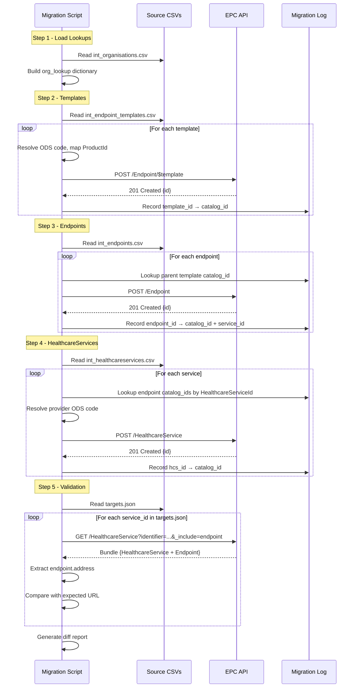

# Migration Process Design: int_ Tables → EPC → Validate via targets.json

## Objective

Populate the new Endpoint Catalogue (EPC) using data from the existing `int_` DynamoDB tables, then validate the migration by querying the EPC API to regenerate `targets.json` and comparing it against the original.

---

## Overview


---

## Pre-requisites

| Item | Description | Status |
|------|-------------|--------|
| EPC API available | Target environment (INT or DEV) accessible | Required |
| API credentials | Bearer token or OAuth2 client credentials | Required |
| Product ID mapping | Short codes (ygm04, AC0, etc.) → agreed Product IDs | Required |
| Organisation ODS lookup | `int_organisations.csv` loaded as in-memory map | Built from source data |
| Migration log store | Persistent map of `source_id → catalog_id` for cross-referencing between steps | Required |

---

## Step 1: Build the Organisation Lookup

**Input:** `int_organisations.csv`

**Action:** Load into memory as a dictionary keyed by `OrganisationId`.

```python
# Pseudocode
org_lookup = {}
for row in int_organisations:
    org_lookup[row.OrganisationId] = {
        "ods_code": row.ODSCode,
        "name": row.Name,
        "is_supplier": row.IsSupplierOnly,
        "active": row.Active
    }
```

**Output:** `org_lookup` dictionary — used by all subsequent steps to resolve UUIDs to ODS codes.

No API calls in this step.

---

## Step 2: Create Endpoint Templates

**Input:** `int_endpoint_templates.csv`

**Filter:** `DataStatus = 0` and `Address != "addressHere"` (exclude placeholders without real URLs)

**For each template row:**

1. Resolve `ManagingOrganisationId` → ODS code via `org_lookup`
2. Map `ProductId` → agreed Product ID (from mapping table)
3. Build FHIR Endpoint payload:

```json
{
  "resourceType": "Endpoint",
  "identifier": [{
    "system": "https://fhir.nhs.uk/id/product-id",
    "value": "{mapped_product_id}"
  }],
  "status": "active",
  "connectionType": {
    "coding": [{
      "system": "http://terminology.hl7.org/CodeSystem/endpoint-connection-type",
      "code": "hl7-fhir-rest",
      "display": "HL7 FHIR"
    }]
  },
  "payloadType": [{
    "coding": [{
      "system": "http://terminology.hl7.org/CodeSystem/endpoint-payload-type-epc",
      "code": "bars",
      "display": "BaRS"
    }]
  }],
  "managingOrganization": [{
    "identifier": {
      "system": "https://fhir.nhs.uk/Id/ods-organization-code",
      "value": "{ods_code}"
    }
  }],
  "address": "{template_address}",
  "header": "{public|private}"
}
```

4. Call: `POST /Endpoint/$template`
5. Record response: `{ source_template_id: response.id }` in migration log

**Output:** `template_log` — map of `TemplateId → EPC catalog_id`

---

## Step 3: Create Child Endpoints

**Input:** `int_endpoints.csv`

**Filter:** `DataStatus = 0`

**For each endpoint row:**

1. Look up `TemplateId` in `template_log` to get the parent's `catalog_id`
2. If template not found in log (e.g., because it had placeholder address), skip or flag for review
3. Map `Active` → status (`true` → `active`, `false` → `off`)
4. Build FHIR Endpoint payload:

```json
{
  "resourceType": "Endpoint",
  "identifier": [{
    "system": "https://fhir.nhs.uk/id/product-id",
    "value": "{mapped_product_id}"
  }],
  "extension": [{
    "url": "http://hl7.org",
    "valueReference": {
      "reference": "Endpoint/{template_catalog_id}",
      "display": "Parent Template Endpoint"
    }
  }],
  "status": "{active|off}",
  "period": {
    "start": "{start_date or migration_date}"
  }
}
```

   Include `period.end` only if `EndDate` is populated.

5. Call: `POST /Endpoint`
6. Record response: `{ source_endpoint_id: response.id, service_id: row.ServiceId, healthcare_service_id: row.HealthcareServiceId }` in migration log

**Output:** `endpoint_log` — map of `EndpointId → { catalog_id, service_id, healthcare_service_id }`

---

## Step 4: Create HealthcareServices

**Input:** `int_healthcareservices.csv`

**Filter:** `DataStatus = 0`

**For each healthcare service row:**

1. Resolve `ProviderOrganisationId` → ODS code via `org_lookup`
2. Find associated Endpoints: look up all entries in `endpoint_log` where `healthcare_service_id == row.HealthcareServiceId`
3. Build array of endpoint references from matched catalog_ids
4. Clean `Name` (strip surrounding quotes)
5. Build FHIR HealthcareService payload:

```json
{
  "resourceType": "HealthcareService",
  "identifier": [{
    "system": "https://fhir.nhs.uk/Id/dos-service-id",
    "value": "{service_id}"
  }],
  "active": true|false,
  "name": "{cleaned_name}",
  "providedBy": {
    "identifier": {
      "system": "https://fhir.nhs.uk/Id/ods-organization-code",
      "value": "{provider_ods_code}"
    }
  },
  "endpoint": [
    {"reference": "Endpoint/{catalog_id_1}"},
    {"reference": "Endpoint/{catalog_id_2}"}
  ]
}
```

6. Call: `POST /HealthcareService`
7. Record response: `{ source_hcs_id: response.id, service_id: row.ServiceId }` in migration log

**Output:** `hcs_log` — map of `HealthcareServiceId → { catalog_id, service_id }`

---

## Step 5: Validate — Rebuild targets.json from EPC

This is the acceptance test. Query the EPC the same way the BaRS proxy would, and reconstruct the service-to-URL mapping.

### 5a. Query the EPC for each service

For each DoS service ID in the original `targets.json`:

```
GET /HealthcareService?identifier=https://fhir.nhs.uk/Id/dos-service-id|{service_id}&_include=HealthcareService:endpoint
```

This returns the HealthcareService and its linked Endpoint(s). From the Endpoint, extract the `address` field (which is inherited from the parent Template).

### 5b. Build the reconstructed targets.json

```python
reconstructed = {}
for service_id in original_targets:
    response = epc_api.get(f"/HealthcareService?identifier=...{service_id}&_include=...")
    
    # Extract the HealthcareService
    hcs = find_resource(response, "HealthcareService")
    
    # Extract the linked Endpoint(s) — use the first active one
    endpoint = find_resource(response, "Endpoint", status="active")
    
    if endpoint:
        reconstructed[service_id] = endpoint.address
    else:
        reconstructed[service_id] = "NOT_FOUND"
```

### 5c. Compare against original

```python
original = load_json("targets.json")["https://fhir.nhs.uk/Id/dos-service-id"]
differences = []

for service_id, expected_url in original.items():
    actual_url = reconstructed.get(service_id)
    if not urls_match(expected_url, actual_url):  # case-insensitive compare
        differences.append({
            "service_id": service_id,
            "expected": expected_url,
            "actual": actual_url
        })

print(f"Total services: {len(original)}")
print(f"Matched: {len(original) - len(differences)}")
print(f"Mismatched: {len(differences)}")
```

### 5d. Success Criteria

| Metric | Target |
|--------|--------|
| Services with correct URL match (case-insensitive) | 100% |
| Services returning NOT_FOUND | 0 |
| Endpoint addresses matching expected URL | Exact match (case-insensitive) |

---

## Migration Log Schema

Each step produces a log entry. Store these persistently (JSON file or database) as they're needed for cross-referencing between steps.

```json
{
  "step": "template|endpoint|healthcareservice",
  "source_id": "uuid-from-int-table",
  "catalog_id": "uuid-from-epc-response",
  "service_id": "dos-service-id (if applicable)",
  "timestamp": "2026-07-20T10:00:00Z",
  "status": "success|error",
  "error_detail": "... (if failed)"
}
```

---

## Error Handling

| Error | Action |
|-------|--------|
| Template POST fails (409 conflict / duplicate) | Check if already exists by ProductId, log existing catalog_id, continue |
| Endpoint POST fails (parent template not found) | Log as skipped, flag for investigation |
| HealthcareService POST fails (no endpoint refs) | Create without endpoint array, log for manual linking |
| ODS code not found in org_lookup | Log warning, use placeholder or skip |
| API rate limit (429) | Backoff and retry with exponential delay |
| Validation: URL mismatch | Log as discrepancy, check case-sensitivity and trailing slashes |

---

## Execution Sequence Diagram



---

## Data Volumes & Estimates

| Resource | Count | API Calls |
|----------|-------|-----------|
| Endpoint Templates | ~50-100 (unique supplier/product combos) | ~100 POSTs |
| Endpoints | ~4,000-5,000 (one per service per template) | ~5,000 POSTs |
| HealthcareServices | ~4,000-5,000 (one per DoS service ID) | ~5,000 POSTs |
| Validation queries | ~4,000 (one per targets.json entry) | ~4,000 GETs |
| **Total API calls** | | **~14,000** |

At ~10 requests/second, estimated runtime: ~25 minutes.

---

## Key Decisions

| Decision | Choice | Rationale |
|----------|--------|-----------|
| Skip templates with `Address = "addressHere"` | Yes | No real URL = unusable in routing. Flag for supplier follow-up |
| Migrate inactive HealthcareServices | Yes | Preserves full state; can be reactivated later |
| URL comparison for validation | Case-insensitive, trailing-slash-tolerant | URLs in source data have inconsistent casing |
| Handle endpoints with no template match | Log and skip | Can't create child without parent |
| Multiple endpoints per HealthcareService | Include all active ones | Some services have multiple endpoints (e.g., different use cases) |

---

## Files & Outputs

| Artifact | Location | Purpose |
|----------|----------|---------|
| Migration script | TBD | Executes Steps 1-4 |
| Validation script | TBD | Executes Step 5 |
| Migration log | `migration-log.json` | Persistent source→catalog ID map |
| Validation report | `validation-report.json` | Diff between expected and actual |
| Reconstructed targets | `targets-reconstructed.json` | Rebuilt from EPC queries |
