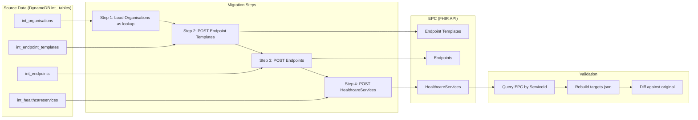
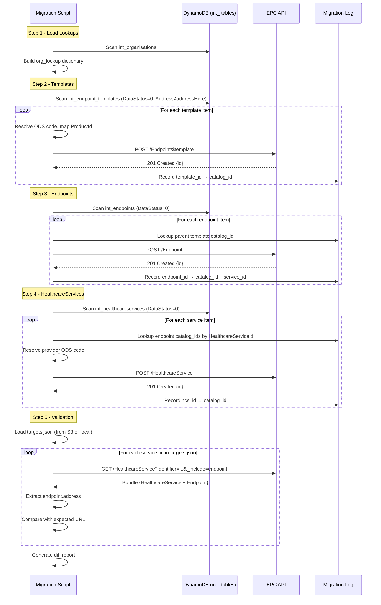

# Migration Process Design: int_ Tables → EPC → Validate via targets.json

## Objective

Populate the new Endpoint Catalogue (EPC) using data from the existing `int_` DynamoDB tables, then validate the migration by querying the EPC API to regenerate `targets.json` and comparing it against the original.

---

## Overview



---

## Pre-requisites

| Item | Description | Status |
|------|-------------|--------|
| EPC API available | Target environment (INT or DEV) accessible | Required |
| API credentials | Bearer token or OAuth2 client credentials for EPC API | Required |
| AWS access | IAM role/credentials with read access to the `int_` DynamoDB tables in the source account | Required |
| Product ID mapping | Short codes (ygm04, AC0, etc.) → agreed Product IDs | Required (see below) |
| Organisation ODS lookup | `int_organisations` DynamoDB table scanned into in-memory map | Built from source data |
| Migration log store | Persistent map of `source_id → catalog_id` for cross-referencing between steps | Required |

---

## Resolving ProductId (Short Code → EPC Product Identifier)

See the dedicated document: **[Resolving ProductId](./resolving-product-id.md)**

The `int_endpoint_templates` and `int_endpoints` tables store internal short codes in their `ProductId` field — e.g., `ygm04`, `8hk48`, `AC0`. These are opaque identifiers from the existing system that have no meaning in the EPC.

The EPC requires a formal Product Identifier (e.g., `CegedimPharmacyServices-v6.0`) that uniquely identifies the supplier's product and version. This is stored in the `identifier` field on Endpoint Templates and child Endpoints per IP002/IP003.

The resolution process:
1. Take the `ProductId` attribute from the source DynamoDB item
2. Look it up (case-insensitive) in the persistent `product-id-lookup.json` file
3. Return the agreed EPC Product Identifier to use in the FHIR payload

If the short code has no mapping, the record is skipped and logged. The R&M team must add the missing mapping to `product-id-lookup.json` before that record can be migrated.

The lookup file is shared across all processes (migration, delta, validation) and must be kept in sync with the [Product ID Mapping](./product-id-mapping.md) document.

---

## Step 1: Build the Organisation Lookup

**Source:** `int_organisations` DynamoDB table

**Action:** Scan the table and load into memory as a dictionary keyed by `OrganisationId`.

```python
# Pseudocode
import boto3

dynamodb = boto3.resource('dynamodb')
table = dynamodb.Table('int_organisations')

org_lookup = {}
response = table.scan()
for item in response['Items']:
    org_lookup[item['OrganisationId']] = {
        "ods_code": item.get('ODSCode', ''),
        "name": item.get('Name', ''),
        "is_supplier": item.get('IsSupplierOnly', False),
        "active": item.get('Active', False)
    }

# Handle pagination for large tables
while 'LastEvaluatedKey' in response:
    response = table.scan(ExclusiveStartKey=response['LastEvaluatedKey'])
    for item in response['Items']:
        org_lookup[item['OrganisationId']] = {
            "ods_code": item.get('ODSCode', ''),
            "name": item.get('Name', ''),
            "is_supplier": item.get('IsSupplierOnly', False),
            "active": item.get('Active', False)
        }
```

**Output:** `org_lookup` dictionary — used by all subsequent steps to resolve UUIDs to ODS codes.

No EPC API calls in this step.

---

## Step 2: Create Endpoint Templates

**Source:** `int_endpoint_templates` DynamoDB table

**Query:** Scan with `FilterExpression`: `DataStatus = 0 AND Address <> "addressHere"`

```python
table = dynamodb.Table('int_endpoint_templates')
response = table.scan(
    FilterExpression=Attr('DataStatus').eq(0) & Attr('Address').ne('addressHere')
)
```

**For each template row:**

1. Resolve `ManagingOrganisationId` → ODS code via `org_lookup`
2. Resolve `ProductId` → EPC Product Identifier via `PRODUCT_ID_MAP` (see "Resolving ProductId" section above). If the short code is unknown, log an error and skip.
3. Build FHIR Endpoint payload (see parameter table below)
4. Call: `POST /Endpoint/$template`
5. Record response: `{ source_template_id: response.id }` in migration log

### Payload Parameter Table

| FHIR Field | Example Value | Source | How to derive |
|------------|--------------|--------|---------------|
| `resourceType` | `"Endpoint"` | Static | Always `"Endpoint"` |
| `identifier[0].system` | `"https://fhir.nhs.uk/id/product-id"` | Static | Always this system URI |
| `identifier[0].value` | `"CegedimPharmacyServices-v6.0"` | `int_endpoint_templates.ProductId` → `PRODUCT_ID_MAP` | Take the `ProductId` attribute (e.g., `ygm04`), look it up in `PRODUCT_ID_MAP` to get the agreed EPC Product Identifier. Case-insensitive lookup recommended. If not found, skip and log. |
| `status` | `"active"` | Static | Always `"active"` for templates being migrated. Templates with `DataStatus != 0` are excluded by the filter. |
| `connectionType.coding[0].system` | `"http://terminology.hl7.org/CodeSystem/endpoint-connection-type"` | Static | Always this system URI. Note: some source items have `https://` — normalise to `http://`. |
| `connectionType.coding[0].code` | `"hl7-fhir-rest"` | `int_endpoint_templates.ConnectionType` | Source value is always `"BARS"` — map to `"hl7-fhir-rest"` (the FHIR standard code for REST endpoints). |
| `connectionType.coding[0].display` | `"HL7 FHIR"` | Static | Always `"HL7 FHIR"` |
| `payloadType[0].coding[0].system` | `"http://terminology.hl7.org/CodeSystem/endpoint-payload-type-epc"` | Static | Always this system URI |
| `payloadType[0].coding[0].code` | `"bars"` | `int_endpoint_templates.ConnectionType` | Source value is always `"BARS"` — map to lowercase `"bars"` for the payload type code. |
| `payloadType[0].coding[0].display` | `"BaRS"` | Static | Always `"BaRS"` |
| `managingOrganization[0].identifier.system` | `"https://fhir.nhs.uk/Id/ods-organization-code"` | Static | Always this system URI |
| `managingOrganization[0].identifier.value` | `"RK5"` | `int_endpoint_templates.ManagingOrganisationId` → `int_organisations.ODSCode` | Take the `ManagingOrganisationId` UUID, look it up in `org_lookup` (built from `int_organisations` table in Step 1). Return the `ODSCode` value. If not found, log error and skip. |
| `address` | `"https://bars-prod-rk5.nervecentre.thirdparty.nhs.uk"` | `int_endpoint_templates.Address` | Direct copy from the `Address` attribute. Must be a valid URL (items with `"addressHere"` are excluded by the filter). Ensure `https://` prefix is present — some source items omit the scheme. |
| `header` | `"public"` | `int_endpoint_templates.IsPrivate` | Map boolean: `false` → `"public"`, `true` → `"private"`. This controls visibility in the catalogue. |

### Example payload (built from source data)

Source row:
```
TemplateId:              c45831fe-f701-433d-abdf-9d91858f705b
ProductId:              RK5
Address:                bars-prod-rk5.nervecentre.thirdparty.nhs.uk
ConnectionSystem:       http://terminology.hl7.org/CodeSystem/endpoint-connection-type
ConnectionType:         BARS
IsPrivate:              false
ManagingOrganisationId: 21b2d67e-0323-4064-8246-118a635d20e9
Name:                   Sherwood Forest Hospitals
```

Resolved values:
- `ProductId "RK5"` → PRODUCT_ID_MAP → `"NervecentreBaRS-v9.2"`
- `ManagingOrganisationId "21b2d67e-..."` → org_lookup → ODSCode `"RK5"`
- `Address` → prepend `https://` → `"https://bars-prod-rk5.nervecentre.thirdparty.nhs.uk"`
- `IsPrivate false` → `"public"`
- `ConnectionType "BARS"` → connectionType code `"hl7-fhir-rest"`, payloadType code `"bars"`

Built payload:
```json
{
  "resourceType": "Endpoint",
  "identifier": [{
    "system": "https://fhir.nhs.uk/id/product-id",
    "value": "NervecentreBaRS-v9.2"
  }],
  "status": "active",
  "connectionType": {
    "coding": [{
      "system": "http://terminology.hl7.org/CodeSystem/endpoint-connection-type",
      "code": "hl7-fhir-rest",
      "display": "HL7 FHIR"
    }]
  },
  "payloadType": [{
    "coding": [{
      "system": "http://terminology.hl7.org/CodeSystem/endpoint-payload-type-epc",
      "code": "bars",
      "display": "BaRS"
    }]
  }],
  "managingOrganization": [{
    "identifier": {
      "system": "https://fhir.nhs.uk/Id/ods-organization-code",
      "value": "RK5"
    }
  }],
  "address": "https://bars-prod-rk5.nervecentre.thirdparty.nhs.uk",
  "header": "public"
}
```

**Output:** `template_log` — map of `TemplateId → { catalog_id, product_id }`

---

## Step 3: Create Child Endpoints

**Source:** `int_endpoints` DynamoDB table

**Query:** Scan with `FilterExpression`: `DataStatus = 0`

```python
table = dynamodb.Table('int_endpoints')
response = table.scan(
    FilterExpression=Attr('DataStatus').eq(0)
)
```

**For each endpoint row:**

1. Look up `TemplateId` in `template_log` to get the parent's `catalog_id`
2. If template not found in log (e.g., because it had placeholder address), skip or flag for review
3. Map `Active` → status (`true` → `active`, `false` → `off`)
4. Build FHIR Endpoint payload (see parameter table below)
5. Call: `POST /Endpoint`
6. Record response: `{ source_endpoint_id: response.id, service_id: row.ServiceId, healthcare_service_id: row.HealthcareServiceId }` in migration log

### Payload Parameter Table

| FHIR Field | Example Value | Source | How to derive |
|------------|--------------|--------|---------------|
| `resourceType` | `"Endpoint"` | Static | Always `"Endpoint"` |
| `identifier[0].system` | `"https://fhir.nhs.uk/id/product-id"` | Static | Always this system URI |
| `identifier[0].value` | `"CegedimPharmacyServices-v6.0"` | Copied from parent Template | Use the same Product ID value that was resolved for the parent Template in Step 2. No separate lookup required — copy from the Template payload already built for this TemplateId. |
| `extension[0].url` | `"http://hl7.org"` | Static | Always this URL — identifies the "basedOn" extension linking child to parent Template. |
| `extension[0].valueReference.reference` | `"Endpoint/5fce3e6a-ba37-4289-84d1-cc3ebdb992f5"` | `int_endpoints.TemplateId` → `template_log` | Take the `TemplateId` UUID from the source item. Look it up in `template_log` (output of Step 2) to get the EPC `catalog_id`. Format as `"Endpoint/{catalog_id}"`. If not found in log, skip this record. |
| `extension[0].valueReference.display` | `"Parent Template Endpoint"` | Static | Always `"Parent Template Endpoint"` |
| `status` | `"active"` | `int_endpoints.Active` | Map boolean: `true` → `"active"`, `false` → `"off"`. If `Active` is `true` but `EndDate` is in the past, consider setting to `"off"`. |
| `period.start` | `"2026-06-01T16:04:05.168Z"` | `int_endpoints.StartDate` | Direct copy from `StartDate` attribute (ISO 8601 format). If empty/null, use the migration execution date as a fallback (e.g., `"2026-07-20T00:00:00Z"`). |
| `period.end` | `"2026-04-22T15:40:17.423Z"` | `int_endpoints.EndDate` | Direct copy from `EndDate` attribute. **Only include this field if EndDate is populated.** If empty, omit entirely (open-ended period). |

### Fields NOT included in child Endpoint payload

These fields are inherited from the parent Template at read time — do NOT include them:

| Field | Reason |
|-------|--------|
| `address` | Inherited from parent Template |
| `connectionType` | Inherited from parent Template |
| `payloadType` | Inherited from parent Template |
| `managingOrganization` | Inherited from parent Template |
| `name` | Inherited from parent Template |
| `header` | Inherited from parent Template |

### Example payload (built from source data)

Source row:
```
EndpointId:             16c8e0f4-538b-4d13-80e0-dbec070ddbcf
Active:                 true
StartDate:              2026-06-01T16:04:05.168Z
EndDate:                (empty)
TemplateId:             26a1070e-c4d3-4ad3-887d-e63635497bd5
HealthcareServiceId:    3adc94a9-9d60-48d5-8d0f-d321854f023e
ManagingOrganisationId: 2f594ac5-6bc8-4241-af41-ae0f92b88949
ProductId:              ygm04
ServiceId:              2000114950
```

Resolved values:
- `TemplateId "26a1070e-..."` → template_log → catalog_id `"5fce3e6a-ba37-4289-84d1-cc3ebdb992f5"`, Product ID `"CegedimPharmacyServices-v6.0"`
- `Active true` → `"active"`
- `StartDate` → direct copy
- `EndDate` empty → omit `period.end`

Built payload:
```json
{
  "resourceType": "Endpoint",
  "identifier": [{
    "system": "https://fhir.nhs.uk/id/product-id",
    "value": "CegedimPharmacyServices-v6.0"
  }],
  "extension": [{
    "url": "http://hl7.org",
    "valueReference": {
      "reference": "Endpoint/5fce3e6a-ba37-4289-84d1-cc3ebdb992f5",
      "display": "Parent Template Endpoint"
    }
  }],
  "status": "active",
  "period": {
    "start": "2026-06-01T16:04:05.168Z"
  }
}
```

**Output:** `endpoint_log` — map of `EndpointId → { catalog_id, service_id, healthcare_service_id }`

---

## Step 4: Create HealthcareServices

**Source:** `int_healthcareservices` DynamoDB table

**Query:** Scan with `FilterExpression`: `DataStatus = 0`

```python
table = dynamodb.Table('int_healthcareservices')
response = table.scan(
    FilterExpression=Attr('DataStatus').eq(0)
)
```

**For each healthcare service row:**

1. Resolve `ProviderOrganisationId` → ODS code via `org_lookup`
2. Find associated Endpoints: look up all entries in `endpoint_log` where `healthcare_service_id == row.HealthcareServiceId`
3. Build array of endpoint references from matched catalog_ids
4. Clean `Name` (strip surrounding quotes)
5. Build FHIR HealthcareService payload (see parameter table below)
6. Call: `POST /HealthcareService`
7. Record response: `{ source_hcs_id: response.id, service_id: row.ServiceId }` in migration log

### Payload Parameter Table

| FHIR Field | Example Value | Source | How to derive |
|------------|--------------|--------|---------------|
| `resourceType` | `"HealthcareService"` | Static | Always `"HealthcareService"` |
| `meta.profile[0]` | `"https://fhir.hl7.org.uk/StructureDefinition/UKCore-HealthcareService"` | Static | Always this profile URI |
| `identifier[0].system` | `"https://fhir.nhs.uk/Id/dos-service-id"` | `int_healthcareservices.ServiceIdType` | The source attribute contains `"https://fhir.nhs.uk/id/service-id"` (lowercase). Normalise to `"https://fhir.nhs.uk/Id/dos-service-id"` — this is the canonical system the BaRS proxy uses to query. |
| `identifier[0].value` | `"2000023201"` | `int_healthcareservices.ServiceId` | Direct copy from `ServiceId` attribute. This is the DoS service identifier (numeric string). |
| `active` | `true` | `int_healthcareservices.Active` | Direct copy of boolean value (`true` or `false`). Note: many records are `false` — still migrate them as inactive services in the catalogue. |
| `name` | `"Pharm+: Victoria Pharmacy Golders Green, Barnet, London"` | `int_healthcareservices.Name` | Copy from `Name` attribute. **Strip surrounding triple-quotes** — source data sometimes wraps names in `"""..."""`. Apply: `name.strip('"')` or regex to remove leading/trailing quote characters. |
| `providedBy.identifier.system` | `"https://fhir.nhs.uk/Id/ods-organization-code"` | Static | Always this system URI |
| `providedBy.identifier.value` | `"FLG23"` | `int_healthcareservices.ProviderOrganisationId` → `org_lookup` | Take the `ProviderOrganisationId` UUID, look it up in `org_lookup` (built in Step 1). Return the `ODSCode` value. This is the **provider** organisation (pharmacy, hospital, etc.) — NOT the supplier. If not found, log warning and use empty string or skip. |
| `endpoint[]` | `[{"reference": "Endpoint/abc123..."}]` | `endpoint_log` (from Step 3) | Query `endpoint_log` for all entries where `healthcare_service_id` matches the current row's `HealthcareServiceId`. For each match, build a reference object: `{"reference": "Endpoint/{catalog_id}"}`. If no matches found, set to empty array `[]` and log a warning. |

### How endpoint association works

The link between a HealthcareService and its Endpoints is resolved via the `endpoint_log` from Step 3:

```
int_healthcareservices.HealthcareServiceId
    ↕ matches
int_endpoints.HealthcareServiceId (recorded in endpoint_log as healthcare_service_id)
    → endpoint_log.catalog_id
    → "Endpoint/{catalog_id}"
```

A single HealthcareService may have zero, one, or multiple associated Endpoints (e.g., if it has been re-onboarded to a new supplier, or supports multiple use cases).

### Example payload (built from source data)

Source row:
```
HealthcareServiceId:    e79e7a8a-eb25-4939-8635-56d43e71f292
ServiceId:              2000023201
Active:                 false
Name:                   """Pharm+: Victoria Pharmacy Golders Green, Barnet, London"""
ProviderOrganisationId: 281b316c-3a38-41dc-8d52-12c55e4c72a5
ServiceIdType:          https://fhir.nhs.uk/id/service-id
```

Resolved values:
- `ProviderOrganisationId "281b316c-..."` → org_lookup → ODSCode `"FLG23"`
- `ServiceIdType` → normalised to `"https://fhir.nhs.uk/Id/dos-service-id"`
- `Name` → strip quotes → `"Pharm+: Victoria Pharmacy Golders Green, Barnet, London"`
- `HealthcareServiceId "e79e7a8a-..."` → search endpoint_log → found 1 match with catalog_id `"0cb21027-a246-43e6-9c7a-35b17163eab1"`

Built payload:
```json
{
  "resourceType": "HealthcareService",
  "meta": {
    "profile": ["https://fhir.hl7.org.uk/StructureDefinition/UKCore-HealthcareService"]
  },
  "identifier": [{
    "system": "https://fhir.nhs.uk/Id/dos-service-id",
    "value": "2000023201"
  }],
  "active": false,
  "name": "Pharm+: Victoria Pharmacy Golders Green, Barnet, London",
  "providedBy": {
    "identifier": {
      "system": "https://fhir.nhs.uk/Id/ods-organization-code",
      "value": "FLG23"
    }
  },
  "endpoint": [
    {"reference": "Endpoint/0cb21027-a246-43e6-9c7a-35b17163eab1"}
  ]
}
```

**Output:** `hcs_log` — map of `HealthcareServiceId → { catalog_id, service_id }`

---

## Step 5: Validate — Rebuild targets.json from EPC

This is the acceptance test. Query the EPC the same way the BaRS proxy would, and reconstruct the service-to-URL mapping.

### 5a. Query the EPC for each service

For each DoS service ID in the original `targets.json`:

```
GET /HealthcareService?identifier=https://fhir.nhs.uk/Id/dos-service-id|{service_id}&_include=HealthcareService:endpoint
```

This returns the HealthcareService and its linked Endpoint(s). From the Endpoint, extract the `address` field (which is inherited from the parent Template).

### 5b. Build the reconstructed targets.json

```python
reconstructed = {}
for service_id in original_targets:
    response = epc_api.get(f"/HealthcareService?identifier=...{service_id}&_include=...")
    
    # Extract the HealthcareService
    hcs = find_resource(response, "HealthcareService")
    
    # Extract the linked Endpoint(s) — use the first active one
    endpoint = find_resource(response, "Endpoint", status="active")
    
    if endpoint:
        reconstructed[service_id] = endpoint.address
    else:
        reconstructed[service_id] = "NOT_FOUND"
```

### 5c. Compare against original

```python
original = load_json("targets.json")["https://fhir.nhs.uk/Id/dos-service-id"]
differences = []

for service_id, expected_url in original.items():
    actual_url = reconstructed.get(service_id)
    if not urls_match(expected_url, actual_url):  # case-insensitive compare
        differences.append({
            "service_id": service_id,
            "expected": expected_url,
            "actual": actual_url
        })

print(f"Total services: {len(original)}")
print(f"Matched: {len(original) - len(differences)}")
print(f"Mismatched: {len(differences)}")
```

### 5d. Success Criteria

| Metric | Target |
|--------|--------|
| Services with correct URL match (case-insensitive) | 100% |
| Services returning NOT_FOUND | 0 |
| Endpoint addresses matching expected URL | Exact match (case-insensitive) |

---

## Migration Log Schema

Each step produces a log entry. Store these persistently (JSON file or database) as they're needed for cross-referencing between steps.

```json
{
  "step": "template|endpoint|healthcareservice",
  "source_id": "uuid-from-int-table",
  "catalog_id": "uuid-from-epc-response",
  "service_id": "dos-service-id (if applicable)",
  "timestamp": "2026-07-20T10:00:00Z",
  "status": "success|error",
  "error_detail": "... (if failed)"
}
```

---

## Error Handling

| Error | Action |
|-------|--------|
| **ProductId not in PRODUCT_ID_MAP** | Log as unmapped, skip record, add to "needs mapping" report |
| Template POST fails (409 conflict / duplicate) | Check if already exists by ProductId, log existing catalog_id, continue |
| Endpoint POST fails (parent template not found) | Log as skipped, flag for investigation |
| HealthcareService POST fails (no endpoint refs) | Create without endpoint array, log for manual linking |
| ODS code not found in org_lookup | Log warning, use placeholder or skip |
| API rate limit (429) | Backoff and retry with exponential delay |
| Validation: URL mismatch | Log as discrepancy, check case-sensitivity and trailing slashes |

---

## Execution Sequence Diagram



---

## Data Volumes & Estimates

| Resource | Count | API Calls |
|----------|-------|-----------|
| DynamoDB scans (source) | 4 tables | 4 scans (paginated) |
| Endpoint Templates | ~50-100 (unique supplier/product combos) | ~100 POSTs |
| Endpoints | ~4,000-5,000 (one per service per template) | ~5,000 POSTs |
| HealthcareServices | ~4,000-5,000 (one per DoS service ID) | ~5,000 POSTs |
| Validation queries | ~4,000 (one per targets.json entry) | ~4,000 GETs |
| **Total EPC API calls** | | **~14,000** |

At ~10 requests/second, estimated EPC API runtime: ~25 minutes.
DynamoDB scans are fast (~seconds for tables of this size).

---

## Key Decisions

| Decision                                      | Choice                                    | Rationale                                                         |
| -----------------------------------------------| -------------------------------------------| -------------------------------------------------------------------|
| Skip templates with `Address = "addressHere"` | Yes                                       | No real URL = unusable in routing. Flag for supplier follow-up    |
| Migrate inactive HealthcareServices           | Yes                                       | Preserves full state; can be reactivated later                    |
| URL comparison for validation                 | Case-insensitive, trailing-slash-tolerant | URLs in source data have inconsistent casing                      |
| Handle endpoints with no template match       | Log and skip                              | Can't create child without parent                                 |
| Multiple endpoints per HealthcareService      | Include all active ones                   | Some services have multiple endpoints (e.g., different use cases) |

---

## Files & Outputs

| Artifact              | Location                     | Purpose                          |
| -----------------------| ------------------------------| ----------------------------------|
| Migration script      | TBD                          | Executes Steps 1-4               |
| Validation script     | TBD                          | Executes Step 5                  |
| Migration log         | `migration-log.json`         | Persistent source→catalog ID map |
| Validation report     | `validation-report.json`     | Diff between expected and actual |
| Reconstructed targets | `targets-reconstructed.json` | Rebuilt from EPC queries         |
