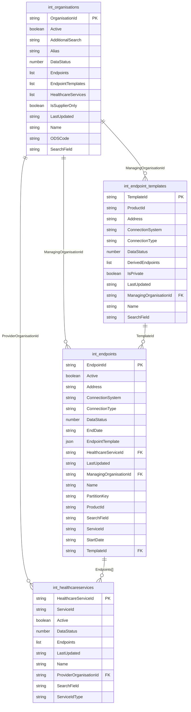
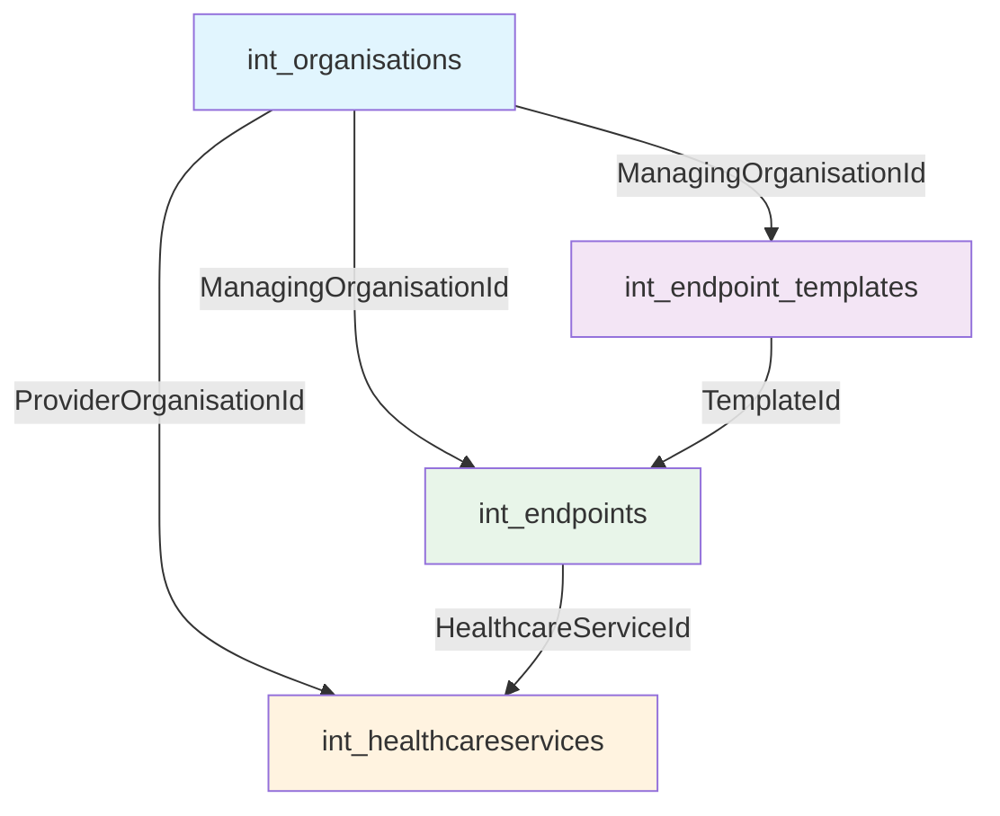

# int_ Tables Relationship Map

## Entity Relationship Diagram

## Relationship Summary

---

## Field-Level Relationship Detail

### Relationship: int_organisations → int_endpoint_templates

| Parent Table | Parent Field | Child Table | Child Field | Cardinality | Notes |
|---|---|---|---|---|---|
| int_organisations | OrganisationId | int_endpoint_templates | ManagingOrganisationId | 1:many | The supplier organisation that owns the template |
| int_organisations | EndpointTemplates[] | int_endpoint_templates | TemplateId | 1:many | Denormalised list on the org side (references back) |

### Relationship: int_organisations → int_endpoints

| Parent Table | Parent Field | Child Table | Child Field | Cardinality | Notes |
|---|---|---|---|---|---|
| int_organisations | OrganisationId | int_endpoints | ManagingOrganisationId | 1:many | The supplier organisation that manages this endpoint |
| int_organisations | Endpoints[] | int_endpoints | EndpointId | 1:many | Denormalised list on the org side (references back) |

### Relationship: int_organisations → int_healthcareservices

| Parent Table | Parent Field | Child Table | Child Field | Cardinality | Notes |
|---|---|---|---|---|---|
| int_organisations | OrganisationId | int_healthcareservices | ProviderOrganisationId | 1:many | The **provider** organisation (pharmacy/hospital) delivering the service |
| int_organisations | HealthcareServices[] | int_healthcareservices | HealthcareServiceId | 1:many | Denormalised list on the org side (references back) |

### Relationship: int_endpoint_templates → int_endpoints

| Parent Table | Parent Field | Child Table | Child Field | Cardinality | Notes |
|---|---|---|---|---|---|
| int_endpoint_templates | TemplateId | int_endpoints | TemplateId | 1:many | Endpoint inherits config from its template |
| int_endpoint_templates | DerivedEndpoints[] | int_endpoints | EndpointId | 1:many | Denormalised list on the template side (references back) |

### Relationship: int_endpoints → int_healthcareservices

| Parent Table | Parent Field | Child Table | Child Field | Cardinality | Notes |
|---|---|---|---|---|---|
| int_endpoints | HealthcareServiceId | int_healthcareservices | HealthcareServiceId | many:1 | Each endpoint is assigned to one healthcare service |
| int_healthcareservices | Endpoints[] | int_endpoints | EndpointId | 1:many | Denormalised list on the HCS side (a service can have multiple endpoints) |

---

## Table Schemas

### int_organisations

| Field | Type | PK/FK | Description |
|-------|------|-------|-------------|
| OrganisationId | String (UUID) | PK | Unique identifier |
| Active | Boolean | | Whether org is active |
| AdditionalSearch | String | | Free-text search context |
| Alias | String | | Short name |
| DataStatus | Number | | 0 = normal |
| Endpoints | List (UUID[]) | FK→int_endpoints | Denormalised refs to child endpoints |
| EndpointTemplates | List (UUID[]) | FK→int_endpoint_templates | Denormalised refs to child templates |
| HealthcareServices | List (UUID[]) | FK→int_healthcareservices | Denormalised refs to child services |
| IsSupplierOnly | Boolean | | true = system supplier (not a care provider) |
| LastUpdated | String (ISO 8601) | | Last modification |
| Name | String | | Full name |
| ODSCode | String | | ODS identifier (e.g., FLG23, RK5) |
| SearchField | String | | Concatenated search index |

### int_endpoint_templates

| Field | Type | PK/FK | Description |
|-------|------|-------|-------------|
| TemplateId | String (UUID) | PK | Unique identifier |
| ProductId | String | | Supplier product code (e.g., ygm04, AC0, RK5) |
| Address | String | | Base URL for the endpoint (or "addressHere" placeholder) |
| ConnectionSystem | String | | Code system for connection type |
| ConnectionType | String | | Always "BARS" |
| DataStatus | Number | | 0 = normal |
| DerivedEndpoints | List (UUID[]) | FK→int_endpoints | Endpoints created from this template |
| IsPrivate | Boolean | | Whether template is private |
| LastUpdated | String (ISO 8601) | | Last modification |
| ManagingOrganisationId | String (UUID) | FK→int_organisations | Supplier org that owns this template |
| Name | String | | Display name |
| SearchField | String | | Concatenated search index |

### int_endpoints

| Field | Type | PK/FK | Description |
|-------|------|-------|-------------|
| EndpointId | String (UUID) | PK | Unique identifier |
| Active | Boolean | | Whether endpoint is active |
| Address | String | | The FHIR base URL for the receiver (or "addressHere" placeholder) |
| ConnectionSystem | String | | Code system for connection type |
| ConnectionType | String | | Always "BARS" |
| DataStatus | Number | | 0 = normal |
| EndDate | String (ISO 8601) | | When endpoint was deactivated (empty if active) |
| EndpointTemplate | JSON | | Embedded copy of the template data (denormalised snapshot) |
| HealthcareServiceId | String (UUID) | FK→int_healthcareservices | The service this endpoint belongs to |
| LastUpdated | String (ISO 8601) | | Last modification |
| ManagingOrganisationId | String (UUID) | FK→int_organisations | Supplier org managing this endpoint |
| Name | String | | Supplier display name |
| PartitionKey | String | | DynamoDB partition key (always "ALL") |
| ProductId | String | | Supplier product code |
| SearchField | String | | Concatenated search index |
| ServiceId | String | | The DoS service ID (numeric string) |
| StartDate | String (ISO 8601) | | When endpoint was activated |
| TemplateId | String (UUID) | FK→int_endpoint_templates | Template this endpoint was derived from |

### int_healthcareservices

| Field | Type | PK/FK | Description |
|-------|------|-------|-------------|
| HealthcareServiceId | String (UUID) | PK | Unique identifier |
| ServiceId | String | | DoS service ID (numeric string, e.g., "2000023201") |
| Active | Boolean | | Whether service is active |
| DataStatus | Number | | 0 = normal |
| Endpoints | List (UUID[]) | FK→int_endpoints | Denormalised refs to assigned endpoints |
| LastUpdated | String (ISO 8601) | | Last modification |
| Name | String | | Human-readable service name |
| ProviderOrganisationId | String (UUID) | FK→int_organisations | Provider org delivering this service |
| SearchField | String | | Concatenated search index |
| ServiceIdType | String | | Identifier system (always "https://fhir.nhs.uk/id/service-id") |

---

## Key Observations

1. **Denormalised references**: All relationships are stored in both directions. The parent has a list of child IDs, and the child has the parent's ID as a foreign key. This is typical DynamoDB design for query flexibility.

2. **Two types of Organisation**: `IsSupplierOnly = true` means it's a software supplier (e.g., Cegedim, EMIS). `IsSupplierOnly = false` means it's a care provider (e.g., a pharmacy). Templates and Endpoints reference the *supplier*, while HealthcareServices reference the *provider*.

3. **Template → Endpoint inheritance**: A template defines the base configuration (URL, product, supplier). Each endpoint is derived from a template and assigned to a specific HealthcareService (i.e., a specific site/location).

4. **ServiceId bridging**: The `ServiceId` field appears in both `int_endpoints` and `int_healthcareservices`, providing a secondary join path via DoS service ID. This is the same ID used in `targets.json`.
