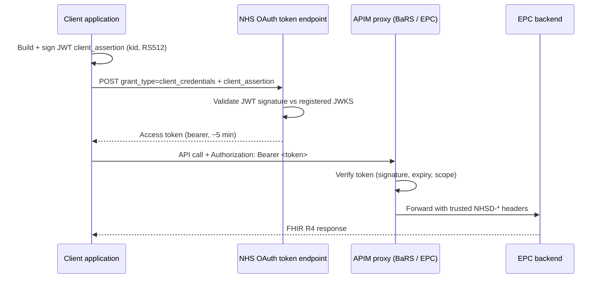

# BaRS EPC — API Token Authentication (OAuth)

## Overview

This document describes how a **client application connected to an NHS APIM proxy**
authenticates to obtain the OAuth 2.0 **access token** used to call the API. It covers the
application-restricted **signed-JWT** flow (system-to-system) and, for EPC, the
user-restricted **CIS2** flow.

This is distinct from two other mechanisms documented elsewhere:

- **mTLS** ([mtls-certificates.md](./mtls-certificates.md)) is the *transport-layer* mutual
  authentication between the proxies and the backend — a different layer from the OAuth
  bearer token described here.
- **Proxygen** authentication (see `proxygen/`) is how the *team's tooling* authenticates to
  the NHS Proxy Generator control-plane to **deploy** the EPC proxy — it is not a consumer
  flow and is out of scope here.

See also [bars-proxy-to-epc-proxy-chaining.md](./bars-proxy-to-epc-proxy-chaining.md) for
the proxy-to-proxy connection model.

## Access modes

| Proxy | Application-restricted (signed JWT) | User-restricted (CIS2) |
|-------|-------------------------------------|------------------------|
| BaRS Proxy | ✅ (only mode) | ❌ (CIS2 not applicable to messaging) |
| EPC Proxy | ✅ | ✅ (administrative operations with a human user) |

## Application-restricted access (signed JWT)

Used for system-to-system operations (reads and automated writes). The application proves
its identity with a short-lived JWT it signs with a private key whose public key is
registered with APIM. This follows the NHS England guide
[Application-restricted RESTful APIs — signed JWT authentication](https://digital.nhs.uk/developer/guides-and-documentation/security-and-authorisation/application-restricted-restful-apis-signed-jwt-authentication#step-1-register-your-application-on-the-api-platform).

**Flow**

1. **Register** the application in the NHS API developer portal and **upload its public key
   as a JWKS** (`{"keys":[…]}`) so Apigee can validate the signed JWT.
2. **Build and sign a short-lived JWT** (the `client_assertion`):
   - Header: `kid` (identifies the registered key), `alg: RS512`.
   - Claims: `sub` = `iss` = the application's client ID; `jti` = unique UUID; `aud` = the
     environment's NHS OAuth 2.0 token endpoint; `exp` = now + ~5 minutes.
3. **POST to the NHS OAuth 2.0 token endpoint** with:
   - `grant_type=client_credentials`
   - `client_assertion_type=urn:ietf:params:oauth:client-assertion-type:jwt-bearer`
   - `client_assertion=<signed JWT>`
4. Receive the **OAuth access token** and send it on API calls as
   `Authorization: Bearer <token>`.

**Notes**

- The public key **must** be registered as a **JWKS**. A bare single JWK is rejected by
  Apigee with `401 steps.jwt.InvalidKeyConfiguration`.
- Access-token lifetime is short (~5–10 minutes) and tokens **cannot be individually
  revoked**.
- Scopes are assigned at registration: `read`, `read write`, or `read write admin`. The
  APIM product scope has the form `urn:nhsd:apim:app:level3:<service-name>` (e.g.
  `urn:nhsd:apim:app:level3:booking-and-referral` for BaRS).

## User-restricted access (CIS2) — EPC only

For administrative operations where a human user is present, EPC also supports
user-restricted access via **NHS CIS2**. This flow is still at design stage (open questions
remain on CIS2 reach for non-NHS suppliers, role mapping, and whether some writes are
CIS2-only) and is not yet wired up.

## Worked example — BaRS Proxy → EPC (`epc-bars-proxy` application)

The concrete app-restricted flow currently used by the BaRS Proxy to call the Endpoint
Catalogue:

- **Application:** `epc-bars-proxy`
- **Signing:** RS512, key ID `kid = test-1`, token TTL 300s. Audience = the environment
  OAuth token endpoint.
- **Keys:** RSA-4096 **test** key pair (test environments only). Private key held in AWS
  Secrets Manager (`epc-bars-proxy-signing-key-ptl` → `private_jwk`); the public key is
  registered with APIM as a **JWKS**. One PTL key pair covers internal-dev / int / sandbox;
  Production gets its own later.
- **Phase 1 (current, internal-dev / int):** the proxy calls EPC **directly at the AWS API
  Gateway `execute-api` URL** using the OAuth app-restricted signed JWT — **not** mTLS, with
  no Apigee EPC Proxy in between.
- **Phase 2 (target / prod):** proxy → EPC Proxy (Apigee) over **mTLS** — mechanism to be
  confirmed with APIM/Platform.

## Two-layer enforcement (design)

1. The **proxy (Apigee)** validates the token's signature, expiry, audience, and key
   registration, then forwards trusted `NHSD-*` claim headers.
2. The **EPC backend** additionally checks the caller's ODS code against the token's ODS
   claim (spoof check → `403 SEND_FORBIDDEN`), RBAC, resource ownership, and Product-ID
   match.

## Open items / to confirm

- **Consumer token-endpoint URL** is not pinned in the repo — docs refer generically to
  "the environment's NHS England OAuth 2.0 token endpoint" (NHS platform convention is
  `https://<env>.api.service.nhs.uk/oauth2/token`, but the concrete value is not committed).
- **Production `client_id` / `kid`** for `epc-bars-proxy` are not yet provisioned; only the
  PTL test material exists (`kid = test-1` is **test-only**).
- **Phase 2 BaRS→EPC mechanism** (mTLS via EPC Proxy) is pending APIM/Platform confirmation.
- **EPC CIS2 user-restricted flow** is design-stage (see open questions above).
