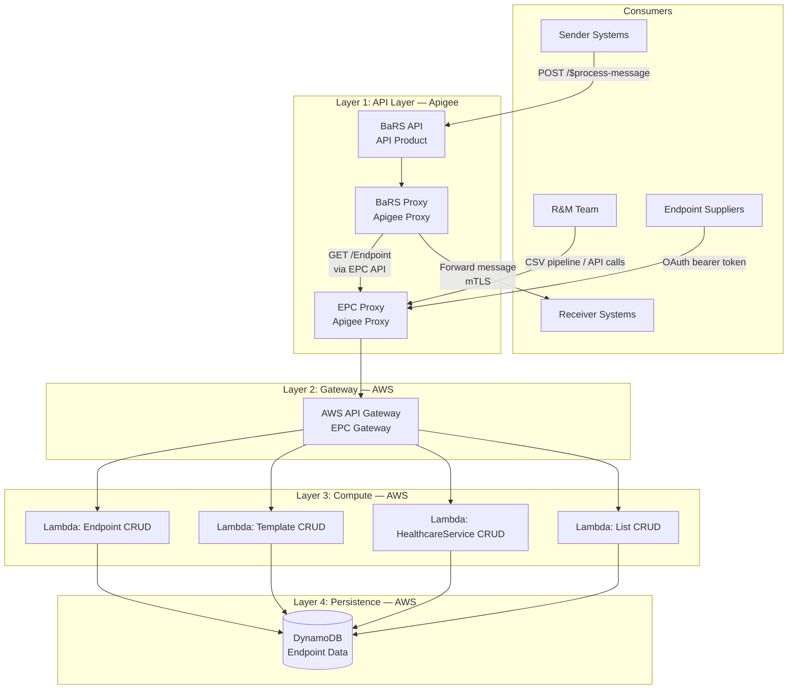
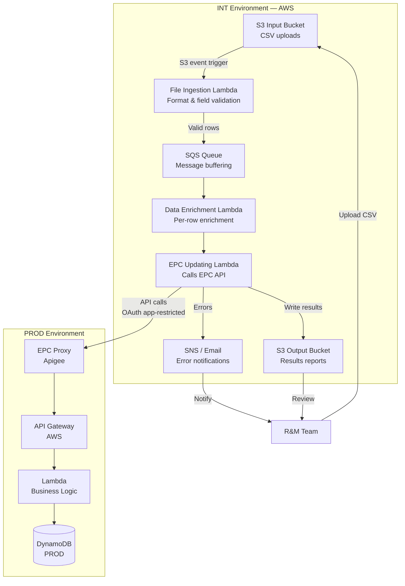
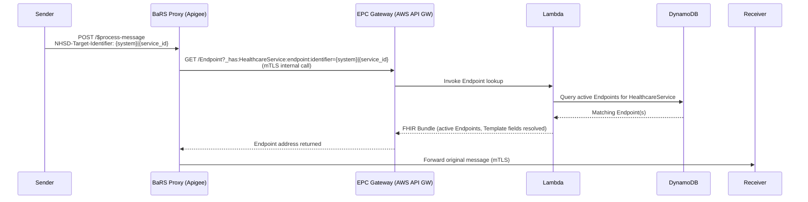
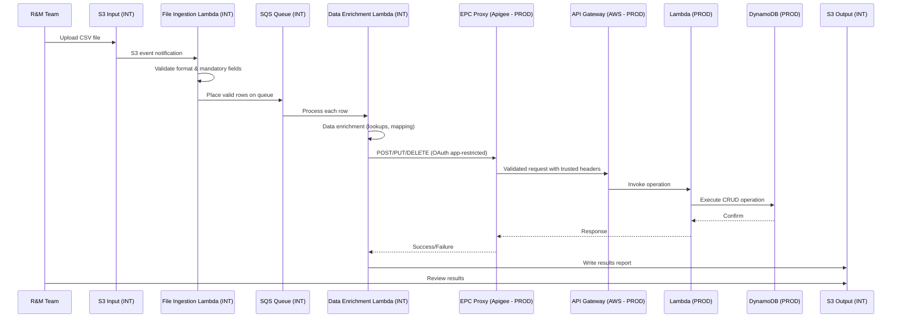

# BaRS Endpoint Catalogue — Architecture Document

## 1 Purpose

This document describes the technical architecture of the BaRS Endpoint Catalogue (EPC), including the deployment topology, component responsibilities, environment strategy, and how the Interim Tactical Solution relates to the production Endpoint Catalogue.

---

## 2 System Overview

The Endpoint Catalogue is a serverless, event-driven platform that provides centralised management and lookup of digital endpoints used for routing BaRS (Booking and Referral Standard) messages across NHS services. It replaces the legacy `targets.json` flat-file routing mechanism with a FHIR R4 API-first approach.

The system comprises two logically distinct capabilities:

1. **Endpoint Catalogue (Production)** — the real-time API for querying and managing endpoint data, consumed by the BaRS Proxy at runtime and administered by the R&M team
2. **EPC Updation Interim Tactical Solution (Integration)** — a batch ingestion pipeline for processing CSV files that enables the R&M team to perform daily operations (supplier switches, onboarding) while RBAC and self-service capabilities are deferred

---

## 3 Environment Strategy

| Component | Environment | Purpose |
|-----------|-------------|---------|
| **Endpoint Catalogue** (API Gateway + Lambda + DynamoDB) | **PROD** (AWS BaRS workload account) | Live endpoint resolution for BaRS Proxy; production data store |
| **EPC Updation Interim Tactical Solution** (S3 + Lambda pipeline) | **INT** (AWS BaRS workload account) | Batch processing of CSV uploads; calls through to the EPC API in PROD |
| **BaRS Proxy** | **PROD** (Apigee) | Runtime message routing — resolves endpoints via EPC |
| **EPC Proxy** | **PROD** (Apigee) | Authenticates external consumers and routes to EPC backend |

The Interim Tactical Solution is hosted in the **Integration (INT)** environment. It processes CSV files uploaded by the R&M team and calls the EPC API (in PROD) via Apigee using app-restricted authentication. This separation ensures that the batch processing workload does not share compute resources with the live endpoint resolution path, and provides an additional layer of isolation for data management operations.

The Endpoint Catalogue itself is deployed across **dev**, **INT**, and **PROD** environments using identical Infrastructure-as-Code (Terraform), ensuring consistency and supporting the standard RAA release process.

---

## 4 Architecture Layers

The architecture is organised into four distinct layers, each with clear responsibilities:

---

### 4.1 Layer 1: API Layer (Apigee — NHS England API Platform)

**Host:** Apigee (NHSE API Management platform)

This layer provides the internet-facing entry point for all consumers. It handles authentication, rate limiting, policy enforcement, and routing.

#### 4.1.1 BaRS API (API Product)

| Attribute | Value |
|-----------|-------|
| Base path | `/booking-and-referral/FHIR/R4` |
| Apigee proxy | BaRS Proxy |
| Authentication | Application-restricted (signed JWT) |
| Purpose | Runtime messaging — booking and referral operations |
| Backend | Receiver systems (via mTLS) |

The BaRS API is the existing messaging product. Sender systems submit referrals and bookings via `POST /$process-message`. The BaRS Proxy receives these and needs to resolve the target receiver endpoint address.

#### 4.1.2 BaRS Proxy (Apigee Proxy)

| Attribute | Value |
|-----------|-------|
| Role | Message routing proxy |
| Relationship to EPC | **Consumer** — makes GET calls to resolve endpoint addresses |
| Authentication to EPC | mTLS / API key (internal platform-to-platform call) |
| Data flow | Receives sender message → queries EPC for endpoint → forwards message to receiver |

The BaRS Proxy is the primary runtime consumer of the Endpoint Catalogue. When a sender submits a message, the Proxy:

1. Extracts the `NHSD-Target-Identifier` header (contains the DoS service ID)
2. Calls the EPC: `GET /Endpoint?_has:HealthcareService:endpoint:identifier={system}|{service_id}`
3. Receives the active Endpoint(s) with the resolved receiver address
4. Forwards the original message to that address via mTLS

The BaRS Proxy has **no involvement** in EPC administrative operations. It does not host, authenticate, or authorise EPC write operations. It is purely a consumer of the read path.

**Previous state:** The BaRS Proxy previously read endpoint routing data from a `targets.json` flat file stored in S3. This is being replaced by the live API call to the EPC.

#### 4.1.3 EPC Proxy (Apigee Proxy)

| Attribute | Value |
|-----------|-------|
| Base path | `/endpoint-catalog/FHIR/R4` (target state) |
| Authentication | Application-restricted (signed JWT → bearer token) + CIS2 user-restricted (future) |
| Purpose | Authenticates external consumers; routes to EPC backend |
| Backend | AWS API Gateway |

The EPC Proxy is a **separate Apigee proxy** from the BaRS Proxy. It handles:

- **Token validation** — verifies OAuth 2.0 bearer tokens issued by the NHS England API Platform
- **Header injection** — extracts claims from the token and injects trusted headers (`NHSD-Client-Id`, `NHSD-Product-Id`, `NHSD-Scope`, `NHSD-End-User-Organisation-ODS`)
- **Rate limiting** — spike arrest and quota policies protect the backend
- **ODS spoofing prevention** — cross-checks `NHSD-End-User-Organisation-ODS` header against token claims
- **Routing** — forwards validated requests to the AWS API Gateway

All external consumers (R&M team pipeline, endpoint suppliers, admin tools) access the EPC through this proxy. The BaRS Proxy's internal consumption of the EPC bypasses this proxy using direct mTLS authentication to the EPC Gateway.

#### 4.1.4 Key Distinction

| Responsibility | BaRS Proxy | EPC Proxy |
|---|---|---|
| Hosting EPC paths | No | Yes |
| Authenticating EPC consumers | No | Yes |
| Authorising EPC writes | No | Routes to Lambda for enforcement |
| Storing endpoint data | No | Routes to DynamoDB via Lambda |
| Resolving endpoints for message routing | Yes (as consumer) | N/A |

---

### 4.2 Layer 2: Gateway (AWS API Gateway)

**Host:** AWS (BaRS workload account — PROD)

| Attribute | Value |
|-----------|-------|
| Service | AWS API Gateway (REST API) |
| Purpose | Receives requests from Apigee; routes to Lambda functions |
| Authentication | mTLS termination (server certificate in EPC Keystore) |
| Throttling | 10,000 req/s burst, 5,000 req/s steady (configurable) |
| Availability | Multi-AZ by default (fully managed, regionally distributed) |
| Integration timeout | 29 seconds (Lambda proxy integration) |
| WAF | Optional — can attach AWS WAF for DDoS/injection protection |
| Caching | Optional — useful for `GET /metadata` and health checks |

The EPC Gateway is the bridge between the Apigee layer and the serverless compute layer. It:

1. Terminates the mTLS connection from Apigee
2. Validates request format and path
3. Routes to the appropriate Lambda function based on HTTP method and path
4. Returns the Lambda response to the caller

Both the BaRS Proxy (internal consumer path) and the EPC Proxy (external consumer path) route their requests to this same API Gateway. The Gateway does not distinguish between callers — authentication is handled upstream by Apigee.

---

### 4.3 Layer 3: Compute (AWS Lambda)

**Host:** AWS (BaRS workload account — PROD)

| Attribute | Value |
|-----------|-------|
| Runtime | TypeScript (Node.js) |
| Execution | Multi-AZ (automatic) |
| Scaling | Auto-scaling (0 to 1,000+ concurrent executions) |
| Timeout | 10 seconds |
| Reserved concurrency | Set per function (e.g. 100 for resource handler) |
| Provisioned concurrency | Recommended for latency-sensitive paths (eliminates cold starts) |
| Deployment | Blue/green via Lambda aliases; canary optional |

The Lambda functions contain all business logic for the Endpoint Catalogue:

| Function | Responsibility |
|----------|---------------|
| **Endpoint CRUD** | Create, read, update, soft/hard delete of Endpoint resources |
| **Template CRUD** | Create, read, update, soft/hard delete of Endpoint Templates |
| **HealthcareService CRUD** | Create, read, update, associate/disassociate endpoints |
| **List CRUD** | Create, read, update, delete priority-ordered endpoint lists |
| **Visibility filtering** | Ensures consumers only see active, valid endpoints based on status and period rules |
| **Template resolution** | Resolves inherited fields from parent Template when returning Endpoints |
| **Ownership enforcement** | Validates ODS code from token matches `managingOrganization` on the resource |
| **Product ID ownership** | Validates token's registered Product ID matches the Template's identifier |
| **Duplicate detection** | Prevents creation of duplicate resources based on defined uniqueness rules |
| **Audit recording** | Records before/after snapshots of every successful write operation |

---

### 4.4 Layer 4: Persistence (AWS DynamoDB)

**Host:** AWS (BaRS workload account — PROD)

| Attribute | Value |
|-----------|-------|
| Service | AWS DynamoDB |
| Billing mode | On-demand (PAY_PER_REQUEST) — auto-scales with traffic |
| Replication | Multi-AZ (3 AZs within region — automatic) |
| Latency | Single-digit millisecond |
| Point-in-Time Recovery | Enabled (continuous backups, restore to any second in last 35 days) |
| Deletion protection | Enabled (prevents accidental table deletion) |
| Backup | Immutably backed up to AWS Backup account |

DynamoDB stores all EPC data:

| Table/Partition | Content |
|-----------------|---------|
| Endpoint Templates | Supplier URL patterns, connection types, payload types |
| Endpoints | Individual endpoint instances (child of Template), status, period, associations |
| HealthcareServices | Clinical service identity, provider organisation, endpoint associations |
| Lists | Priority-ordered endpoint lists per HealthcareService |
| Audit records | Before/after snapshots of all write operations (1-year TTL retention) |

---

## 5 Interim Tactical Solution (INT Environment)

**Host:** AWS (BaRS workload account — **INT**)

The Interim Tactical Solution is the CSV-to-API pipeline that enables the R&M team to perform bulk operations against the Endpoint Catalogue. It is hosted in the **INT environment** while the Endpoint Catalogue itself runs in **PROD**.

### 5.1 Architecture

### 5.2 Components

| Component | Purpose | Environment |
|-----------|---------|-------------|
| **S3 Input Bucket** | R&M team uploads CSV files here | INT |
| **File Ingestion Lambda** | Triggered by S3 upload; validates file format and mandatory fields | INT |
| **SQS Queue** | Buffers messages between validation and processing; provides retry capability | INT |
| **Data Enrichment Lambda** | Performs data enrichment per CSV row (e.g. lookups for ODS, supplier mapping) | INT |
| **EPC Updating Lambda** | Calls the EPC API (via Apigee) to execute the required operation | INT |
| **S3 Output Bucket** | Stores processing results (success/failure per row) | INT |
| **Email notifications** | Alerts R&M team on errors via Observability | INT |

### 5.3 Supported Operations

The Interim Tactical Solution supports the following scenarios via CSV upload:

**Onboarding and Management:**
- Add endpoint template
- Update endpoint template
- Delete endpoint template
- Create endpoint based on a template
- Create endpoint without a template
- Update existing endpoint
- Delete an endpoint
- Create/update/delete HealthcareService

**DUEC DoS Pharmacy Processes:**
- Switch to a new endpoint (daily supplier switches)

### 5.4 Processing Flow

1. R&M team prepares a CSV file (from Master Switch Log or supplier onboarding data)
2. R&M team uploads CSV to the S3 input bucket
3. S3 event triggers the File Ingestion Lambda
4. File Ingestion Lambda validates file format and mandatory fields
5. Valid rows are placed on the SQS queue
6. Data Enrichment Lambda processes each message, performing lookups and enrichment
7. EPC Updating Lambda calls the EPC API (PROD) via Apigee with app-restricted OAuth token
8. The EPC API validates, authorises, and executes the operation
9. Results (success/failure per row) are written to the S3 output bucket
10. Errors trigger email notifications to the R&M team via CloudWatch/SNS

### 5.5 Why INT?

The Interim Tactical Solution is hosted in INT rather than PROD because:

- **Isolation** — batch processing workloads do not share compute with live endpoint resolution
- **Safety** — the pipeline's processing logic can be updated and tested without risking the production API
- **Separation of concerns** — the tactical solution is temporary infrastructure that will be superseded by self-service capabilities in future phases
- **Rate limiting** — bulk operations can be throttled independently of production API traffic

The pipeline authenticates to the PROD EPC API through Apigee using the same OAuth flow as any other consumer, ensuring full audit trail and ownership enforcement.

---

## 6 Data Flow: Real-Time API Request

---

## 7 Data Flow: Endpoint Management (via Interim Tactical Solution)

---

## 8 Security Architecture

### 8.1 Authentication

| Access Path | Method | Token Type |
|-------------|--------|------------|
| BaRS Proxy → EPC (internal) | mTLS + API key | Platform-to-platform (no external OAuth flow) |
| R&M Pipeline → EPC (via Apigee) | App-restricted | Signed JWT → bearer token |
| Endpoint Suppliers → EPC (via Apigee) | App-restricted | Signed JWT → bearer token |
| Admin users → EPC (future, via Apigee) | CIS2 user-restricted | NHS CIS2 login → bearer token |

### 8.2 Authorisation

| Control | Enforcement Point | Description |
|---------|-------------------|-------------|
| ODS ownership | Lambda | ODS code from token must match `managingOrganization` on the resource |
| Product ID ownership | Lambda | Token's registered Product ID must match Template's identifier |
| ODS spoofing prevention | Apigee / Lambda | `NHSD-End-User-Organisation-ODS` header cross-checked against token claims |
| RBAC (future) | Lambda | Per-operation role enforcement using CIS2 role claims |

### 8.3 Security Patterns

| Pattern | Implementation |
|---------|---------------|
| mTLS | BaRS Proxy ↔ EPC Gateway; EPC Gateway ↔ Receiver systems |
| JWT tokens | OAuth 2.0 app-restricted flow via NHS England API Platform |
| IAM | AWS IAM roles for Lambda execution, DynamoDB access, S3 access |
| Secrets management | AWS Secrets Manager — centrally managed, accessed at runtime |
| Encryption at rest | DynamoDB encryption (AWS managed keys); S3 encryption (SSE-S3) |
| Encryption in transit | TLS 1.2+ on all connections |

---

## 9 Observability

### 9.1 Components

| Component | Purpose |
|-----------|---------|
| **CloudTrail** | Tracks AWS API activity for all EPC resources (S3, IAM, Lambda, API Gateway, DynamoDB, SQS, KMS) |
| **CloudWatch Logs** | Lambda execution logs, API Gateway access logs, structured JSON format |
| **CloudWatch Metrics** | Custom application metrics, Lambda performance, DynamoDB capacity |
| **CloudWatch Alarms** | Error rate, latency, throttling, Lambda errors — routes to SNS |
| **CloudWatch Dashboards** | Five domain-specific dashboards (API Gateway, DynamoDB, Lambda, Health/Business, Aggregate) |
| **OpenTelemetry (ADOT)** | Distributed tracing via AWS Distro for OpenTelemetry Lambda layer |
| **AppDynamics / Dynatrace / ODIN** | Application performance monitoring and end-to-end tracing (future) |

### 9.2 Audit Logging

Two distinct audit layers provide complete coverage:

| Layer | Mechanism | Scope | Retention |
|-------|-----------|-------|-----------|
| API Gateway audit | Apigee → Splunk | All inbound HTTP requests (success and failure) | 1 year |
| Application audit | Lambda → DynamoDB (Audit table) | Successful write operations with before/after snapshots | 1 year (TTL) |

Full request/response logging (headers and payloads) is persisted for 180 days. Audit records retaining who made a request, when, and the outcome are persisted indefinitely in the gateway layer.

### 9.3 Alerting

Five priority-level SNS topics (P1–P5) route alarms based on criticality:

| Priority | Meaning | Routing |
|----------|---------|---------|
| P1 (Critical) | Infrastructure down, data loss risk | Immediate notification to on-call |
| P2 (High) | Service degradation | Urgent notification |
| P3 (Medium) | Functional issues with workarounds | Team channel |
| P4 (Low) | Non-critical errors | Email |
| P5 (Info) | Status updates | Background |

---

## 10 Resilience and Recovery

### 10.1 Service Level

| Metric | Target |
|--------|--------|
| Availability | 99.9% (Gold service classification) |
| P95 response time | < 150 ms (end-to-end at API Gateway) |
| DR recovery target | 4 hours |
| Support | 24x7x365 (NHSE Service Management + Accenture R&M) |

### 10.2 Resilience by Component

| Component | Resilience Mechanism |
|-----------|---------------------|
| API Gateway | Multi-AZ (built-in), throttling, WAF (optional) |
| Lambda | Multi-AZ (built-in), auto-scaling, reserved concurrency, provisioned concurrency |
| DynamoDB | Multi-AZ (3 AZs, built-in), on-demand scaling, PITR, deletion protection |
| S3 | 99.999999999% durability, versioning enabled |

### 10.3 Disaster Recovery

| Mechanism | Coverage |
|-----------|----------|
| Infrastructure-as-Code (Terraform) | Full environment rebuild capability |
| DynamoDB Point-in-Time Recovery | Restore to any second in last 35 days |
| DynamoDB Deletion Protection | Prevents accidental table deletion |
| Immutable backups | DynamoDB data backed up to separate AWS Backup account |
| Lambda alias rollback | Revert to previous version in < 5 minutes |
| API Gateway rollback | Revert stage deployment |
| BCDR document | EPC added to existing ERS and Wayfinder BCDR documentation |

---

## 11 Deployment

### 11.1 Infrastructure as Code

All infrastructure is defined in Terraform and deployed via CI/CD pipelines (GitHub Actions). Terraform state is stored in S3 with state locking.

### 11.2 CI/CD Pipeline

Security and quality gates include: SonarQube, automated secret scanning, Dependabot, and Tenable scanning.

### 11.3 Deployment Strategy

| Practice | Description |
|----------|-------------|
| Blue/green | Lambda `live` alias switches to new version after validation |
| Canary (optional) | 10% traffic to new version; promote after 5 min if error-free |
| Automated rollback | CloudWatch alarms trigger auto-rollback within 5 minutes |
| Environment promotion | Sandbox → Integration → Production (identical IaC) |

---

## 12 Migration and Cutover

The transition from `targets.json` to the live EPC follows a dual-running strategy:

| Phase | BaRS Proxy reads from | Duration |
|-------|----------------------|----------|
| **Pre-cutover (dual running)** | targets.json (unchanged) | Until confidence criteria met |
| **Cutover** | EPC | One-off proxy deployment |
| **Post-cutover monitoring** | EPC | 2–4 weeks |
| **Retirement** | EPC | targets.json decommissioned |

During dual running, daily reconciliation compares the EPC and targets.json to prove 100% consistency before the BaRS Proxy is switched to the EPC.

---

## 13 Technology Stack Summary

| Layer / Capability | Technology | Usage |
|-------------------|------------|-------|
| Cloud Platform | AWS | Primary cloud provider |
| API Management | Apigee (NHSE API Platform) | Internet-facing API gateway |
| Source Control | GitHub | Source code management |
| CI/CD | GitHub Actions | Build, test, deploy pipelines |
| Infrastructure as Code | Terraform | AWS infrastructure provisioning |
| Terraform State | Amazon S3 | Centralised state backend with locking |
| Secrets Management | AWS Secrets Manager | Runtime credential access |
| Compute | AWS Lambda (TypeScript) | Serverless business logic |
| API Gateway | AWS API Gateway | Request routing and mTLS termination |
| Database | AWS DynamoDB | Endpoint data store (on-demand, multi-AZ) |
| Message Queue | AWS SQS | Batch processing pipeline (INT) |
| Object Storage | AWS S3 | CSV uploads, Lambda artifacts, backups |
| Monitoring & Logging | Amazon CloudWatch | Metrics, logs, alarms, dashboards |
| Distributed Tracing | AWS X-Ray / OpenTelemetry (ADOT) | Request tracing across components |
| Audit (gateway) | Apigee → Splunk | HTTP request logging |
| Static Code Analysis | SonarQube | Code quality and security |
| Load Testing | JMeter / k6 | Performance testing |
| Interoperability | FHIR R4 | Healthcare data exchange standard |

---

## 14 Out of Scope

- Building a new BaRS Proxy (existing proxy is modified to call EPC)
- Building a user interface for onboarding or management of endpoints (deferred to future phase)
- RBAC / CIS2 user-restricted authentication (deferred — ODS + Product ID ownership sufficient for MVP)
- Multi-region deployment (deferred — single-region with PITR provides adequate resilience for Gold service)
- ODIN observability platform integration (deferred — CloudWatch provides adequate MVP observability)

---

## 15 Related Documents

| Document | Description |
|----------|-------------|
| [EPC MVP — Scope and Architecture](./mvp/README.md) | MVP scope, API operations, deferrals |
| [BaRS OAS Alignment and Routing](./bars-oas-alignment-and-routing.md) | API routing architecture, OAS separation |
| [Resilience and Availability](./resilience-and-availability.md) | Detailed resilience design |
| [Disaster Recovery](./disaster-recovery.md) | DR strategy, RPO/RTO, runbooks |
| [Dual Running Strategy](./dual-running-strategy.md) | Migration and cutover plan |
| [Audit and Logging](./audit.md) | Audit requirements and design |
| [R&M Support Infrastructure](./mvp/mvp-rm-support-infrastructure.md) | CSV-to-API pipeline detail |
| [Authorisation](./authorisation.md) | Authentication and ownership model |
