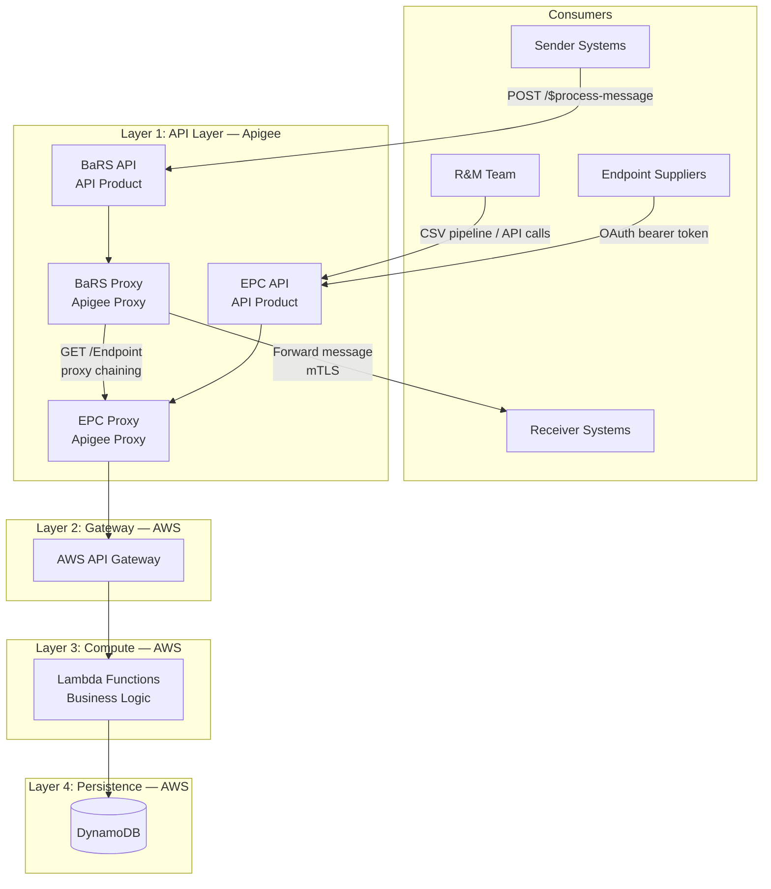
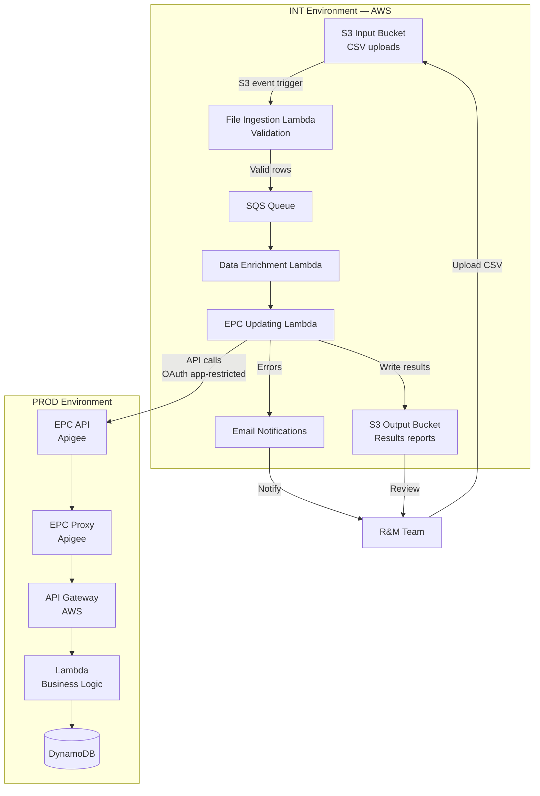
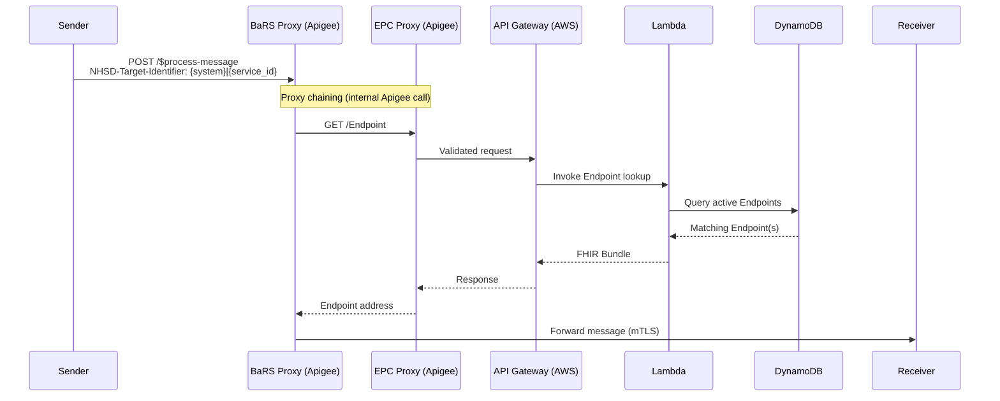
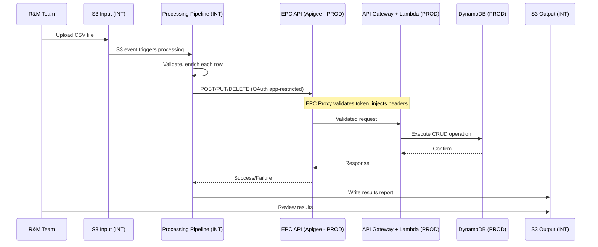

# BaRS Endpoint Catalogue — Logical Architecture

## Access Model

> **The first drop of the EPC is for internal use only.** External suppliers will not have
> direct access to the API. All write operations will be performed by the R&M team via
> the CSV-to-API pipeline or internal tooling.
>
> Once CIS2 authentication and Role-Based Access Control (RBAC) are in place, suppliers
> will be granted direct access to the EPC API to manage their own endpoints and templates
> under their authorised scope.

---

## 1 Purpose

This document describes the logical architecture of the BaRS Endpoint Catalogue (EPC), including the component responsibilities, environment strategy, data flows, and how the Interim Tactical Solution relates to the production Endpoint Catalogue.

---

## 2 System Overview

The Endpoint Catalogue is a centralised platform that provides management and lookup of digital endpoints used for routing BaRS (Booking and Referral Standard) messages across NHS services. It replaces the legacy `targets.json` flat-file routing mechanism with a FHIR R4 API-first approach.

The system comprises two logically distinct capabilities:

1. **Endpoint Catalogue (Production)** — the real-time API for querying and managing endpoint data, consumed by the BaRS Proxy at runtime and administered by the R&M team
2. **EPC Updation Interim Tactical Solution (Integration)** — a batch ingestion pipeline for processing CSV files that enables the R&M team to perform daily operations (supplier switches, onboarding) while self-service capabilities are deferred

---

## 3 Environment Strategy

| Component | Environment | Purpose |
|-----------|-------------|---------|
| **Endpoint Catalogue** (API Gateway + Lambda + DynamoDB) | **PROD** (AWS) | Live endpoint resolution and production data store |
| **EPC Updation Interim Tactical Solution** (S3 + Lambda pipeline) | **INT** (AWS) | Batch processing of CSV uploads; calls through to the EPC API in PROD |
| **BaRS Proxy** | **PROD** (Apigee) | Runtime message routing — resolves endpoints via EPC API |
| **EPC API + EPC Proxy** | **PROD** (Apigee) | Published API product that authenticates consumers and routes to EPC backend |

The Interim Tactical Solution is hosted in the **Integration (INT)** environment. It processes CSV files uploaded by the R&M team and calls the EPC API (in PROD) via Apigee using app-restricted authentication. This separation ensures batch processing workloads do not share compute with live endpoint resolution.

The Endpoint Catalogue itself is deployed across **dev**, **INT**, and **PROD** environments using identical Infrastructure-as-Code (Terraform).

---

## 4 Architecture Layers

The architecture is organised into four layers:

---

### 4.1 Layer 1: API Layer (Apigee)

This layer provides the internet-facing entry point for all consumers. It handles authentication, policy enforcement, and routing.

#### BaRS API (API Product)

| Attribute | Value |
|-----------|-------|
| Base path | `/booking-and-referral/FHIR/R4` |
| Purpose | Runtime messaging — booking and referral operations |
| Backend | Receiver systems (via mTLS) |

The existing messaging product. Sender systems submit referrals and bookings via `POST /$process-message`.

#### BaRS Proxy (Apigee Proxy)

| Attribute | Value |
|-----------|-------|
| Role | Message routing proxy |
| Relationship to EPC | **Consumer** — calls the EPC Proxy to resolve endpoint addresses |
| Authentication to EPC | Proxy chaining within Apigee (internal proxy-to-proxy call) |

> **Note:** It is believed the BaRS Proxy will call the EPC Proxy using **Apigee proxy chaining**
> (an internal proxy-to-proxy invocation within the Apigee platform). This avoids an
> external round-trip and keeps the call within the API management layer. **This needs to
> be confirmed with the APIM team.**

The BaRS Proxy is **loosely coupled** to the EPC — it calls the EPC through the published API contract, not directly to the AWS backend. This ensures:

- No direct dependency on the EPC's internal infrastructure
- The EPC backend can be changed or redeployed without affecting the BaRS Proxy
- Authentication and policy enforcement are applied consistently

When a sender submits a message, the Proxy:

1. Extracts the `NHSD-Target-Identifier` header (DoS service ID)
2. Calls the EPC (via proxy chaining): `GET /Endpoint?_has:HealthcareService:endpoint:identifier={system}|{service_id}`
3. Receives the active Endpoint(s) with the resolved receiver address
4. Forwards the original message to that address via mTLS

**Previous state:** The BaRS Proxy read endpoint routing data from a `targets.json` flat file in S3. This is being replaced by the live API call to the EPC.

#### EPC API (API Product)

| Attribute | Value |
|-----------|-------|
| Base path | `/endpoint-catalog/FHIR/R4` |
| Purpose | The published API that all consumers interact with for catalogue operations |
| Consumers | BaRS Proxy, R&M team pipeline, Endpoint Suppliers |

The EPC API is a **separate API product** on the NHS England API Platform. All consumers — BaRS Proxy, R&M team, and endpoint suppliers — interact with this single published interface.

The EPC API provides:
- Endpoint lookup (GET) — used by the BaRS Proxy at runtime and by the R&M team for queries
- Template management (POST/PUT/DELETE) — used by the R&M team
- Endpoint management (POST/PUT/DELETE) — used by the R&M team and suppliers
- HealthcareService management (POST/PUT/DELETE) — used by the R&M team
- List management (POST/PUT/DELETE) — used by the R&M team

#### EPC Proxy (Apigee Proxy)

| Attribute | Value |
|-----------|-------|
| Role | Implementation proxy behind the EPC API product |
| Purpose | Authentication, header injection, and routing to AWS backend |

The EPC Proxy is an implementation detail behind the EPC API. Consumers target the EPC API — they do not interact with the Proxy directly. It handles token validation, injects trusted headers from token claims, and routes validated requests to the AWS backend.

#### Key Distinction

| Responsibility | BaRS Proxy | EPC API |
|---|---|---|
| Hosting EPC paths | No | Yes |
| Authenticating EPC consumers | No | Yes (via EPC Proxy) |
| Storing endpoint data | No | Routes to DynamoDB via Lambda |
| Resolving endpoints for message routing | Yes (as consumer of EPC API) | Serves the response |

---

### 4.2 Layer 2: Gateway (AWS API Gateway)

| Attribute | Value |
|-----------|-------|
| Purpose | Receives requests from Apigee; routes to Lambda functions |
| Connection | mTLS from Apigee |

The API Gateway bridges the Apigee layer and the serverless compute layer. It receives already-authenticated requests from the EPC Proxy and routes them to the appropriate Lambda function based on HTTP method and path.

---

### 4.3 Layer 3: Compute (AWS Lambda)

| Attribute | Value |
|-----------|-------|
| Runtime | TypeScript |
| Scaling | Serverless auto-scaling |

The Lambda functions contain all business logic:

| Capability | Description |
|------------|-------------|
| CRUD operations | Create, read, update, soft/hard delete of Endpoints, Templates, HealthcareServices, and Lists |
| Visibility filtering | Ensures consumers only see active, valid endpoints based on status and period rules |
| Template resolution | Resolves inherited fields from parent Template when returning Endpoints |
| Ownership enforcement | Validates ODS code and Product ID from token match the resource being written |
| Duplicate detection | Prevents creation of duplicate resources |
| Audit recording | Records before/after snapshots of every successful write operation |

---

### 4.4 Layer 4: Persistence (AWS DynamoDB)

| Attribute | Value |
|-----------|-------|
| Scaling | On-demand (auto-scales with traffic) |
| Availability | Multi-AZ (3 AZs within region) |
| Recovery | Point-in-Time Recovery enabled; immutable backups to AWS Backup account |

DynamoDB stores:

| Data | Content |
|------|---------|
| Endpoint Templates | Supplier URL patterns, connection types, payload types |
| Endpoints | Individual endpoint instances (child of Template), status, period, associations |
| HealthcareServices | Clinical service identity, provider organisation, endpoint associations |
| Lists | Priority-ordered endpoint lists per HealthcareService |
| Audit records | Before/after snapshots of all write operations (1-year retention) |

---

## 5 Interim Tactical Solution (INT Environment)

The Interim Tactical Solution is the CSV-to-API pipeline that enables the R&M team to perform bulk operations against the Endpoint Catalogue. It is hosted in **INT** while the Endpoint Catalogue runs in **PROD**.

### 5.1 Architecture

### 5.2 Components

| Component                  | Purpose                                                            | Environment |
| ----------------------------| --------------------------------------------------------------------| -------------|
| **S3 Input Bucket**        | R&M team uploads CSV files here                                    | INT         |
| **File Ingestion Lambda**  | Triggered by S3 upload; validates file format and mandatory fields | INT         |
| **SQS Queue**              | Buffers messages between validation and processing                 | INT         |
| **Data Enrichment Lambda** | Performs data enrichment per CSV row (lookups, supplier mapping)   | INT         |
| **EPC Updating Lambda**    | Calls the EPC API (PROD) to execute the required operation         | INT         |
| **S3 Output Bucket**       | Stores processing results (success/failure per row)                | INT         |

### 5.3 Supported Operations

**Onboarding and Management:**
- Add / update / delete endpoint template
- Add/ update / delete endpoint
- Areate / update / delete HealthcareService

**DUEC DoS Pharmacy Processes:**
- Switch to a new endpoint (daily supplier switches)

### 5.4 Processing Flow

1. R&M team prepares a CSV file (from Master Switch Log or supplier onboarding data)
2. R&M team uploads CSV to the S3 input bucket
3. S3 event triggers the File Ingestion Lambda
4. File Ingestion Lambda validates file format and mandatory fields
5. Valid rows are placed on the SQS queue
6. Data Enrichment Lambda processes each message, performing lookups and enrichment
7. EPC Updating Lambda calls the **EPC API** (PROD) with app-restricted OAuth token
8. The EPC API validates, authorises, and executes the operation
9. Results (success/failure per row) are written to the S3 output bucket
10. Errors trigger email notifications to the R&M team

### 5.5 Why INT?

- **Isolation** — batch processing workloads do not share compute with live endpoint resolution
- **Safety** — pipeline logic can be updated and tested without risking the production API
- **Separation of concerns** — temporary infrastructure superseded by self-service in future phases

The pipeline authenticates to the PROD EPC API through Apigee using the same OAuth flow as any other consumer, ensuring full audit trail and ownership enforcement.

---

## 6 Data Flow: Real-Time API Request

---

## 7 Data Flow: Endpoint Management (via Interim Tactical Solution)

---

## 8 Security

### 8.1 Authentication

| Consumer                       | Method               | Description                   |
| --------------------------------| ----------------------| -------------------------------|
| BaRS Proxy → EPC Proxy         | Proxy chaining       | Internal Apigee proxy-to-proxy call (to be confirmed) |
| R&M Pipeline → EPC API         | App-restricted       | Signed JWT → bearer token     |
| Endpoint Suppliers → EPC API   | App-restricted       | Signed JWT → bearer token     |
| Admin users → EPC API (future) | CIS2 user-restricted | NHS CIS2 login → bearer token |

### 8.2 Authorisation

| Control | Description |
|---------|-------------|
| ODS ownership | ODS code from token must match `managingOrganization` on the resource |
| Product ID ownership | Token's Product ID must match the Template's identifier |
| ODS spoofing prevention | ODS header cross-checked against token claims |
| RBAC (future) | Per-operation role enforcement using CIS2 role claims |

### 8.3 Key Security Patterns

- **mTLS** between Apigee and AWS API Gateway; between BaRS Proxy and receiver systems
- **OAuth 2.0** app-restricted flow via NHS England API Platform
- **IAM** roles for Lambda execution and resource access
- **Secrets Manager** for runtime credential access
- **Encryption** at rest (DynamoDB, S3) and in transit (TLS 1.2+)

---

## 9 Observability

| Capability | Implementation |
|------------|----------------|
| Audit (gateway) | Apigee → Splunk — all inbound HTTP requests |
| Audit (application) | Lambda → DynamoDB — before/after snapshots of write operations |
| Logging | CloudWatch Logs — structured JSON, 90-day retention |
| Metrics & alarms | CloudWatch — error rate, latency, Lambda errors |
| Dashboards | CloudWatch — API Gateway, DynamoDB, Lambda, Health, Aggregate |
| Distributed tracing | OpenTelemetry (ADOT) Lambda layer |
| APM (future) | ODIN / Dynatrace / AppDynamics |

---

## 10 Resilience and Recovery

| Metric | Target |
|--------|--------|
| Availability | 99.9% (Gold service classification) |
| DR recovery target | 4 hours |
| Support | 24x7x365 (NHSE Service Management + Accenture R&M) |

| Mechanism | Coverage |
|-----------|----------|
| Multi-AZ | All components (API Gateway, Lambda, DynamoDB) — built-in |
| Auto-scaling | Lambda concurrency + DynamoDB on-demand |
| Point-in-Time Recovery | DynamoDB — restore to any second in last 35 days |
| Immutable backups | DynamoDB data backed up to separate AWS Backup account |
| Infrastructure-as-Code | Terraform — full environment rebuild capability |
| Deployment rollback | Lambda alias rollback (< 5 minutes) |
| BCDR | EPC added to existing ERS and Wayfinder BCDR documentation |

---

## 11 Deployment

### CI/CD Pipeline

### Deployment Strategy

| Practice | Description |
|----------|-------------|
| Blue/green | Lambda alias switches to new version after validation |
| Automated rollback | Alarms trigger auto-rollback within 5 minutes |
| Environment promotion | Sandbox → Integration → Production (identical IaC) |

---

## 12 Migration and Cutover

The transition from `targets.json` to the live EPC follows a dual-running strategy:

| Phase | BaRS Proxy reads from | Duration |
|-------|----------------------|----------|
| **Pre-cutover (dual running)** | targets.json (unchanged) | Until confidence criteria met |
| **Cutover** | EPC API | One-off proxy deployment |
| **Post-cutover monitoring** | EPC API | 2–4 weeks |
| **Retirement** | EPC API | targets.json decommissioned |

During dual running, daily reconciliation compares the EPC and targets.json to prove 100% consistency before the BaRS Proxy is switched to the EPC.

---

## 13 Technology Stack

| Layer | Technology | Usage |
|-------|------------|-------|
| API Management | Apigee | Internet-facing API platform |
| Cloud Platform | AWS | Backend infrastructure |
| Compute | AWS Lambda (TypeScript) | Serverless business logic |
| API Gateway | AWS API Gateway | Request routing |
| Database | AWS DynamoDB | Endpoint data store |
| Message Queue | AWS SQS | Batch pipeline (INT) |
| Object Storage | AWS S3 | CSV uploads, artifacts, backups |
| Monitoring | Amazon CloudWatch | Logs, metrics, alarms, dashboards |
| Tracing | OpenTelemetry (ADOT) | Distributed tracing |
| IaC | Terraform | Infrastructure provisioning |
| CI/CD | GitHub Actions | Build and deployment pipelines |
| Source Control | GitHub | Code management |
| Interoperability | FHIR R4 | Healthcare data exchange standard |

---

## 14 Out of Scope

- Building a new BaRS Proxy (existing proxy is modified to call EPC API)
- Building a user interface for onboarding or management of endpoints
- RBAC / CIS2 user-restricted authentication (deferred)
- Multi-region deployment (deferred)
- ODIN observability platform (deferred)

---

## 15 Related Documents

| Document | Description |
|----------|-------------|
| [EPC MVP — Scope and Architecture](./mvp/README.md) | MVP scope, API operations, deferrals |
| [BaRS OAS Alignment and Routing](./bars-oas-alignment-and-routing.md) | API routing architecture, OAS separation |
| [Resilience and Availability](./resilience-and-availability.md) | Detailed resilience design |
| [Disaster Recovery](./disaster-recovery.md) | DR strategy, RPO/RTO, runbooks |
| [Dual Running Strategy](./dual-running-strategy.md) | Migration and cutover plan |
| [Audit and Logging](./audit.md) | Audit requirements and design |
| [R&M Support Infrastructure](./mvp/mvp-rm-support-infrastructure.md) | CSV-to-API pipeline detail |
| [Authorisation](./authorisation.md) | Authentication and ownership model |
