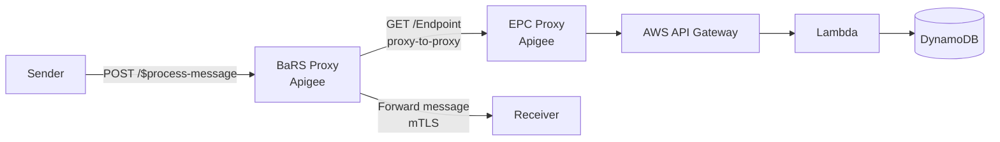

# BaRS Proxy → EPC Proxy: Chaining and Connection Model

## Overview

This document describes how the **BaRS Proxy** connects to the **EPC Proxy** within the
Apigee API management layer to resolve endpoint addresses at runtime. When a sender submits
a BaRS message, the BaRS Proxy must look up the target receiver's address from the Endpoint
Catalogue before forwarding the message. That lookup is a proxy-to-proxy call inside Apigee.

This resolves [Open Question 4 in the routing document](./bars-oas-alignment-and-routing.md)
(*"How does the BaRS Proxy's internal EPC call authenticate?"*) and confirms the mechanism
referenced but left "to be confirmed" in [architecture.md](./architecture.md).

> **Platform:** **Apigee Edge**. This is confirmed and shapes the options below — in
> particular, IAM (Google service-account identity tokens) is an Apigee X / hybrid feature
> on Google Cloud and is **not available on Edge**, so it is excluded from the
> recommendation.
>
> **Expected model:** The BaRS Proxy calls the EPC Proxy **directly within the Apigee
> layer** over **HTTPS**, authenticated using **OAuth/JWT or mTLS**. Apigee supports two
> mechanisms for one proxy to call another — a *local* connection (true proxy chaining) and
> an *HTTP* connection (proxy-to-proxy over the network). The distinction matters for
> authentication and is covered in [Section 3](#3-two-connection-mechanisms).

---

## 1 Context

When a sender submits a message, the BaRS Proxy performs endpoint resolution before
forwarding:

```
1. Sender → BaRS Proxy:    POST /$process-message
                           NHSD-Target-Identifier: {system}|{service_id}
2. BaRS Proxy → EPC Proxy: GET /Endpoint?_has:HealthcareService:endpoint:identifier={system}|{value}
3. EPC Proxy → BaRS Proxy: Active Endpoint(s) with resolved receiver address
4. BaRS Proxy extracts `address` from the first active Endpoint
5. BaRS Proxy → Receiver:  Forwards the original message (mTLS)
```

Step 2 is the proxy-to-proxy call this document specifies. It replaces the legacy
`targets.json` flat-file lookup that the BaRS Proxy previously used.



---

## 2 What Apigee proxy chaining is

Apigee lets one proxy call another. Per the Apigee documentation on
[chaining API proxies together](https://docs.cloud.google.com/apigee/docs/api-platform/fundamentals/connecting-proxies-other-proxies),
one proxy is specified as the *target endpoint* of another. There are two ways to do this,
and they behave differently:

| Approach | Apigee element | Call path | Network hop |
|----------|----------------|-----------|-------------|
| **Proxy chaining (local)** | `LocalTargetConnection` | Stays inside the Apigee runtime — bypasses load balancers, routers, and message processors | No |
| **Proxy-to-proxy (HTTP)** | `HTTPTargetConnection` | Leaves the runtime and calls the second proxy over the network as a normal HTTPS client | Yes |

The key trade-off:

- **Local chaining is faster** — it avoids a network round-trip, which is why the Apigee
  docs describe it as improving overall performance.
- **HTTP connection allows full authentication** — because the call goes over HTTPS as a
  normal client request, the calling proxy can present an OAuth/JWT bearer token or an mTLS
  client certificate, and the target proxy enforces it with standard policies.

This is the crux of the design decision: **true local chaining and the OAuth/JWT/IAM/mTLS
authentication you'd expect are somewhat at odds.** A local connection does not carry an
external credential in the usual way, so it relies on network-locality trust rather than a
presented token. See [Section 4](#4-recommendation) for how to reconcile this.

---

## 3 Two connection mechanisms

### 3.1 Local target connection (true proxy chaining)

The BaRS Proxy names the EPC Proxy as a local target. The request never leaves the Apigee
runtime.

**Connect by proxy name:**

```xml
<TargetEndpoint name="epc-endpoint-catalogue">
    <PreFlow name="PreFlow"/>
    <PostFlow name="PostFlow"/>
    <LocalTargetConnection>
        <APIProxy>epc-proxy</APIProxy>
        <ProxyEndpoint>default</ProxyEndpoint>
    </LocalTargetConnection>
</TargetEndpoint>
```

**Connect by path** (more robust when the two proxies are owned by different teams and the
proxy name may change):

```xml
<TargetEndpoint name="epc-endpoint-catalogue">
    <PreFlow name="PreFlow"/>
    <PostFlow name="PostFlow"/>
    <LocalTargetConnection>
        <Path>/endpoint-catalog/FHIR/R4</Path>
    </LocalTargetConnection>
</TargetEndpoint>
```

**Authentication in this mode.** A local connection does not perform an external OAuth
handshake or TLS negotiation between the proxies — the whole point is to bypass the network.
The Apigee docs note that with a chained call, the client IP appears as **local**, and the
target proxy can validate that locality (via an `AccessControl` policy) before processing.
So the trust model here is *network locality within Apigee*, optionally combined with a
lightweight shared secret or header injected by the BaRS Proxy.

**Trade-off with API products.** The Apigee docs are explicit that proxy chaining works best
when both proxies are in the **same API product**, and Apigee does not currently support
bundling the target proxy in a separate product that clients can't reach. The EPC is
designed as a **separate API product** from BaRS, so pure local chaining sits awkwardly with
that separation — the EPC Proxy is meant to be independently secured for external suppliers.

### 3.2 HTTP target connection (proxy-to-proxy over HTTPS) — preferred for authentication

The BaRS Proxy calls the EPC Proxy as an ordinary HTTPS client. This accepts one network hop
in exchange for standard, enforceable authentication.

```xml
<TargetEndpoint name="epc-endpoint-catalogue">
    <PreFlow name="PreFlow">
        <!-- Attach a service-account identity token or signed JWT here -->
    </PreFlow>
    <HTTPTargetConnection>
        <URL>https://{epc-host}/endpoint-catalog/FHIR/R4</URL>
        <SSLInfo>
            <Enabled>true</Enabled>
            <ClientAuthEnabled>true</ClientAuthEnabled>
            <KeyStore>ref://bars-proxy-keystore</KeyStore>
            <KeyAlias>bars-client-cert</KeyAlias>
            <TrustStore>ref://epc-truststore</TrustStore>
        </SSLInfo>
    </HTTPTargetConnection>
</TargetEndpoint>
```

**Authentication options in this mode (Apigee Edge):**

| Option | How it works | Notes |
|--------|--------------|-------|
| **mTLS** | BaRS Proxy presents a client certificate from the Apigee Edge keystore; EPC Proxy validates against its truststore | Strong mutual authentication; no token to expire or refresh. Configured via the target `SSLInfo` / a keystore + truststore reference |
| **OAuth / signed JWT** | BaRS Proxy obtains a bearer token (client-credentials or signed JWT) and sends it in `Authorization`; EPC Proxy validates with a `VerifyJWT` or `OAuthV2` policy | Consistent with the app-restricted flow already used by other EPC consumers; carries a verifiable identity claim |

> **Not available on Apigee Edge:** IAM (Google service-account identity tokens) is an
> Apigee X / hybrid capability tied to Google Cloud service accounts. It is **not** an
> option on Edge and has been excluded.

The `SSLInfo` block above shows mTLS. For OAuth/JWT, the BaRS Proxy attaches the token in a
PreFlow policy (e.g. `GenerateJWT` or a `ServiceCallout` to the token endpoint) and the EPC
Proxy verifies it with `VerifyJWT` / `OAuthV2` before routing to the AWS backend.

---

## 4 Recommendation

Use an **HTTP target connection over HTTPS with authentication** ([Section 3.2](#32-http-target-connection-proxy-to-proxy-over-https--preferred-for-authentication)),
rather than a pure local chained connection, for the following reasons:

1. **The EPC is a separate API product.** Local chaining is documented as best suited to
   proxies in the *same* product. An HTTP connection respects the product boundary and lets
   the EPC Proxy remain independently secured for external suppliers.
2. **Authentication is enforceable.** On Apigee Edge, OAuth/JWT or mTLS give the EPC Proxy
   a verifiable caller identity to validate with standard policies — network-locality trust
   alone is weaker and harder to audit.
3. **Audit consistency.** A call authenticated with a token/certificate appears in the
   Apigee → Splunk audit trail with an identifiable caller, aligning with the EPC audit
   model. A local chained call may not surface the same way. See [audit.md](./audit.md).
4. **Uniform consumer model.** Treating the BaRS Proxy as an authenticated consumer of the
   EPC — the same as any other consumer — keeps the EPC's authorisation model consistent and
   avoids a special-case internal path.

**Preferred authentication (Apigee Edge):** **mTLS** for the proxy-to-proxy transport (no
token lifecycle to manage), optionally combined with a **signed JWT** carrying the BaRS
Proxy's service identity so the EPC can record *which* consumer made the call. IAM
service-account identity tokens are **not** available on Edge and are therefore not part of
the recommendation.

**If latency proves critical** and the network hop is measurably too expensive, fall back to
a local chained connection ([Section 3.1](#31-local-target-connection-true-proxy-chaining))
with an `AccessControl` policy validating the local client IP, plus an injected shared secret
header — accepting the weaker trust model and the API-product coupling as the trade-off.

---

## 5 Authorisation note

The BaRS Proxy's call is a **read-only `GET /Endpoint`** lookup. It does **not** perform
write operations and therefore is **not** subject to the ODS ownership and Product ID checks
described in [authorisation.md](./authorisation.md), which apply only to writes.

The BaRS Proxy also does **not** forward an `NHSD-End-User-Organisation-ODS` header on behalf
of an end user — it acts as a system consumer resolving a routing address. Its identity is
the proxy/service identity established by the connection mechanism above (mTLS certificate,
JWT subject, or IAM service account), not an end-user organisation.

---

## 6 Decision summary

| Aspect | Decision |
|--------|----------|
| Connection mechanism | HTTP target connection over HTTPS (proxy-to-proxy), not pure local chaining |
| Platform | Apigee Edge |
| Transport security | TLS 1.2+; mTLS preferred |
| Authentication | mTLS, optionally + signed JWT (IAM identity tokens not available on Edge) |
| Call type | Read-only `GET /Endpoint` — endpoint resolution |
| Authorisation | Not subject to write-time ODS/Product ID ownership checks |
| API product boundary | Preserved — EPC remains a separate, independently secured product |
| Fallback if latency-bound | Local `LocalTargetConnection` chaining + `AccessControl` local-IP validation + shared-secret header |

---

## 7 Open questions

| # | Question | For | Status |
|---|----------|-----|--------|
| 1 | ~~Is the platform Apigee Edge, Apigee hybrid, or Apigee X?~~ | Platform / APIM team | ✅ **Resolved** — Apigee Edge. IAM identity tokens are not available; mTLS and OAuth/JWT are the candidates. |
| 2 | Confirm the EPC Proxy will accept an authenticated HTTP connection from the BaRS Proxy rather than requiring same-product local chaining. | Platform / APIM team | Open |
| 3 | Which credential does the BaRS Proxy present — mTLS client cert or signed JWT — and where is it stored (Apigee Edge keystore / KVM)? | Platform / APIM team | Open |
| 4 | Is the measured latency of an HTTP proxy-to-proxy hop within the EPC's P95 response-time budget, or is local chaining required for performance? | Platform / APIM team | Open |

---

## 8 Related documents

| Document | Description |
|----------|-------------|
| [Logical Architecture](./architecture.md) | Overall EPC architecture and layers |
| [BaRS OAS Alignment and Routing](./bars-oas-alignment-and-routing.md) | API routing, EPC vs BaRS separation, Open Question 4 |
| [Authentication and Authorisation](./authorisation.md) | Ownership model for write operations |
| [Audit and Logging](./audit.md) | Gateway and application audit layers |

---

## 9 Reference

- Apigee — [Chaining API proxies together](https://docs.cloud.google.com/apigee/docs/api-platform/fundamentals/connecting-proxies-other-proxies)

*Content from the Apigee documentation was rephrased for compliance with licensing restrictions.*
