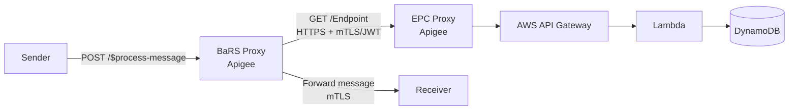

# BaRS Proxy → EPC Proxy: Connection Model

## Overview

This document describes how the **BaRS Proxy** connects to the **EPC Proxy** within the
Apigee API management layer to resolve endpoint addresses at runtime. When a sender submits
a BaRS message, the BaRS Proxy must look up the target receiver's address from the Endpoint
Catalogue before forwarding the message. That lookup is a proxy-to-proxy call within Apigee.

This resolves [Open Question 4 in the routing document](./bars-oas-alignment-and-routing.md)
(*"How does the BaRS Proxy's internal EPC call authenticate?"*) and confirms the mechanism
referenced but left "to be confirmed" in [architecture.md](./architecture.md).

> **Platform:** **Apigee Edge (NHS)**.
>
> **Confirmed constraint:** NHS Apigee **does not support proxy chaining**
> (`LocalTargetConnection`). The local, in-runtime connection between proxies is therefore
> **not available** and is not an option for this design. See
> [Section 2](#2-why-proxy-chaining-is-not-used).
>
> **Confirmed model:** The BaRS Proxy calls the EPC Proxy over **HTTPS** using an Apigee
> `HTTPTargetConnection` — a normal proxy-to-proxy call over the network — authenticated
> with **mTLS and/or OAuth/JWT**. This is now the single connection model; there is no
> local-chaining fallback. IAM (Google service-account identity tokens) is an Apigee X /
> hybrid feature and is not available on Edge.

---

## 1 Context

When a sender submits a message, the BaRS Proxy performs endpoint resolution before
forwarding:

```
1. Sender → BaRS Proxy:    POST /$process-message
                           NHSD-Target-Identifier: {system}|{service_id}
2. BaRS Proxy → EPC Proxy: GET /Endpoint?_has:HealthcareService:endpoint:identifier={system}|{value}
3. EPC Proxy → BaRS Proxy: Active Endpoint(s) with resolved receiver address
4. BaRS Proxy extracts `address` from the first active Endpoint
5. BaRS Proxy → Receiver:  Forwards the original message (mTLS)
```

Step 2 is the proxy-to-proxy call this document specifies. It replaces the legacy
`targets.json` flat-file lookup that the BaRS Proxy previously used.



---

## 2 Why proxy chaining is not used

Apigee in principle offers two ways for one proxy to call another:

| Approach | Apigee element | Call path | Available on NHS Apigee? |
|----------|----------------|-----------|--------------------------|
| **Proxy chaining (local)** | `LocalTargetConnection` | Stays inside the Apigee runtime — bypasses load balancers, routers, and message processors | ❌ **No — not supported** |
| **Proxy-to-proxy (HTTP)** | `HTTPTargetConnection` | Leaves the runtime and calls the second proxy over the network as a normal HTTPS client | ✅ **Yes — the model used** |

Proxy chaining (`LocalTargetConnection`) would avoid a network hop by keeping the call inside
the Apigee runtime. However, **NHS Apigee does not support proxy chaining**, so this option
is unavailable regardless of its performance benefit.

This constraint also aligns with the EPC's design intent. Even where chaining is available,
the Apigee documentation notes it works best when both proxies belong to the **same API
product**, and it does not support placing the target proxy in a separate product that
clients can't reach. The EPC is deliberately a **separate API product** from BaRS so it can
be independently secured for external suppliers — so an HTTP connection was the better fit on
architectural grounds as well.

The BaRS Proxy therefore connects to the EPC Proxy as an authenticated HTTPS client, exactly
as any other EPC consumer would.

---

## 3 Connection model: HTTP target connection over HTTPS

The BaRS Proxy calls the EPC Proxy as an ordinary HTTPS client using an
`HTTPTargetConnection`, presenting a client certificate (mTLS) and/or a bearer token
(OAuth/JWT).

```xml
<TargetEndpoint name="epc-endpoint-catalogue">
    <PreFlow name="PreFlow">
        <!-- If using OAuth/JWT: attach the signed JWT / bearer token here -->
    </PreFlow>
    <HTTPTargetConnection>
        <URL>https://{epc-host}/endpoint-catalog/FHIR/R4</URL>
        <SSLInfo>
            <Enabled>true</Enabled>
            <ClientAuthEnabled>true</ClientAuthEnabled>
            <KeyStore>ref://bars-proxy-keystore</KeyStore>
            <KeyAlias>bars-client-cert</KeyAlias>
            <TrustStore>ref://epc-truststore</TrustStore>
        </SSLInfo>
    </HTTPTargetConnection>
</TargetEndpoint>
```

The `SSLInfo` block above configures mTLS. For OAuth/JWT, the BaRS Proxy attaches the token
in a PreFlow policy (e.g. `GenerateJWT` or a `ServiceCallout` to the token endpoint) and the
EPC Proxy verifies it with a `VerifyJWT` / `OAuthV2` policy before routing to the AWS backend.

### 3.1 Authentication options (Apigee Edge)

| Option | How it works | Notes |
|--------|--------------|-------|
| **mTLS** *(preferred)* | BaRS Proxy presents a client certificate from the Apigee Edge keystore; EPC Proxy validates against its truststore | Strong mutual authentication; no token lifecycle to manage. Reuses the mTLS pattern already used on the Apigee↔AWS and Proxy↔receiver legs |
| **OAuth / signed JWT** | BaRS Proxy obtains a bearer token (client-credentials or signed JWT) and sends it in `Authorization`; EPC Proxy validates with `VerifyJWT` / `OAuthV2` | Consistent with the app-restricted flow used by other EPC consumers; carries a verifiable identity claim identifying the caller |

> **Not available on Apigee Edge:** IAM (Google service-account identity tokens) is an
> Apigee X / hybrid capability tied to Google Cloud service accounts. It is **not** an
> option on Edge and has been excluded.

---

## 4 Recommendation

With proxy chaining ruled out, the connection is an **`HTTPTargetConnection` over HTTPS with
authentication** — this is the only supported model, not a choice between alternatives.

**Preferred authentication (Apigee Edge):** **mTLS** for the proxy-to-proxy transport (no
token lifecycle to manage), optionally combined with a **signed JWT** carrying the BaRS
Proxy's service identity so the EPC can record *which* consumer made the call.

Rationale:

1. **It is the only supported mechanism.** NHS Apigee does not support proxy chaining, so an
   HTTP connection is required.
2. **Authentication is enforceable.** On Apigee Edge, mTLS or OAuth/JWT give the EPC Proxy a
   verifiable caller identity to validate with standard policies.
3. **Audit consistency.** A call authenticated with a certificate/token appears in the
   Apigee → Splunk audit trail with an identifiable caller, aligning with the EPC audit
   model. See [audit.md](./audit.md).
4. **Uniform consumer model.** Treating the BaRS Proxy as an authenticated consumer of the
   EPC — the same as any other consumer — keeps the EPC's authorisation model consistent and
   respects the separate-API-product boundary.

**Latency note:** because proxy chaining is unavailable, the network hop introduced by the
HTTP connection is unavoidable. It should be accounted for in the EPC's P95 response-time
budget rather than treated as something to design away. Standard mitigations (connection
reuse/keep-alive, and short-TTL caching of resolved endpoints in the BaRS Proxy where
freshness requirements allow) are the levers available.

---

## 5 Authorisation note

The BaRS Proxy's call is a **read-only `GET /Endpoint`** lookup. It does **not** perform
write operations and therefore is **not** subject to the ODS ownership and Product ID checks
described in [authorisation.md](./authorisation.md), which apply only to writes.

The BaRS Proxy also does **not** forward an `NHSD-End-User-Organisation-ODS` header on behalf
of an end user — it acts as a system consumer resolving a routing address. Its identity is
the proxy/service identity established by the connection mechanism above (mTLS certificate or
JWT subject), not an end-user organisation.

---

## 6 Decision summary

| Aspect | Decision |
|--------|----------|
| Platform | Apigee Edge (NHS) |
| Proxy chaining (`LocalTargetConnection`) | ❌ Not supported by NHS Apigee — not used |
| Connection mechanism | `HTTPTargetConnection` over HTTPS (proxy-to-proxy) — the only supported model |
| Transport security | TLS 1.2+; mTLS preferred |
| Authentication | mTLS, optionally + signed JWT (IAM identity tokens not available on Edge) |
| Call type | Read-only `GET /Endpoint` — endpoint resolution |
| Authorisation | Not subject to write-time ODS/Product ID ownership checks |
| API product boundary | Preserved — EPC remains a separate, independently secured product |
| Latency | Network hop is unavoidable; manage via response-time budget, keep-alive, optional caching |

---

## 7 Open questions

| # | Question | For | Status |
|---|----------|-----|--------|
| 1 | ~~Is the platform Apigee Edge, Apigee hybrid, or Apigee X?~~ | Platform / APIM team | ✅ **Resolved** — Apigee Edge. IAM identity tokens are not available; mTLS and OAuth/JWT are the candidates. |
| 2 | ~~Does the design rely on proxy chaining?~~ | Platform / APIM team | ✅ **Resolved** — NHS Apigee does not support proxy chaining; an `HTTPTargetConnection` over HTTPS is used. |
| 3 | Which credential does the BaRS Proxy present — mTLS client cert or signed JWT — and where is it stored (Apigee Edge keystore / KVM)? | Platform / APIM team | Open |
| 4 | Is the added latency of the HTTP proxy-to-proxy hop within the EPC's P95 response-time budget, and is endpoint-resolution caching in the BaRS Proxy acceptable given data-freshness requirements? | Platform / APIM team | Open |

---

## 8 Related documents

| Document | Description |
|----------|-------------|
| [Logical Architecture](./architecture.md) | Overall EPC architecture and layers |
| [BaRS OAS Alignment and Routing](./bars-oas-alignment-and-routing.md) | API routing, EPC vs BaRS separation, Open Question 4 |
| [Authentication and Authorisation](./authorisation.md) | Ownership model for write operations |
| [Audit and Logging](./audit.md) | Gateway and application audit layers |

---

## 9 Reference

- Apigee — [Chaining API proxies together](https://docs.cloud.google.com/apigee/docs/api-platform/fundamentals/connecting-proxies-other-proxies)

*Content from the Apigee documentation was rephrased for compliance with licensing restrictions.*
