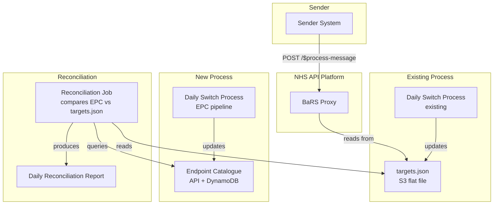
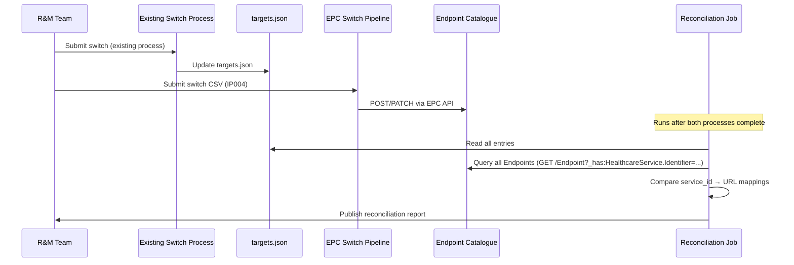
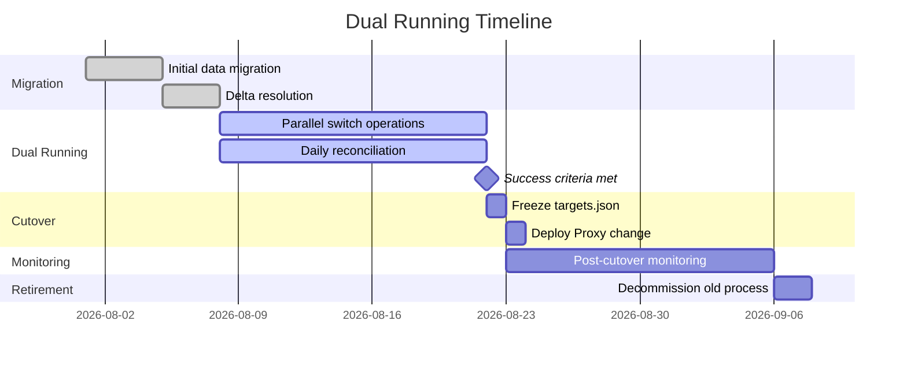

# Dual Running Strategy: EPC and targets.json

## Purpose

This document describes the dual-running period during which the EPC is deployed and actively maintained in PROD alongside the existing `targets.json` flat-file routing. The BaRS Proxy continues to use `targets.json` for live routing until the dual-running period proves that the EPC is consistent and reliable — at which point the Proxy is switched to the EPC and the old process is retired.

---

## Executive Summary

| Phase | BaRS Proxy reads from | Daily switch process updates | Duration |
|-------|----------------------|------------------------------|----------|
| **1. Pre-cutover (dual running)** | targets.json (unchanged) | Both targets.json AND EPC | Until confidence criteria met |
| **2. Cutover** | EPC | EPC only | One-off change |
| **3. Post-cutover (monitoring)** | EPC | EPC only | 2–4 weeks |
| **4. Retirement** | EPC | EPC only | targets.json process decommissioned |

---

## Why Dual Run?

The EPC replaces `targets.json` as the source of endpoint routing for the BaRS Proxy. This is a critical-path change — if the EPC returns incorrect data, referrals are misrouted. A dual-running period provides:

1. **Proof of consistency** — daily reconciliation confirms the EPC and targets.json agree on every routing decision
2. **No-risk deployment** — the EPC is live and receiving updates, but the Proxy still reads from the proven flat file
3. **Rollback simplicity** — if issues are found, the Proxy never changed; there is nothing to roll back
4. **R&M team confidence** — the team operates both processes in parallel and can validate their new tooling without production pressure

---

## Architecture During Dual Running



During dual running:
- The **BaRS Proxy** continues to read from `targets.json` — no change to live routing
- The **existing daily switch process** continues to update `targets.json` as normal
- The **new EPC switch process** (IP004) runs in parallel, applying the same changes to the EPC
- A **reconciliation job** compares the two sources daily and produces a report

---

## Daily Switch Process (Dual Running)

During dual running, each daily switch is applied to **both** systems:



---

## Reconciliation Process

### What it checks

For every DoS service ID that exists in `targets.json`:

1. Query the EPC for Endpoints associated with that service: `GET /Endpoint?_has:HealthcareService.Identifier=https://fhir.nhs.uk/Id/dos-service-id|{service_id}`
2. Extract the active Endpoint's `address` from the returned Bundle
3. Compare (case-insensitive, trailing-slash-tolerant) against the URL in targets.json

> **Note:** `_include=HealthcareService:endpoint` is not supported on `GET /HealthcareService`. The `GET /Endpoint` search with `_has` is the correct way to retrieve Endpoints for a given HealthcareService identifier. This also provides visibility filtering (status, period) and supports filtering by `connectionType` and `payloadType`.

### Report output

```csv
ServiceId,TargetsURL,EPC_URL,Status
2000017562,https://bars-prod-ygm04.cegedim.thirdparty.nhs.uk/FHIR/R4/,https://bars-prod-ygm04.cegedim.thirdparty.nhs.uk/FHIR/R4/,MATCH
2000020742,https://bars-prod-8hk48.sonar.thirdparty.nhs.uk,https://bars-prod-8hk48.sonar.thirdparty.nhs.uk,MATCH
2000099999,https://bars-prod-ygm06-pharmoutcomes.emis.thirdparty.nhs.uk,,MISSING_IN_EPC
```

### Status values

| Status | Meaning | Action |
|--------|---------|--------|
| `MATCH` | Both sources agree | None |
| `MISMATCH` | URLs differ | Investigate — which source is correct? |
| `MISSING_IN_EPC` | Service exists in targets.json but not in EPC | Run delta process (Step 4 from migration doc) to generate CSV for R&M |
| `MISSING_IN_TARGETS` | Service exists in EPC but not in targets.json | May be expected (new service added to EPC first) or investigate |

### Success criteria for ending dual running

| Metric | Target | Measured over |
|--------|--------|---------------|
| MATCH rate | 100% | 5 consecutive business days |
| MISMATCH count | 0 | 5 consecutive business days |
| MISSING_IN_EPC count | 0 | 5 consecutive business days |
| Daily switch applied to both systems successfully | 100% | 5 consecutive business days |
| No manual intervention required to fix sync issues | True | 5 consecutive business days |

---

## Cutover: Switch the BaRS Proxy to EPC

Once the success criteria are met, the BaRS Proxy is changed to read from the EPC instead of `targets.json`.

### What changes

| Component | Before cutover | After cutover |
|-----------|---------------|---------------|
| BaRS Proxy endpoint resolution | `GET targets.json` from S3 | `GET /Endpoint?_has:HealthcareService:endpoint:identifier=...` from EPC API |
| Daily switch process | Updates targets.json | Updates EPC only |
| targets.json | Actively maintained | Frozen (retained as rollback) |
| Reconciliation job | Runs daily | Runs for monitoring period, then retired |

### Cutover steps

1. **Final reconciliation** — run reconciliation and confirm 100% MATCH
2. **Freeze targets.json** — stop the existing daily switch process (no more updates to the flat file)
3. **Deploy Proxy change** — release the BaRS Proxy update that reads from the EPC instead of targets.json
4. **Verify live traffic** — monitor referral routing for errors, latency, and success rate
5. **Confirm rollback path** — targets.json remains in S3, Proxy can be reverted if needed

### Rollback

If issues are discovered after cutover:

1. Revert the BaRS Proxy deployment to the previous version (reads targets.json)
2. Resume the existing daily switch process
3. Investigate and resolve EPC issues
4. Re-attempt cutover after issues are fixed and a new dual-running period confirms consistency

Rollback is low-risk because targets.json was frozen (not deleted) at cutover time. It contains the last known-good state.

---

## Post-Cutover Monitoring (2–4 weeks)

After cutover, continue running the reconciliation job against the frozen targets.json for a monitoring period:

- Confirms the EPC continues to return correct results under live load
- Detects any drift that might emerge from new switches being applied only to the EPC
- Provides a safety net before the old process is fully retired

After the monitoring period:
- Retire the reconciliation job (or convert it to a periodic health check)
- Archive `targets.json` (retain for audit/historical reference)
- Decommission the existing daily switch process

---

## Retirement

| Item | Action | When |
|------|--------|------|
| Existing daily switch process | Decommission — no longer runs | After monitoring period |
| targets.json (S3) | Archive to cold storage (Glacier) | After monitoring period |
| Reconciliation job | Retire or convert to weekly health check | After monitoring period |
| EPC switch pipeline (IP004) | Becomes the sole daily switch process | Immediate from cutover |
| BaRS Proxy (EPC integration) | Becomes the permanent routing path | Immediate from cutover |

---

## Risks

| Risk | Impact | Mitigation |
|------|--------|------------|
| R&M team applies switch to one system but not the other | Reconciliation shows MISMATCH on next run | Automate: a single switch submission triggers both processes. Or: reconciliation runs after every switch, not just daily. |
| EPC returns stale data due to caching | Proxy routes to old endpoint after a switch | Confirm EPC has no caching layer, or TTL < switch frequency |
| Cutover deployment fails | Proxy cannot read EPC | Automatic rollback to previous Proxy version (reads targets.json) |
| EPC downtime during dual running | Reconciliation fails; new switches not applied | Does not affect live routing (Proxy still uses targets.json). Queue switch CSVs and re-process when EPC recovers. |
| Reconciliation reports persistent MISMATCHes | Cannot proceed to cutover | Investigate root cause. May indicate a bug in the EPC switch pipeline. Fix before re-attempting. |

---

## Timeline



> **Note:** Dates are illustrative. Actual timeline depends on migration completion, R&M team readiness, and success criteria being met.

---

## Related Documents

| Document | Relationship |
|----------|-------------|
| [Migration: targets.json → EPC](../Data%20Migration/Documentation/migration-from-targets-json.md) | Populates the EPC with initial data before dual running begins |
| [IP004 — Daily Switch Process](./Processes/IP004-daily-switch-process.md) | The EPC switch pipeline used during and after dual running |
| [MVP README](./mvp/README.md) | Overall MVP scope including the BaRS Proxy integration |
