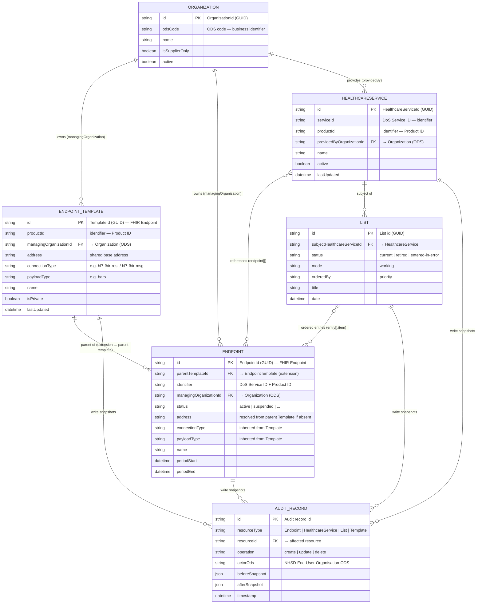

# EPC Data Model

This page describes the logical data model of the BaRS Endpoint Catalogue (EPC). The
EPC is a **FHIR R4** service-discovery store: its core entities map directly onto FHIR
resources (`Endpoint`, `HealthcareService`, `List`, `Organization`), persisted in
DynamoDB and served through the EPC API.

The model is built around one deliberate design choice: **Endpoint Templates and
Endpoints are both FHIR `Endpoint` resources.** A Template is a *parent* that holds the
shared connection details for a supplier product; an Endpoint is a *child instance* that
references the Template and inherits its fields at read time. This keeps supplier
connection data defined once and reused across many service-specific endpoints.

---

## 1 Entity relationship diagram

---

## 2 Entities

### Organization
The owning NHS organisation, identified by an **ODS code**. Every writable resource is
owned by an Organization, and ownership drives authorisation: the ODS code on the caller's
token must match the resource's `managingOrganization` (Endpoint/Template) or `providedBy`
(HealthcareService). Suppliers can be flagged `isSupplierOnly`.

### Endpoint Template (FHIR `Endpoint`)
The **parent** resource. Keyed by a supplier **Product ID**, it holds the connection
details shared across many endpoints: `address`, `connectionType`, `payloadType`, and the
`managingOrganization`. A Template can be marked `isPrivate`. Defined once per supplier
product and reused.

### Endpoint (FHIR `Endpoint`)
The **child instance**. It references its parent Template via a FHIR `extension` and
inherits the Template's fields (address, connection type, payload type) at read time —
"template resolution". Each Endpoint carries its own `identifier` (DoS Service ID and
Product ID), a `status`, and a `period` (`start`/`end`) that together govern visibility.
Consumers only see Endpoints that are active, in-period, and belong to an active
HealthcareService.

### HealthcareService
The clinical service identity, identified by its **DoS Service ID** (and Product ID). It
is `providedBy` an Organization and references one or more Endpoints via `endpoint[]`.
This is the entity the BaRS Proxy resolves against at runtime using the reverse-chained
search `GET /Endpoint?_has:HealthcareService:endpoint:identifier={system}|{value}`.

### List
A FHIR `List` expresses **communication preference** — the priority-ordered set of
Endpoints for a HealthcareService. Neither Endpoint nor HealthcareService carries order;
the List does. `subject` references the HealthcareService, each `entry[].item` references
an Endpoint, and `orderedBy = priority` with array position as the priority (index 0 =
highest). One `current` List should exist per HealthcareService.

### Audit record
Every successful write (create/update/delete) records a **before/after snapshot** of the
affected resource along with the acting ODS code and timestamp (1-year retention). Not a
FHIR resource — an internal audit store.

---

## 3 Key relationships

| Relationship | Cardinality | Mechanism |
|---|---|---|
| Organization → Endpoint Template | 1 : many | `managingOrganization` (ODS code) |
| Organization → Endpoint | 1 : many | `managingOrganization` (ODS code) |
| Organization → HealthcareService | 1 : many | `providedBy` (ODS code) |
| Endpoint Template → Endpoint | 1 : many | `extension` → parent template reference |
| HealthcareService → Endpoint | many : many | `endpoint[]` references |
| HealthcareService → List | 1 : many | `List.subject` reference |
| List → Endpoint | many : many | `List.entry[].item` references (ordered) |
| Resource → Audit record | 1 : many | write-time before/after snapshots |

---

## 4 Notes on identifiers

- **Resource id** (`Endpoint.id`, `HealthcareService.id`, etc.) is a GUID — the unique
  key for the resource instance. It is **not** the same as the business `identifier`.
- **`Endpoint.identifier`** can be shared across multiple Endpoint resources (it names the
  *type* of endpoint, typically set by the supplier). Do not treat it as a primary key.
- **DoS Service ID** (`https://fhir.nhs.uk/Id/dos-service-id`) identifies a
  HealthcareService and is the runtime routing key.
- **Product ID** (`https://fhir.nhs.uk/Id/product-id`) links Endpoints and
  HealthcareServices to a supplier product and its Template.
- **ODS code** (`https://fhir.nhs.uk/Id/ods-organization-code`) identifies the owning
  Organization and is the basis for authorisation.

---

## 5 Related documents

| Document | Description |
|----------|-------------|
| [Logical Architecture](../architecture.md) | System overview, layers, data flows |
| [Endpoint / Template design pros & cons](../template-design-pros-cons.md) | Rationale for the Template/Endpoint split |
| [Endpoint ordering with List](../endpoint-ordering-with-list.md) | Priority ordering via the List resource |
| [Endpoint visibility, status and period](../endpoint-visibility-status-and-period.md) | Visibility filtering rules |
| Endpoint Catalog API OAS | `../../OAS/endpoint-catalog-api.json` — FHIR R4 resource schemas |
