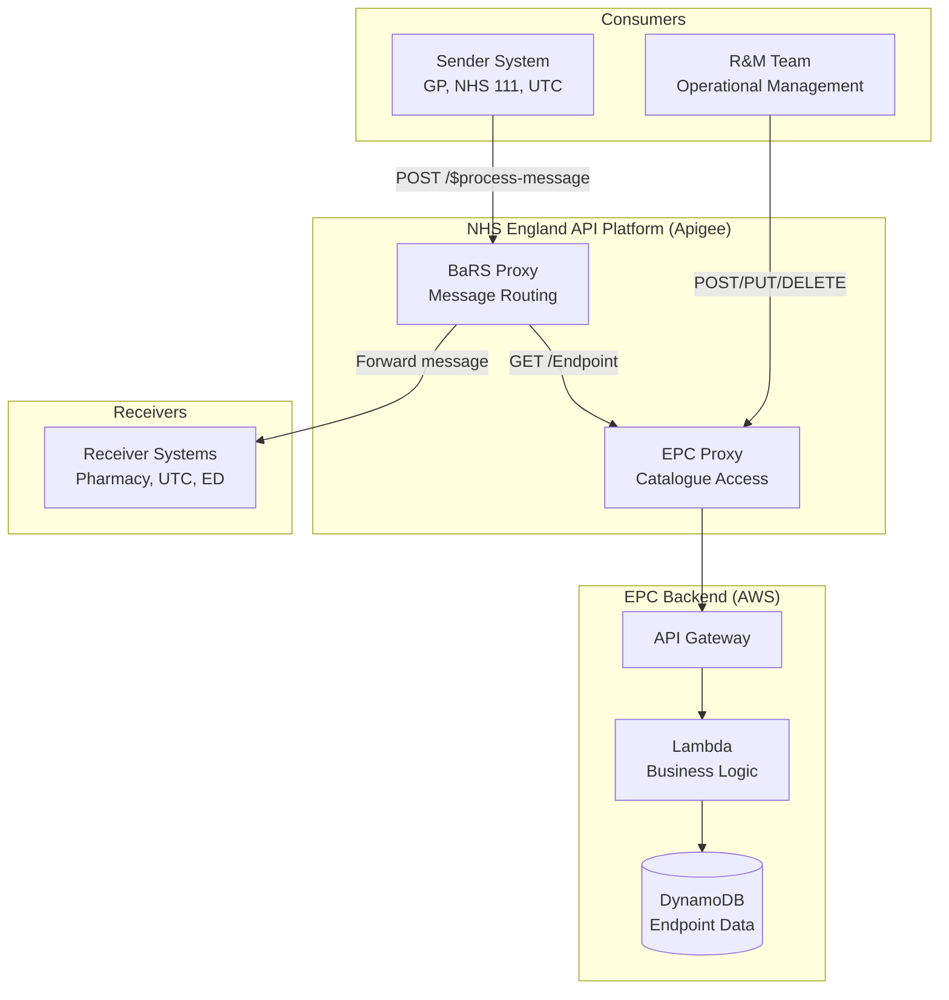

# EPC MVP — Scope and Architecture

## Purpose

This document defines the EPC MVP scope: what is delivered, the API operations included, how the BaRS Proxy integrates as a consumer, the routing architecture, and what has been deferred to future iterations.

---

## Executive Summary

The EPC MVP delivers a fully functional Endpoint Catalogue that:
- Enables the **BaRS Proxy** to resolve receiver endpoints at runtime (replacing `targets.json`)
- Provides the **R&M team** with API and CSV-based tooling to manage endpoints, templates, and services
- Enforces **authentication and ownership** on all write operations
- Is **internal-only** — external supplier access requires RBAC (deferred)

---

## Architecture

### System Context



### How the BaRS Proxy Uses the EPC

The BaRS Proxy is the primary **consumer** of the EPC at runtime. When a sender submits a referral, the Proxy resolves the target receiver address:

```
1. Sender → BaRS Proxy:   POST /$process-message (NHSD-Target-Identifier: system|service_id)
2. BaRS Proxy → EPC:      GET /Endpoint?_has:HealthcareService:endpoint:identifier={system}|{service_id}
3. EPC → BaRS Proxy:      Returns active Endpoint(s) with resolved address
4. BaRS Proxy:            Selects first active Endpoint, extracts `address`
5. BaRS Proxy → Receiver: Forwards message to that address (via mTLS)
```

The Proxy authenticates to the EPC via **mTLS/API key** — an internal platform-to-platform call. The sender never interacts with the EPC directly.

### Two Separate API Products

| API Product | Base Path | Apigee Proxy | Backend | Purpose |
|---|---|---|---|---|
| **BaRS API** | `/booking-and-referral/FHIR/R4` | BaRS Proxy | Receiver systems (mTLS) | Runtime message routing |
| **Endpoint Catalog API** | `/endpoint-catalog/FHIR/R4` | EPC Proxy | AWS API GW → Lambda → DynamoDB | Catalogue management + lookups |

---

## MVP API Operations

### Endpoint Lookup (Consumer Path — BaRS Proxy)

| Operation | Method | Path | Description |
|-----------|--------|------|-------------|
| Search Endpoints by HealthcareService | `GET` | `/Endpoint?_has:HealthcareService:endpoint:_id={id}` | Returns active Endpoints for a service (with Template fields resolved) |
| Search Endpoints by identifier | `GET` | `/Endpoint?_has:HealthcareService:endpoint:identifier={system}\|{value}` | Returns Endpoints for a service identified by DoS ID |
| Get Endpoint by ID | `GET` | `/Endpoint/{id}` | Returns a single Endpoint (with Template fields resolved) |

### Template Management (R&M / Admin Path)

| Operation | Method | Path | Description |
|-----------|--------|------|-------------|
| Create Template | `POST` | `/Endpoint/$template` | Creates a new supplier Endpoint Template (URL, product, org) |
| Get Template | `GET` | `/Endpoint/$template?Endpoint.identifier={system}\|{value}` | Retrieves a Template by Product ID |
| Update Template | `PUT` | `/Endpoint/{id}/$template` | Updates an existing Template (e.g., URL change) |
| Delete Template | `DELETE` | `/Endpoint/{id}/$template` | Soft or hard delete of a Template |

### Endpoint Management (R&M / Admin Path)

| Operation | Method | Path | Description |
|-----------|--------|------|-------------|
| Create Endpoint | `POST` | `/Endpoint` | Creates a child Endpoint linked to a Template |
| Get Endpoint | `GET` | `/Endpoint/{id}` | Returns a single Endpoint |
| Update Endpoint | `PUT` | `/Endpoint/{id}` | Updates status, period, or name |
| Delete Endpoint | `DELETE` | `/Endpoint/{id}` | Soft or hard delete |

### HealthcareService Management (R&M / Admin Path)

| Operation | Method | Path | Description |
|-----------|--------|------|-------------|
| Create HealthcareService | `POST` | `/HealthcareService` | Creates a service with identifier, provider, and endpoint associations |
| Search HealthcareService | `GET` | `/HealthcareService?identifier={system}\|{value}` | Finds a service by DoS ID |
| Get HealthcareService | `GET` | `/HealthcareService/{id}` | Returns a single service |
| Update HealthcareService | `PUT` | `/HealthcareService/{id}` | Updates associations, name, active status |
| Patch HealthcareService | `PATCH` | `/HealthcareService/{id}` | Partial update (e.g., add/remove endpoint) |
| Delete HealthcareService | `DELETE` | `/HealthcareService/{id}` | Soft or hard delete |

### Endpoint Ordering (List — R&M / Admin Path)

| Operation | Method | Path | Description |
|-----------|--------|------|-------------|
| Create List | `POST` | `/List` | Creates a priority-ordered Endpoint list for a HealthcareService |
| Search List | `GET` | `/List?subject=HealthcareService/{id}` | Finds the List for a service (with optional `_include=List:item`) |
| Get List | `GET` | `/List/{id}` | Returns a specific List |
| Update List | `PUT` | `/List/{id}` | Replaces the List (reorder, add, remove entries) |
| Delete List | `DELETE` | `/List/{id}` | Removes priority ordering |

### Metadata

| Operation | Method | Path | Description |
|-----------|--------|------|-------------|
| Capability Statement | `GET` | `/metadata` | Returns FHIR CapabilityStatement |

---

## Authentication & Authorisation (MVP)

| Concern | MVP Implementation |
|---------|-------------------|
| **Authentication** | Application-restricted (signed JWT → bearer token via NHS API Platform) |
| **Ownership enforcement** | ODS code from token must match `managingOrganization` on the resource being written |
| **Product ID ownership** | Token's registered Product ID must match the Template's `identifier` |
| **ODS spoofing protection** | `NHSD-End-User-Organisation-ODS` header cross-checked against token claims |
| **Audit** | Every write attributed to client_id + ODS code + timestamp |

> ⚠️ RBAC (user-restricted CIS2 auth with named roles) is deferred. MVP is internal-only.

---

## R&M Support Infrastructure

The R&M team operates the EPC via a CSV-to-API pipeline:

```
R&M prepares CSV → Uploads to S3 → Lambda processes rows → Calls EPC API → Results logged
```

CSV formats follow IP001 (HealthcareService), IP002 (Template), IP003 (Endpoint). See [R&M Support Infrastructure](./mvp-rm-support-infrastructure.md) for full detail.

---

## MVP Scope Statement

> ⚠️ **The MVP is for internal use only.** External consumers (suppliers, third-party
> systems) must not be granted write access to the EPC until RBAC and the full DR plan
> are in place.

The EPC MVP delivers:


| Capability                   | Detail                                                                                             |
| ------------------------------ | ---------------------------------------------------------------------------------------------------- |
| Consumer endpoint lookup     | `GET /Endpoint` by HealthcareService, with `_has` pattern                                          |
| Template management          | Create, update, soft/hard delete Endpoint Templates                                                |
| Endpoint management          | Create, update status/period, soft/hard delete child Endpoints                                     |
| HealthcareService management | Create, update, associate/disassociate Endpoints                                                   |
| Supplier switch workflow     | Re-association of Endpoints between suppliers (pharmacy switches)                                  |
| Endpoint ordering (List)     | FHIR List resource for priority ordering of Endpoints per HealthcareService                        |
| Authentication               | Application-restricted (signed JWT → bearer token) via NHS England API Platform                   |
| Authorisation                | ODS ownership + Product ID ownership enforcement on all write operations                           |
| Audit                        | Application-level audit trail (client_id, ODS code, operation, timestamp)                          |
| Observability                | CloudWatch Logs, Metrics, Alarms, Dashboards, X-Ray tracing                                        |
| R&M support infrastructure   | CSV-to-API processing pipeline enabling the R&M team to perform daily switches and bulk operations |

For detail on the R&M support infrastructure, see
[R&M Support Infrastructure](./mvp-rm-support-infrastructure.md).

---

## Deferrals


| # | Deferral                           | What it is                                                                                    | Requirement ref                         | Why deferred                                                                                                                                                                                              | Effort to deliver | Effort rationale                                                                                                                       | Document                                                                 |
| --- | ------------------------------------ | ----------------------------------------------------------------------------------------------- | ----------------------------------------- | ----------------------------------------------------------------------------------------------------------------------------------------------------------------------------------------------------------- | ------------------- | ---------------------------------------------------------------------------------------------------------------------------------------- | -------------------------------------------------------------------------- |
| 1 | Role-Based Access Control (RBAC)   | CIS2 user-restricted auth, named roles, per-operation role enforcement, individual user audit | EPCSe Requirements V1.8 §5.0, EPCSe006 | CIS2 integration complexity; ODS + Product ID ownership is sufficient for MVP operational model                                                                                                           | **L**             | CIS2 integration, role catalogue registration, token validation branching, per-operation role matrix, admin UI dependency              | [mvp-deferral-rbac.md](./mvp-deferral-rbac.md)                           |
| 2 | Observability (ODIN)               | OpenTelemetry instrumentation, ODIN export, Grafana dashboards, cross-service correlation     | EPC-NF06, EPC-NF07, EPC-NF08, EPC-NF09  | ODIN onboarding prerequisites unresolved; CloudWatch provides adequate MVP observability                                                                                                                  | **M**             | OTel layer configuration, Grafana dashboard build, alert recreation — primarily configuration, no application logic changes           | [mvp-deferral-observability.md](./mvp-deferral-observability.md)         |
| 3 | ~~Endpoint Ordering (List)~~       | ~~FHIR List resource for priority ordering, auto-creation, multi-protocol failover~~          | ~~EPCFUNC-06 (endpoint ordering)~~      | ~~MVP consumers (BaRS) have one Endpoint per type per service — nothing to order. Required for DUEC.~~                                                                                                   | **~~M~~**         | ~~New DynamoDB table, new Lambda handler, auto-creation/sync logic, OAS additions, consumer contract changes~~                         | [mvp-deferral-endpoint-ordering.md](./mvp-deferral-endpoint-ordering.md) |
| 4 | Disaster Recovery (Full DR Plan)   | Multi-region failover, tested runbooks, scheduled DR exercises, formal RPO/RTO                | EPC-NF09 (Platinum service class)       | Serverless inherent resilience + PITR is sufficient for MVP. Full DR delivered at production readiness review. ⚠️**Requires a let (exemption) from Engineering CoE — MVP is not Red Lines compliant.** | **S**             | Mostly process and testing — runbook documentation, backup automation in CI/CD, scheduling quarterly exercises, no new infrastructure | [mvp-deferral-disaster-recovery.md](./mvp-deferral-disaster-recovery.md) |
| 5 | Private Endpoint Address Redaction | `header: private` field triggering address omission for non-owner consumers                   | EPCSe001 AC4                            | Under discussion and may be struck from the spec. All MVP endpoints are public (BaRS). Adds conditional logic to every read path.                                                                         | **S**             | Conditional check on read path + ownership lookup per Endpoint. Small code change but touches every GET response.                      | [mvp-deferral-private-endpoint.md](./mvp-deferral-private-endpoint.md)   |

> **Note:** Item 3 (Endpoint Ordering) has been implemented by the supplier and is no
> longer deferred from the MVP. The deferral document is retained for historical context.

---

---

## Effort sizing guide


| Size  | Indicative duration | Meaning                                                                                                                                                                  |
| ------- | --------------------: | -------------------------------------------------------------------------------------------------------------------------------------------------------------------------- |
| **S** |        1–2 sprints | Configuration, process, or minor code changes. No new infrastructure or API surface.                                                                                     |
| **M** |        3–4 sprints | New component or capability. May include new infrastructure, Lambda handler, DynamoDB table, or OAS additions. Contained scope.                                          |
| **L** |          5+ sprints | Cross-cutting change with external dependencies (e.g. CIS2 onboarding, role catalogue registration, third-party integration). Requires coordination beyond the EPC team. |

Estimates assume a single team working on the deferral alongside BAU. They cover design
refinement, implementation, testing, and documentation — not just coding.

---

## Effort saved by deferrals


| Deferral                   | Size |
| ---------------------------- | ------ |
| RBAC                       | L    |
| Observability (ODIN)       | M    |
| ~~Endpoint Ordering (List)~~   | ~~M~~    |
| Disaster Recovery          | S    |
| Private Endpoint Redaction | S    |

> **Note:** Endpoint Ordering (List) has been implemented by the supplier and no longer
> contributes to effort savings. The remaining deferrals still apply.

**Elapsed time saved:** *to be provided by supplier.*

The biggest saving is not sprint count alone — it is the removal of **external
dependencies** that are outside the EPC team's control:


| External dependency                    | Deferral      | Risk removed                                                         |
| ---------------------------------------- | --------------- | ---------------------------------------------------------------------- |
| CIS2 onboarding and role catalogue     | RBAC          | Could block delivery indefinitely if CIS2 team is unavailable        |
| ODIN platform availability and funding | Observability | Could block delivery if ODIN onboarding prerequisites are unresolved |

Without these deferrals, the MVP timeline is gated by third-party readiness. With them,
the EPC team can deliver end-to-end on its own schedule.

---

## Cannot be deferred

The following capabilities are essential to MVP and cannot be deferred without breaking
the core value proposition or creating unacceptable risk.


| Capability                                           | Requirement ref                                | Why it cannot be deferred                                                                                                                                                                                                                                                                                                                                |
| ------------------------------------------------------ | ------------------------------------------------ | ---------------------------------------------------------------------------------------------------------------------------------------------------------------------------------------------------------------------------------------------------------------------------------------------------------------------------------------------------------- |
| **Consumer Endpoint lookup (`GET /Endpoint`)**       | EPCFUNC-31, EPCFUNC-32, EPCFUNC-33             | This is the primary reason the EPC exists. BaRS Proxy and other consumers need to resolve Endpoints at runtime. Without it there is no product.                                                                                                                                                                                                          |
| **Template-based Endpoint management**               | EPCFUNC-01, EPCFUNC-15                         | The Template model is the mechanism that allows a single URL change to propagate to hundreds of child Endpoints. Without it, the R&M team must update every Endpoint individually — the operational burden the EPC was built to eliminate.                                                                                                              |
| **HealthcareService management**                     | EPCFUNC-03                                     | HealthcareServices are the anchor between a clinical service identity (DoS Service ID) and its technical Endpoints. Without them, consumers cannot discover Endpoints by service.                                                                                                                                                                        |
| **Supplier switch workflow**                         | EPCFUNC-14                                     | Pharmacy switches are the highest-volume daily operation for the R&M team. If the MVP cannot support switches, it cannot replace the current process.                                                                                                                                                                                                    |
| **Application-restricted authentication**            | EPCSe Requirements V1.8 §5.0                  | Without authentication, the API is open to anyone. There is no acceptable "unauthenticated MVP" — all write operations must be gated by a validated token from day one.                                                                                                                                                                                 |
| **ODS ownership enforcement**                        | EPCSe Requirements V1.8 §5.0                  | Without ownership checks, any authenticated application could modify any organisation's resources. This is a fundamental security control that prevents one supplier from interfering with another's data.                                                                                                                                               |
| **Product ID ownership check**                       | EPCSe Requirements V1.8 §5.0                  | Prevents one supplier from modifying another supplier's Templates and Endpoints even if they share the same ODS code. Essential for multi-tenant supplier environments.                                                                                                                                                                                  |
| **ODS spoofing protection**                          | EPCSe Requirements V1.8 §5.0                  | Without token-to-header cross-checking, a malicious caller could forge the ODS header and bypass ownership controls. This is a security baseline, not a feature.                                                                                                                                                                                         |
| **Structured audit logging**                         | EPCSe006, EPC-NF06                             | Every write must be attributed to the calling application and organisation. Without audit, there is no traceability for changes — unacceptable for a system managing live service routing.                                                                                                                                                              |
| **DynamoDB PITR (Point-in-Time Recovery)**           | EPC-NF09 (Platinum service class)¹            | Continuous backup with ~5-minute granularity. This is the safety net for data loss scenarios. Costs nothing to enable and provides the baseline data protection that allows the full DR plan to be deferred.                                                                                                                                             |
| **DynamoDB Deletion Protection**                     | EPC-NF09 (Platinum service class)¹            | Prevents accidental table deletion. A single misconfigured Terraform apply could destroy all data without this. Zero-cost, zero-effort, non-negotiable.                                                                                                                                                                                                  |
| **CloudWatch Alarms (basic set)**                    | EPC-NF07, EPC-NF09¹                           | Error rate, latency, Lambda errors, DynamoDB throttling. Without alerting, failures are invisible until users report them. Basic operational awareness is a go-live requirement.                                                                                                                                                                         |
| **Status and period-based visibility filtering**     | EPCFUNC-31, EPCFUNC-32, EPCFUNC-33, EPCFUNC-14 | Ensures consumers only see active, valid Endpoints. Without filtering, suspended, expired, or errored Endpoints would be returned — causing routing failures for senders.                                                                                                                                                                               |
| **Infrastructure-as-code (Terraform)**               | EPC-NF09 (Platinum service class)¹            | Reproducible environments are essential for deployment confidence and disaster recovery. Manual infrastructure is not acceptable for a production service.                                                                                                                                                                                               |
| **R&M support infrastructure (CSV-to-API pipeline)** | Operational requirement                        | The R&M team is the primary write operator for MVP. Without the processing pipeline, they cannot perform daily supplier switches, endpoint activations, or bulk updates. The EPC delivers no operational value if the team that operates it has no tooling. See[R&M Support Infrastructure](./mvp-rm-support-infrastructure.md).                         |
| **Data migration from existing endpoint solution**   | Path to live                                   | Migration of existing endpoint configuration data from the current endpoint solution into the EPC. Without migration, the EPC launches empty — no endpoints to resolve, no templates to manage, no service routing. Includes data mapping, validation, reconciliation, and cutover planning. This is a path-to-live activity, not a product capability. |

> ¹ EPC-NF09 references the Platinum service class. In practice, the EPC would be
> classified as **Gold** (consistent with the BaRS Proxy, which it directly supports).
> The service class has not yet been formally confirmed — see DR deferral document.

---

## Missed requirements

The following requirement is not captured in the current EPCSe/EPCFUNC/EPC-NF requirements
but is necessary for the EPC to be usable by consumers during development and onboarding.

### Sandbox / Mock Server

**Gap:** There is no requirement in the current specification for providing a sandbox or
mock server environment. The existing documentation uses `sandbox.api.service.nhs.uk` as
an example host in HTTP requests, but this is the standard NHS England API Platform
sandbox — it requires the EPC backend to be deployed and running.

**Why this matters:** All NHS England APIs published on the API Platform provide a sandbox
environment that consumers can use to develop and test their integrations before
connecting to production. Without a sandbox:

- BaRS Proxy cannot develop its EPC lookup integration without access to a live environment
- Supplier systems cannot test their automation (endpoint creation, status updates) during
  onboarding
- The R&M team cannot validate their CSV pipeline against a safe environment before
  running it against production data
- Consumer onboarding is blocked until the production (or integration) environment is
  available

**What is needed:**


| Component                         | Detail                                                                                          |
| ----------------------------------- | ------------------------------------------------------------------------------------------------- |
| Sandbox deployment of EPC backend | Lambda + DynamoDB + API Gateway deployed to sandbox environment with test data                  |
| Sandbox Apigee configuration      | EPC API product available in the sandbox API Platform so consumers can obtain tokens            |
| Test data                         | Representative set of Templates, Endpoints, and HealthcareServices for consumers to query       |
| Isolation                         | Sandbox data is independent of production — consumers can write without affecting live routing |

**Recommendation:** Add this as a requirement and include it in MVP scope. A sandbox is a
prerequisite for consumer onboarding — without it, no consumer can develop their
integration. The effort is small (the same IaC deploys to sandbox as to production; test
data seeding is a one-time script) but it must be explicitly planned.

**Suggested requirement:** *"The EPC must provide a sandbox environment on the NHS England
API Platform that allows consumers to develop and test their integrations using
representative test data without affecting production service routing."*

---

## Principles

1. **Deferrals are sequencing decisions, not scope cuts.** Every deferred item has a
   defined target state and conditions for delivery.
2. **The MVP must be production-ready.** Deferred items are enhancements — the MVP is
   not a prototype or proof-of-concept.
3. **Design for the final state, build the MVP state.** Where possible, MVP
   implementations are pre-aligned to the final solution to minimise migration effort
   (e.g. structured log format matches ODIN conventions, metric names are stable).
4. **Each deferral documents its migration path.** The cost and effort to move from MVP
   to final is explicit, not discovered later.
